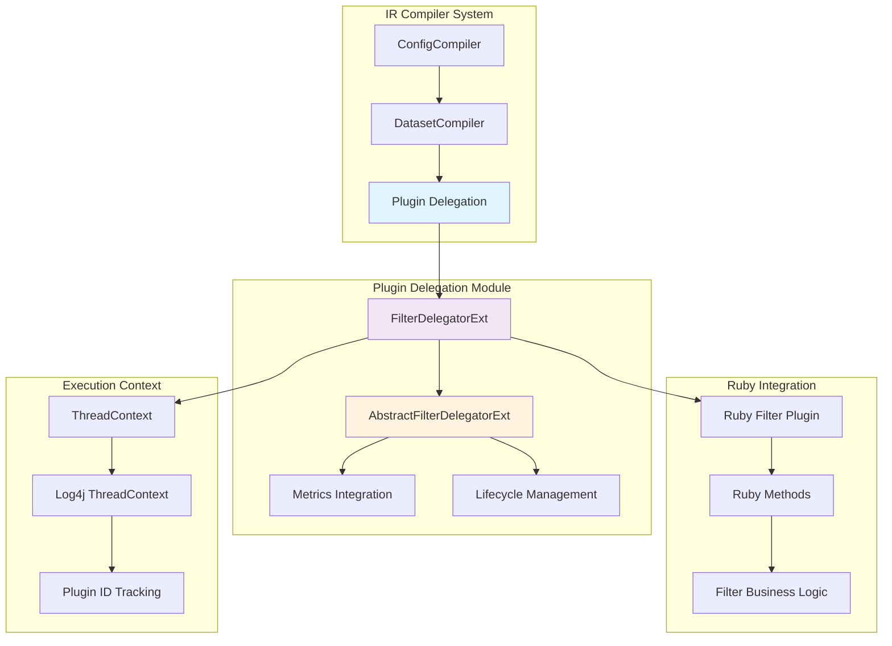
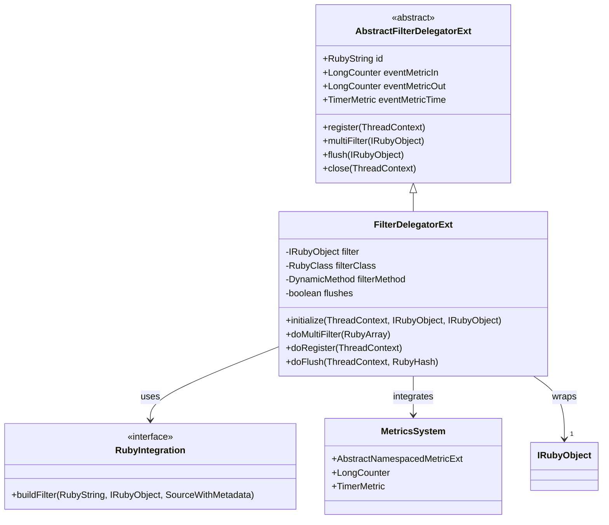
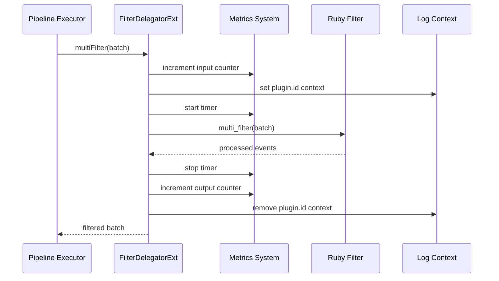
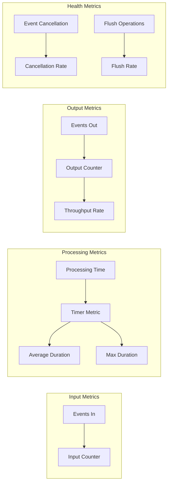
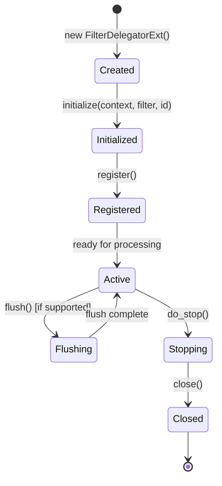

# Plugin Delegation Module

The plugin_delegation module provides a critical abstraction layer for filter plugin execution within Logstash's IR (Intermediate Representation) compiler system. It acts as a bridge between the compiled pipeline execution engine and Ruby-based filter plugins, enabling seamless integration while maintaining performance and observability.

## Architecture Overview

The plugin_delegation module implements the Delegation pattern to wrap filter plugins with additional functionality including metrics collection, lifecycle management, and thread-safe execution. The primary component, `FilterDelegatorExt`, serves as a proxy that intercepts plugin method calls to add instrumentation and logging context.

## Core Components

### FilterDelegatorExt

The main delegation class that wraps Ruby filter plugins and provides:

- **Plugin Lifecycle Management**: Handles registration, execution, and shutdown phases
- **Metrics Integration**: Collects performance and throughput metrics
- **Thread Safety**: Manages concurrent access to filter instances
- **Logging Context**: Maintains plugin identification in log messages
- **Flush Capability Detection**: Determines if plugins support periodic flushing

#### Key Responsibilities

1. **Initialization and Setup**
   - Wraps Ruby filter instances with delegation layer
   - Initializes metrics collection infrastructure
   - Detects plugin capabilities (flush support, thread safety)

2. **Event Processing**
   - Delegates batch processing to underlying Ruby filters
   - Maintains execution metrics (input/output counts, timing)
   - Provides logging context for debugging

3. **Lifecycle Operations**
   - Manages plugin registration and shutdown sequences
   - Handles graceful stopping and resource cleanup
   - Supports plugin reloading capabilities

## Component Relationships

## Data Flow and Processing

The plugin delegation system orchestrates event processing through a well-defined flow:

## Integration Points

### With IR Compiler System

The plugin_delegation module integrates closely with other IR compiler components:

- **[dataset_compilation](dataset_compilation.md)**: Receives compiled filter datasets for execution
- **[ruby_integration_layer](ruby_integration_layer.md)**: Uses Ruby integration services for plugin instantiation
- **[event_condition_system](event_condition_system.md)**: Works with conditional logic compilation

### With Core Systems

- **[metrics_system](metrics_system.md)**: Provides comprehensive performance monitoring
- **[ruby_integration](ruby_integration.md)**: Enables seamless Ruby-Java interoperability
- **[logging_system](logging_system.md)**: Maintains execution context for debugging

## Performance Characteristics

### Metrics Collection

The delegation layer automatically collects key performance metrics:

### Thread Safety Considerations

- **Plugin Detection**: Automatically detects thread-safe plugins
- **Context Isolation**: Maintains separate execution contexts per thread
- **Metric Synchronization**: Thread-safe metric collection and aggregation

## Configuration and Lifecycle

### Plugin Initialization

### Capability Detection

The system automatically detects plugin capabilities:

- **Flush Support**: Checks if plugin responds to `flush` method
- **Periodic Flush**: Determines if plugin requires periodic flushing
- **Thread Safety**: Evaluates plugin thread safety characteristics
- **Reloadability**: Assesses if plugin supports hot reloading

## Error Handling and Resilience

### Exception Management

- **Plugin Isolation**: Exceptions in one plugin don't affect others
- **Context Preservation**: Maintains logging context during error conditions
- **Graceful Degradation**: Continues processing when possible

### Resource Management

- **Memory Cleanup**: Proper cleanup of transient references
- **Context Management**: Automatic cleanup of thread-local contexts
- **Metric Resource Management**: Efficient metric collection without memory leaks

## Testing and Validation

### Test Infrastructure

The module provides specialized testing utilities:

- **Mock Plugin Support**: `initForTesting()` method for unit testing
- **Dummy Metrics**: Null object pattern for test environments
- **Isolated Execution**: Test-specific initialization paths

### Validation Points

- Plugin method availability verification
- Metric collection accuracy
- Thread safety validation
- Lifecycle state management

## Future Considerations

### Extensibility

The delegation pattern allows for future enhancements:

- **Additional Instrumentation**: New metrics and monitoring capabilities
- **Plugin Optimization**: Performance improvements through delegation
- **Enhanced Error Handling**: More sophisticated error recovery mechanisms

### Performance Optimization

- **Method Caching**: Optimization of Ruby method lookups
- **Batch Processing**: Enhanced batch processing capabilities
- **Memory Efficiency**: Reduced memory footprint for high-throughput scenarios

## Related Documentation

- [ir_compiler](ir_compiler.md) - Parent module containing plugin delegation
- [ruby_integration_layer](ruby_integration_layer.md) - Ruby-Java integration services
- [metrics_system](metrics_system.md) - Performance monitoring infrastructure
- [pipeline_execution](pipeline_execution.md) - Pipeline execution framework
- [plugin_system](plugin_system.md) - Overall plugin architecture