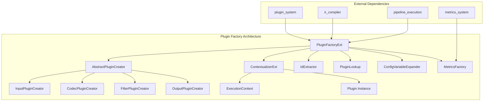
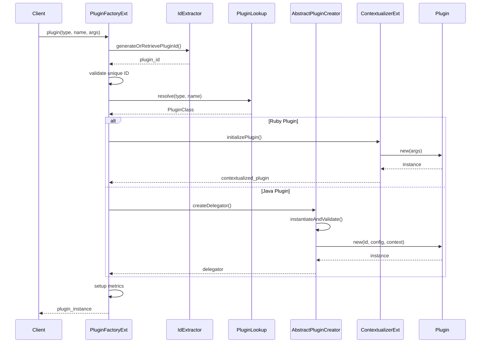
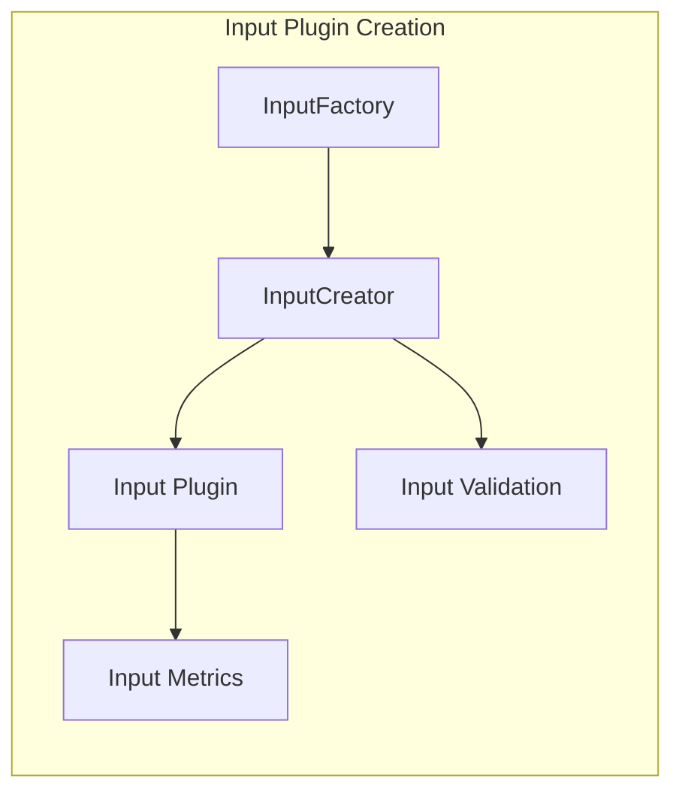
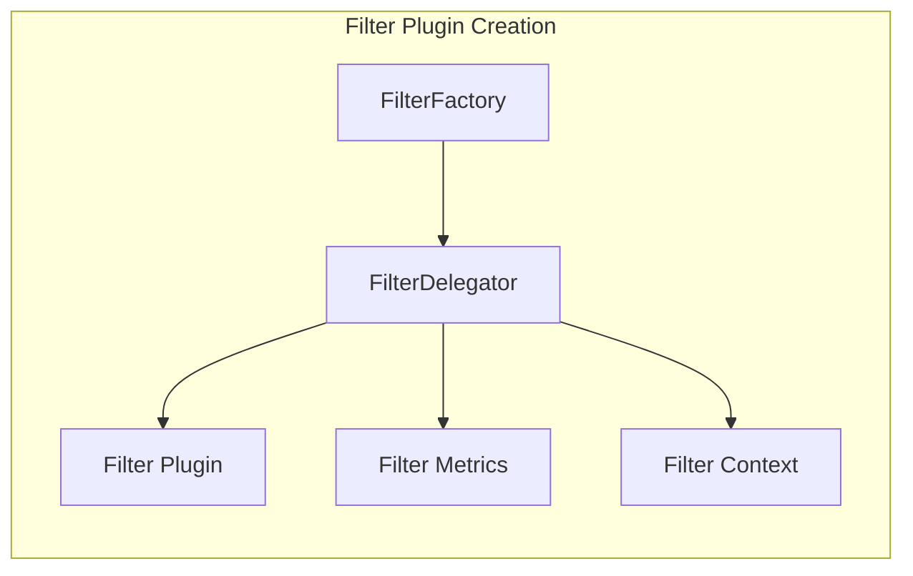
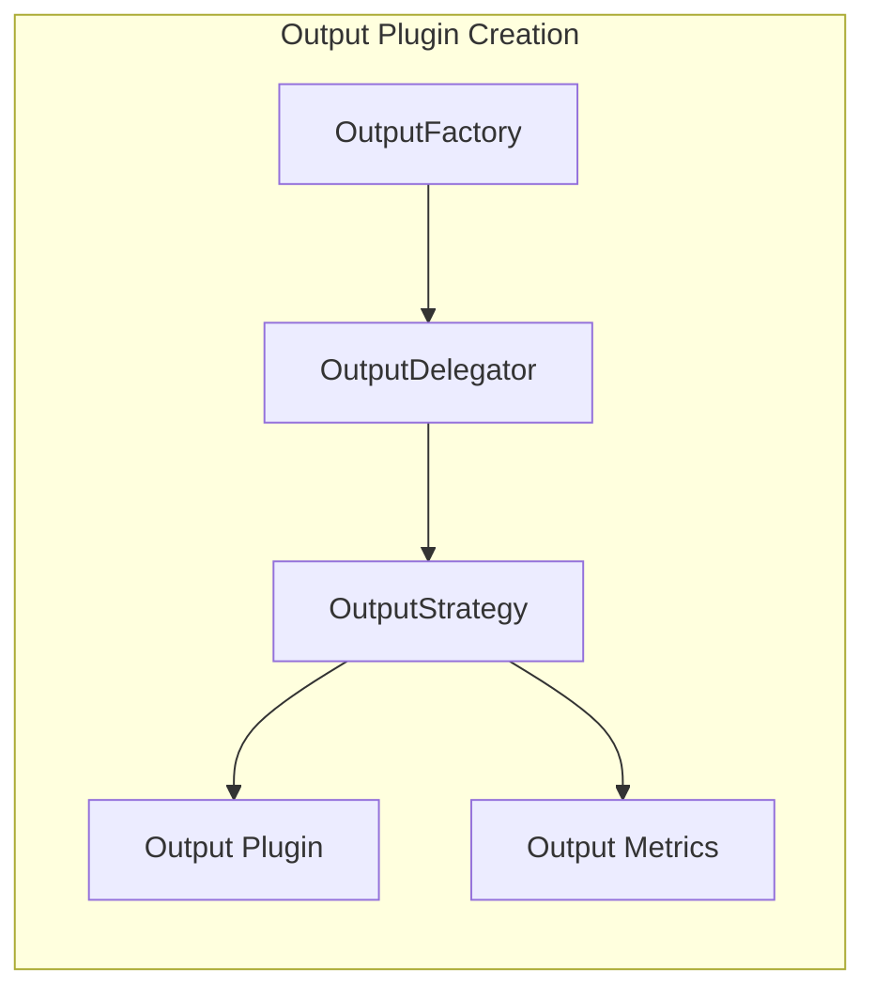
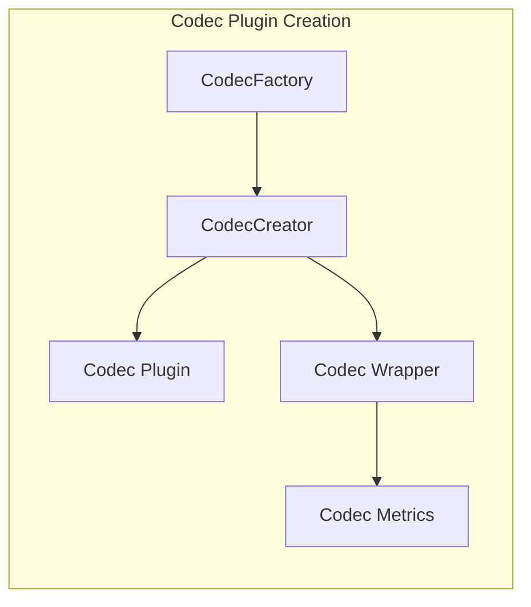
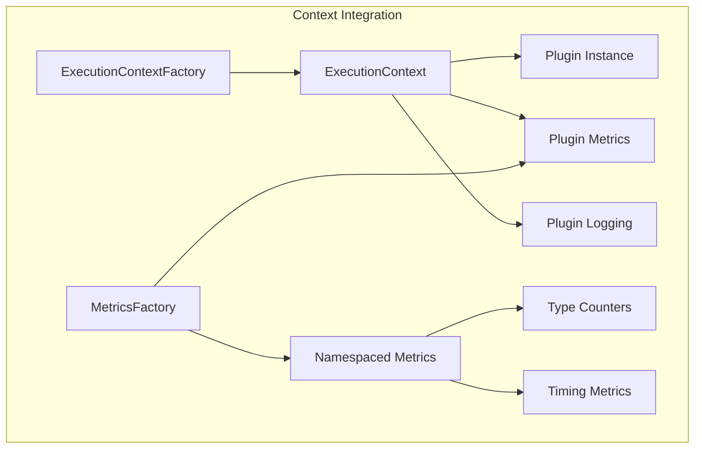
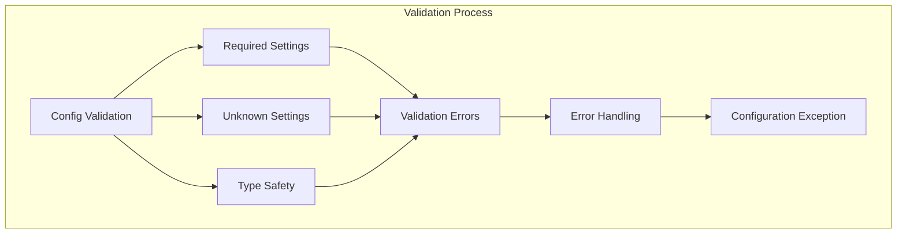

# Plugin Factory Module

The plugin_factory module is a critical component of Logstash's plugin system that provides centralized plugin instantiation, configuration, and lifecycle management. It serves as the primary factory for creating all types of plugins (input, filter, output, codec) with proper context injection, metrics integration, and configuration validation.

## Architecture Overview

The plugin_factory module implements a sophisticated factory pattern that handles the complexity of creating plugins across different languages (Ruby and Java), managing their lifecycle, and integrating them with Logstash's execution context and metrics systems.



## Core Components

### PluginFactoryExt
The main factory class that orchestrates plugin creation and manages the plugin registry.

**Key Responsibilities:**
- Plugin instantiation for all plugin types
- ID generation and uniqueness validation
- Integration with metrics and execution context
- Configuration variable expansion
- Language-specific plugin handling (Ruby vs Java)

**Core Methods:**
- `plugin()`: Universal plugin creation method
- `buildInput()`, `buildOutput()`, `buildFilter()`, `buildCodec()`: Type-specific builders
- `generateOrRetrievePluginId()`: Plugin ID management
- `filterDelegator()`: Special handling for filter plugins

### AbstractPluginCreator
Abstract base class for type-specific plugin creators that handle Java plugin instantiation.

**Key Features:**
- Template method pattern for plugin creation
- Configuration validation integration
- Context injection for Java plugins
- Reflection-based instantiation

### ContextualizerExt
Ruby integration component that injects execution context into plugins before initialization.

**Key Capabilities:**
- Execution context injection
- Ruby module prepending for context support
- Plugin initialization orchestration
- Support for both contextualized and legacy plugins

### IdExtractor
Functional interface for plugin ID extraction with multiple fallback strategies.

**Extraction Strategies:**
1. LIR (Logstash Intermediate Representation) source metadata
2. Explicit configuration arguments
3. UUID generation for codecs
4. Fallback UUID generation

## Plugin Creation Flow



## Plugin Type Handling

### Input Plugins


### Filter Plugins


### Output Plugins


### Codec Plugins


## Configuration and Context Management

### Configuration Processing
The factory handles complex configuration scenarios:

1. **Variable Expansion**: Environment variable substitution in configuration values
2. **Type Coercion**: Conversion between Ruby and Java types
3. **Validation**: Schema-based configuration validation
4. **Context Injection**: Execution context and metrics integration

### Execution Context Integration


## Plugin Lifecycle Management

### Registration and Initialization
1. **Plugin Resolution**: Lookup plugin class by type and name
2. **ID Generation**: Ensure unique plugin identification
3. **Context Creation**: Setup execution context and metrics
4. **Instantiation**: Create plugin instance with proper configuration
5. **Validation**: Verify configuration against plugin schema
6. **Registration**: Register plugin with pipeline

### Metrics Integration
Each plugin receives:
- **Namespaced Metrics**: Type and ID-scoped metric namespace
- **Performance Counters**: Event processing counters
- **Timing Metrics**: Execution time tracking
- **Custom Metrics**: Plugin-specific metric support

## Error Handling and Validation

### Configuration Validation


### Error Scenarios
- **Duplicate Plugin IDs**: Prevents ID conflicts in pipeline
- **Missing Required Configuration**: Validates mandatory settings
- **Unknown Configuration Keys**: Detects invalid configuration options
- **Plugin Class Resolution Failures**: Handles missing or invalid plugins
- **Instantiation Errors**: Manages reflection and constructor failures

## Integration Points

### Pipeline Compilation Integration
The plugin factory integrates closely with the [ir_compiler](ir_compiler.md) module:
- Receives compiled pipeline IR for plugin resolution
- Extracts plugin metadata from compilation artifacts
- Provides plugin instances for pipeline execution

### Metrics System Integration
Integrates with the [metrics_system](metrics_system.md) for comprehensive monitoring:
- Creates type-scoped metric namespaces
- Provides plugin-specific metric instances
- Enables performance tracking and monitoring

### Plugin System Integration
Works within the broader [plugin_system](plugin_system.md) architecture:
- Uses PluginLookup for plugin resolution
- Integrates with plugin registry and discovery
- Supports plugin hooks and lifecycle events

## Performance Considerations

### Caching and Optimization
- **Plugin Class Caching**: Avoids repeated class resolution
- **Metric Namespace Reuse**: Optimizes metric object creation
- **Configuration Validation Caching**: Reduces validation overhead
- **Context Reuse**: Minimizes context creation overhead

### Memory Management
- **Weak References**: For plugin instance tracking
- **Resource Cleanup**: Proper disposal of plugin resources
- **Metric Cleanup**: Cleanup of plugin-specific metrics

## Usage Examples

### Basic Plugin Creation
```java
// Create an input plugin
IRubyObject inputPlugin = pluginFactory.plugin(
    context, 
    PluginLookup.PluginType.INPUT, 
    "file", 
    configArgs, 
    sourceMetadata
);

// Create a filter plugin with delegation
AbstractFilterDelegatorExt filterPlugin = pluginFactory.buildFilter(
    RubyUtil.RUBY.newString("grok"),
    configArgs,
    sourceMetadata
);
```

### Custom Plugin Creator
```java
public class CustomPluginCreator extends AbstractPluginCreator<CustomPlugin> {
    @Override
    IRubyObject createDelegator(String name, Map<String, Object> pluginArgs, 
                               String id, AbstractNamespacedMetricExt typeScopedMetric,
                               PluginLookup.PluginClass pluginClass, Context pluginContext) {
        CustomPlugin plugin = instantiateAndValidate(pluginArgs, id, pluginContext, pluginClass);
        return new CustomPluginDelegator(plugin, id, typeScopedMetric);
    }
}
```

## Thread Safety

The plugin factory implements thread-safe operations:
- **Concurrent Plugin Creation**: Thread-safe plugin instantiation
- **ID Uniqueness**: Atomic ID validation and registration
- **Metrics Thread Safety**: Safe metric namespace creation
- **Configuration Isolation**: Thread-local configuration processing

## Monitoring and Debugging

### Plugin Factory Metrics
- Plugin creation rates by type
- Configuration validation failures
- Plugin instantiation errors
- ID generation statistics

### Debug Information
- Plugin resolution traces
- Configuration expansion logs
- Context injection details
- Validation error details

## Future Enhancements

### Planned Improvements
- **Plugin Versioning**: Support for plugin version constraints
- **Hot Reloading**: Dynamic plugin replacement capabilities
- **Plugin Isolation**: Enhanced plugin sandboxing
- **Performance Profiling**: Built-in plugin performance analysis

### Extension Points
- **Custom Plugin Creators**: Support for new plugin types
- **Configuration Processors**: Custom configuration handling
- **Context Providers**: Alternative context implementations
- **Validation Extensions**: Custom validation rules

The plugin_factory module serves as the cornerstone of Logstash's plugin architecture, providing robust, scalable, and maintainable plugin instantiation and management capabilities that support the entire Logstash ecosystem.