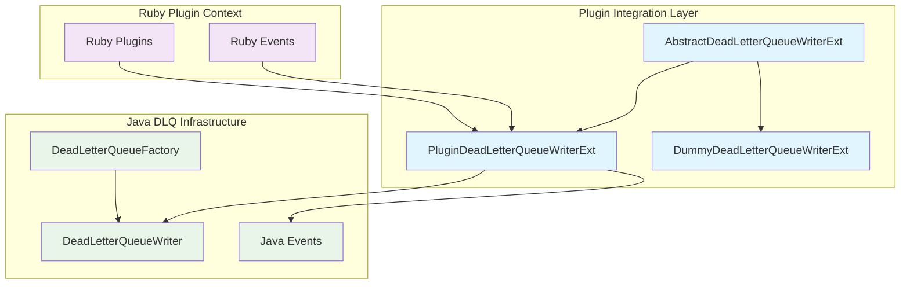
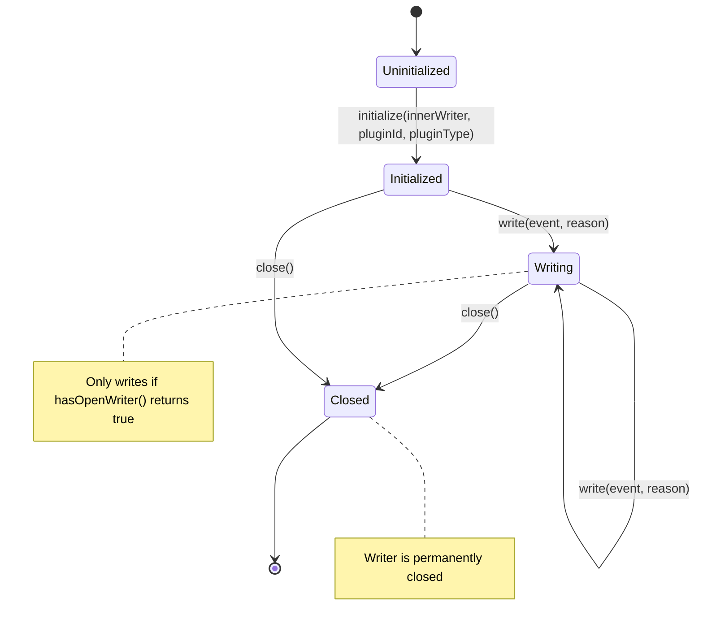
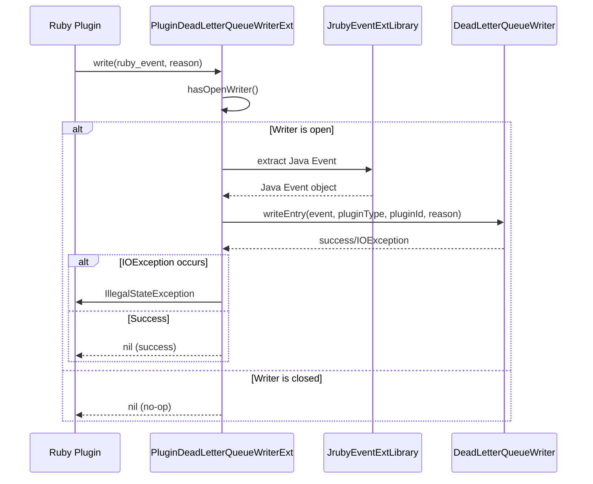
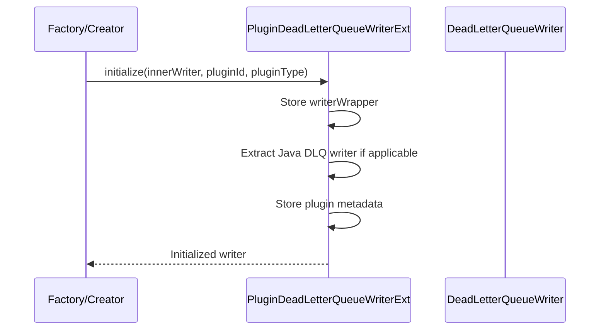
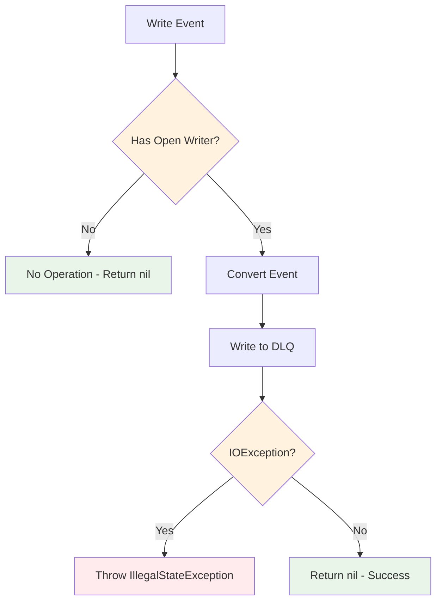

# Plugin Integration Layer

## Overview

The Plugin Integration Layer serves as a critical bridge between Logstash plugins and the Dead Letter Queue (DLQ) system, providing a Ruby-accessible interface for plugins to write failed events to the DLQ. This module is part of the broader [dead_letter_queue](dead_letter_queue.md) system and enables seamless integration between plugin execution contexts and error handling mechanisms.

## Architecture

The Plugin Integration Layer implements a wrapper pattern that encapsulates Java-based DLQ writers within Ruby-accessible objects, allowing plugins written in Ruby to interact with the underlying Java DLQ infrastructure without direct Java interoperability concerns.



## Core Components

### AbstractDeadLetterQueueWriterExt

The abstract base class that defines the contract for all DLQ writer implementations accessible from Ruby:

**Key Responsibilities:**
- Defines Ruby method interfaces (`is_open`, `plugin_id`, `plugin_type`, `inner_writer`, `write`, `close`)
- Provides template method pattern for concrete implementations
- Ensures consistent API across different writer types

**Ruby Method Mappings:**
- `is_open` → `open(ThreadContext)`
- `plugin_id` → `getPluginId(ThreadContext)`
- `plugin_type` → `getPluginType(ThreadContext)`
- `inner_writer` → `getInnerWriter(ThreadContext)`
- `write(event, reason)` → `doWrite(ThreadContext, IRubyObject, IRubyObject)`
- `close` → `doClose(ThreadContext)`

### PluginDeadLetterQueueWriterExt

The primary implementation that bridges Ruby plugins with Java DLQ infrastructure:

**Core Features:**
- **Plugin Context Tracking**: Maintains plugin ID and type for event attribution
- **Event Conversion**: Converts Ruby events to Java events for DLQ storage
- **Writer Management**: Manages lifecycle of underlying Java DLQ writer
- **Error Handling**: Wraps IOException in IllegalStateException for Ruby consumption

**State Management:**


### DummyDeadLetterQueueWriterExt

A null object implementation for scenarios where DLQ functionality is disabled:

**Characteristics:**
- All operations return `nil` or `false`
- No actual DLQ operations performed
- Minimal resource overhead
- Used when DLQ is disabled in configuration

## Integration Patterns

### Plugin-to-DLQ Flow



### Initialization Flow



## Dependencies

### Internal Dependencies

- **[dlq_writer_system](dead_letter_queue.md#dlq-writer-system)**: Provides underlying Java DLQ writer infrastructure
- **[ruby_integration](ruby_integration.md)**: Provides JRuby extension framework and event conversion
- **[event_api](event_api.md)**: Defines event structures and interfaces

### External Dependencies

- **JRuby Runtime**: For Ruby-Java interoperability
- **Java I/O**: For file-based DLQ operations
- **Logstash Event System**: For event data structures

## Configuration Integration

The Plugin Integration Layer works with various configuration scenarios:

### Enabled DLQ Configuration
```ruby
# When DLQ is enabled, plugins receive PluginDeadLetterQueueWriterExt
dead_letter_queue.enable: true
dead_letter_queue.max_bytes: 1024mb
```

### Disabled DLQ Configuration
```ruby
# When DLQ is disabled, plugins receive DummyDeadLetterQueueWriterExt
dead_letter_queue.enable: false
```

## Error Handling Strategy



## Performance Considerations

### Optimization Strategies

1. **Lazy Writer Validation**: `hasOpenWriter()` checks are performed only when needed
2. **String Caching**: Plugin ID and type strings are cached to avoid repeated conversions
3. **Null Object Pattern**: Dummy writer eliminates conditional checks in disabled scenarios
4. **Direct Java Integration**: Minimal Ruby-Java boundary crossings for performance-critical operations

### Memory Management

- **Transient Fields**: Writer references marked as transient to prevent serialization issues
- **Weak References**: No strong references held to prevent memory leaks
- **Resource Cleanup**: Proper cleanup in close() method

## Thread Safety

The Plugin Integration Layer maintains thread safety through:

- **Immutable Plugin Metadata**: Plugin ID and type are set once during initialization
- **Delegated Thread Safety**: Relies on underlying DLQ writer's thread safety guarantees
- **Stateless Operations**: Write operations are stateless beyond the writer reference

## Usage Examples

### Plugin Implementation
```ruby
# In a Logstash plugin
def register
  @dlq_writer = @execution_context.dlq_writer
end

def filter(event)
  begin
    # Plugin processing logic
    process_event(event)
  rescue => e
    # Write failed event to DLQ
    @dlq_writer.write(event, e.message) if @dlq_writer.is_open
    event.cancel
  end
  [event]
end
```

### Factory Integration
```java
// Java factory code creating plugin writers
PluginDeadLetterQueueWriterExt writer = new PluginDeadLetterQueueWriterExt(
    runtime, metaClass
);
writer.initialize(context, dlqWriter, pluginId, pluginType);
```

## Monitoring and Observability

The Plugin Integration Layer supports monitoring through:

- **Writer State Queries**: `is_open` method for health checks
- **Plugin Attribution**: Events tagged with plugin ID and type
- **Error Propagation**: IOExceptions converted to trackable RuntimeExceptions

## Related Documentation

- [Dead Letter Queue System](dead_letter_queue.md) - Parent system architecture
- [DLQ Writer System](dead_letter_queue.md#dlq-writer-system) - Underlying writer infrastructure
- [Ruby Integration](ruby_integration.md) - JRuby extension framework
- [Event API](event_api.md) - Event data structures and interfaces
- [Plugin System](plugin_system.md) - Plugin lifecycle and management

## Future Considerations

- **Async Writing**: Potential for asynchronous DLQ writing to improve plugin performance
- **Batch Operations**: Support for batch writing of multiple events
- **Enhanced Metadata**: Additional context information for DLQ entries
- **Compression**: Event compression before DLQ storage