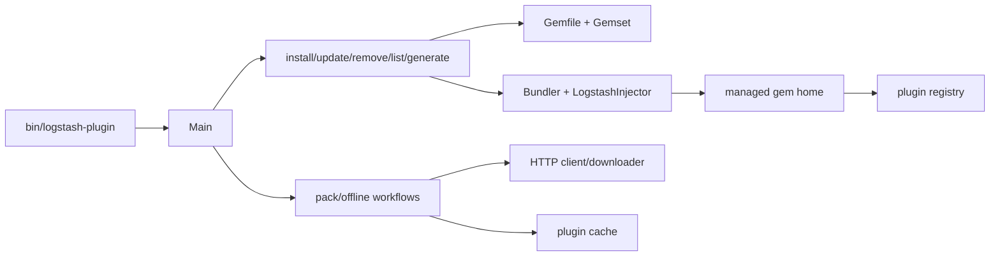
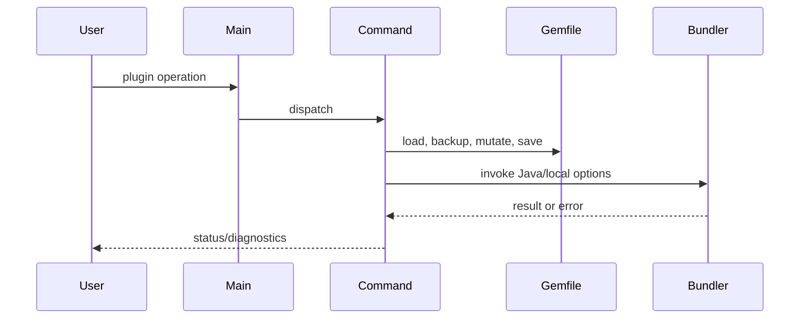

# Logstash Plugin Manager

The `plugin_manager` module implements `bin/logstash-plugin`: listing, installing, updating, removing, generating, and packaging Logstash plugins. It bridges the CLI with Bundler/RubyGems, maintaining the generated Gemfile and the managed JRuby gem home.

## Architecture

`Main` initializes Logstash gem paths and registers subcommands. Normal lifecycle operations mutate the Gemfile and invoke Bundler; local gems and offline packs additionally use explicit cache/archive layouts.

## Submodules

- [CLI and gem management](plugin_manager_cli_and_gem_management.md): command entrypoint, Gemfile model, Bundler injection, and physical gem installation.
- [Installation and lifecycle](plugin_manager_installation_and_lifecycle.md): strategy selection, install/update/remove, and plugin generation.
- [Offline packaging](plugin_manager_offline_packaging.md): current and legacy archive workflows.
- [Pack and network utilities](plugin_manager_pack_and_network_utilities.md): URI/repository lookup, HTTP, downloads, and pack metadata.

## End-to-end flow

The module depends on environment and Bundler setup documented in [runtime_foundation_and_configuration.md](runtime_foundation_and_configuration.md), while generated plugins target the APIs and registry in [plugin_api_and_registry.md](plugin_api_and_registry.md).

Important invariants: Gemfile failures restore the prior file; platform handling is normalized to Java; remote installs may verify metadata; local mode can bypass network/JAR lookup; integration plugins can prevent conflicting individual operations; offline packs exclude core/mixin implementation gems.
