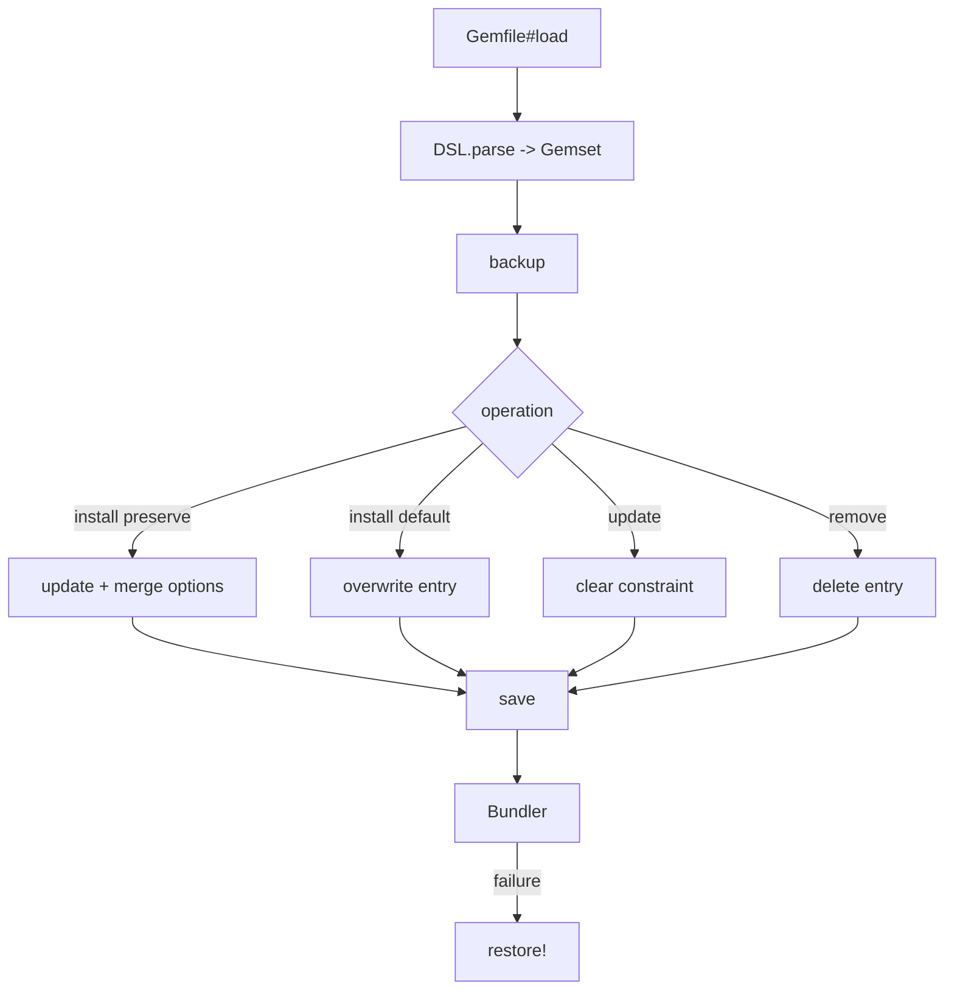

# Plugin Manager: CLI and Gem Management

`LogStash::PluginManager::Main < Clamp::Command` loads command classes, configures proxy support, sets RubyGems paths, and dispatches `list`, `install`, `remove`, `update`, `pack`, `unpack`, `generate`, and `prepare-offline-pack` (with deprecated aliases).

`LogStash::Gemfile`, `Gemset`, `Gem`, and `DSL` implement a deliberately small Gemfile DSL. The parser supports `source`, `gem`, and one `gemspec`; the gemset maintains a case-insensitive index. `update_gem` replaces requirements while merging options, `overwrite_gem` replaces the whole entry, and `remove_gem` deletes by normalized name. `Gemfile` handles UTF-8 IO, serialization, backup/restore, and path-based local gems.

`Bundler::LogstashInjector` injects exact versions without remote resolution, resets RubyGems specifications, normalizes platforms to Java, locks the definition, and restores the Gemfile on failure.

`GemInstaller` materializes a `.gem` under `BUNDLE_DIR/jruby/3.1.0`, creating `gems`, `specifications`, and `cache`, extracting files, writing a cache-compatible gemspec, and copying the archive to cache.

Lifecycle commands are detailed in [plugin_manager_installation_and_lifecycle.md](plugin_manager_installation_and_lifecycle.md); runtime plugin discovery is covered by [plugin_api_and_registry.md](plugin_api_and_registry.md).
