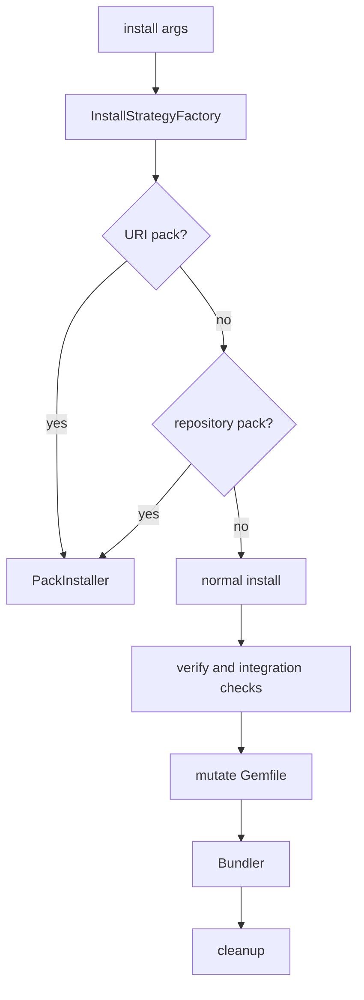
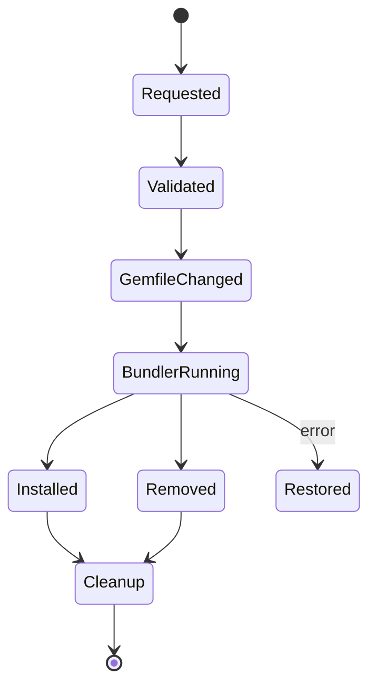

# Plugin Manager: Installation and Lifecycle

`Install#execute` first asks `InstallStrategyFactory` whether the first argument is a local, remote, or repository pack. Otherwise it validates options and selects local `.gem` files, development dependencies, or remote plugin names. Remote plugins are verified unless disabled; aliases can be remapped. Integration conflicts are rejected, mixin dependencies may be expanded, the Gemfile is changed, and Bundler runs. Failure restores the Gemfile; success removes overlaps, unused local gems, and orphans.

`Update` finds latest installed specifications, skips core/path gems, removes old constraints, and invokes Bundler with `major`, `minor`, or `patch` level plus local/conservative options. It compares before/after versions and removes orphan dependencies. `Remove` validates targets, resolves aliases, blocks integration-provided plugins, delegates to `Bundler::LogstashUninstall`, and performs cleanup.

`Generate` creates `logstash-{type}-{name}` from an input/filter/output/codec template, recursively rendering `.erb` files with plugin name, Git author/email, minimum Logstash version, and source path context.

Generated skeletons target [plugin_api_and_registry.md](plugin_api_and_registry.md); environment paths come from [runtime_foundation_and_configuration.md](runtime_foundation_and_configuration.md).
