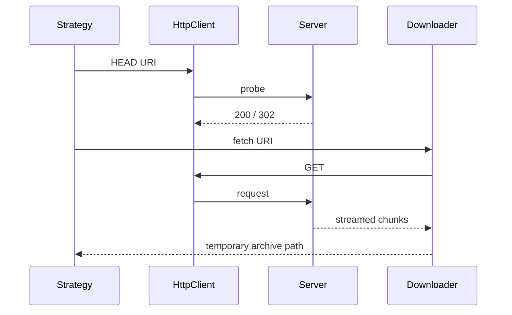

# Plugin Manager: Pack and Network Utilities

`PackFetchStrategy::Uri` recognizes `file://` and HTTP(S) URIs and returns a local or remote installer. `PackFetchStrategy::Repository` constructs a versioned Elastic artifact URL from `LOGSTASH_PACK_URL` or its default base and probes it with HEAD. Reachability errors skip the repository strategy so normal installation can continue.

`HttpClient.start` configures `Net::HTTP` with optional HTTPS proxy credentials from `https_proxy`/`HTTPS_PROXY` and TLS for HTTPS. `remote_file_exist?` follows 302 redirects up to five times. `Downloader#fetch` streams successful responses into a temporary file, follows the same limit, and removes temporary state on failure. Progressbar and silent feedback support interactive and quiet operation.

Both probing and downloading enforce `REDIRECTION_LIMIT = 5`; non-200 downloads become `FileNotFoundError`, while other failures propagate after cleanup. `Pack::GemInformation` extracts name, version, platform, and dependency/plugin status from archive paths. `Pack` exposes `plugins`, `dependencies`, and `valid?` (at least one plugin gem).

These utilities support [plugin_manager_installation_and_lifecycle.md](plugin_manager_installation_and_lifecycle.md) and [plugin_manager_offline_packaging.md](plugin_manager_offline_packaging.md).

