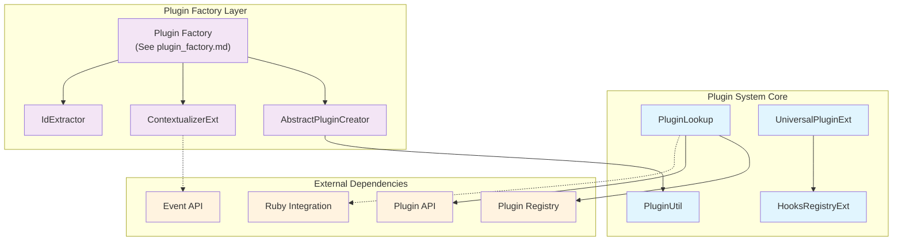
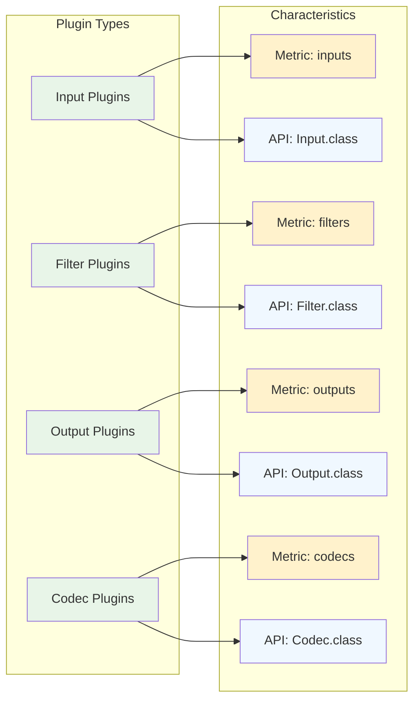
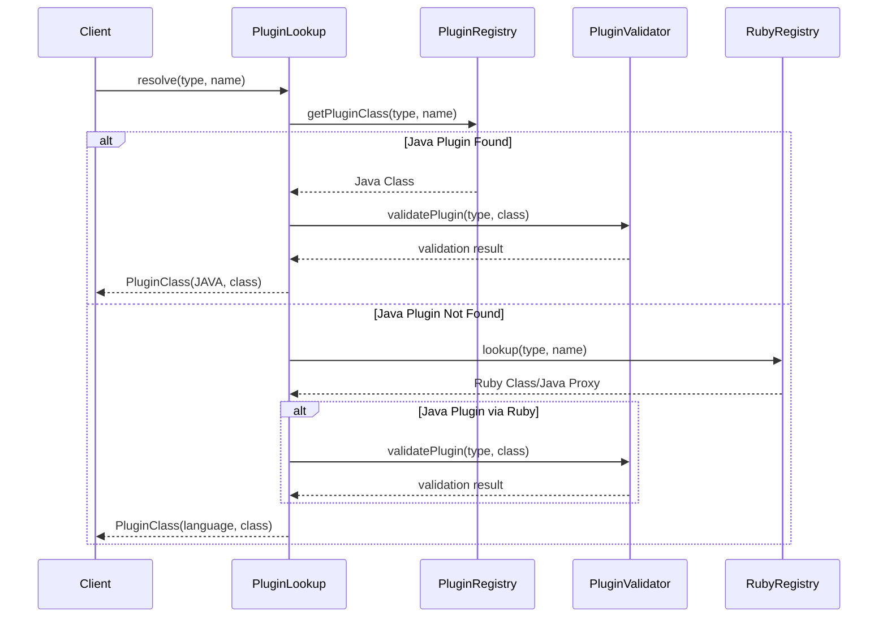
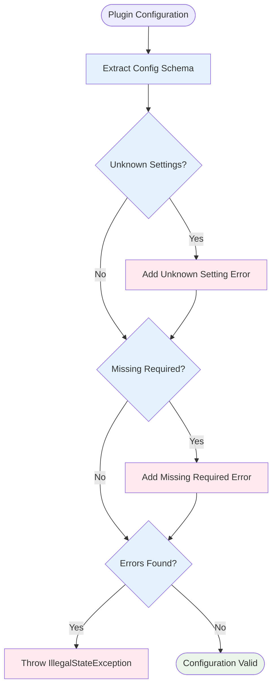
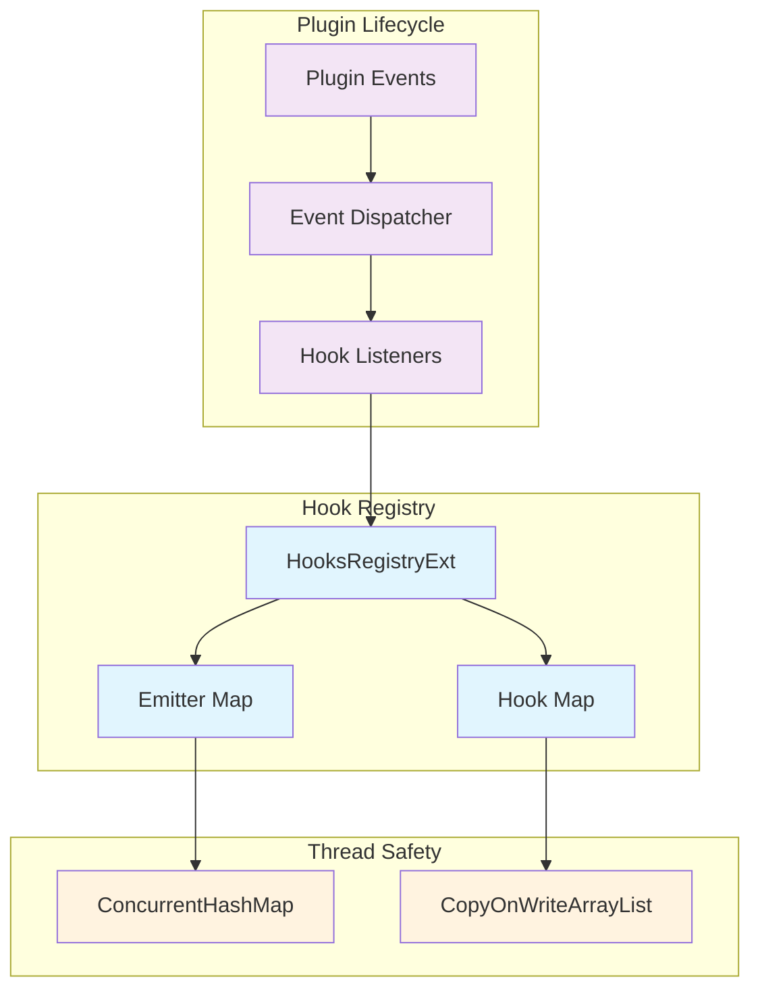

# Plugin System Module

## Overview

The Plugin System module is the core infrastructure that manages plugin discovery, instantiation, validation, and lifecycle management within Logstash. It provides a unified interface for handling both Java and Ruby plugins across all plugin types (input, filter, output, and codec), ensuring seamless integration and consistent behavior throughout the Logstash ecosystem.

## Purpose

The plugin system serves as the central orchestrator for:
- **Plugin Discovery**: Locating and identifying available plugins from various sources
- **Plugin Resolution**: Determining the correct plugin implementation based on type and name
- **Plugin Instantiation**: Creating plugin instances with proper configuration and context
- **Plugin Validation**: Ensuring plugins meet API requirements and configuration constraints
- **Hook Management**: Providing extensibility through a comprehensive hook system
- **Cross-Language Support**: Bridging Java and Ruby plugin implementations seamlessly

## Architecture Overview

The plugin system follows a layered architecture that separates concerns and provides clear interfaces between components:



## Core Components

### Plugin Lookup System
- **PluginLookup**: Central plugin resolution service that handles both Java and Ruby plugins
- **PluginClass Interface**: Abstraction for plugin implementations across languages
- **PluginType Enum**: Defines supported plugin types with their characteristics

### Plugin Utilities
- **PluginUtil**: Validation and utility functions for plugin configuration and lifecycle
- **Configuration Validation**: Ensures plugin configurations meet schema requirements

### Universal Plugin Framework
- **UniversalPluginExt**: Base Ruby extension for universal plugin functionality
- **Hook Integration**: Provides standardized hook registration and management

### Hook Management System
- **HooksRegistryExt**: Thread-safe registry for managing plugin hooks and event emitters
- **Event Dispatching**: Coordinates hook execution across plugin lifecycle events

### Plugin Factory Integration
The plugin system works closely with the **[plugin_factory](plugin_factory.md)** module to handle:
- **Plugin Creation**: Abstract creators for different plugin types
- **Context Management**: Execution context injection and management
- **ID Extraction**: Plugin identification and naming strategies

## Plugin Type System

The plugin system supports four primary plugin types, each with specific characteristics:



## Plugin Resolution Flow

The plugin resolution process follows a well-defined sequence that ensures proper plugin discovery and validation:



## Configuration Validation System

The plugin system implements comprehensive configuration validation to ensure plugin reliability:



## Hook Management Architecture

The hook system provides extensible plugin lifecycle management through event-driven architecture:



## Integration with Other Modules

The plugin system integrates closely with several other Logstash modules:

### Core Dependencies
- **[event_api](event_api.md)**: Provides the Plugin interface and core API definitions
- **[ruby_integration](ruby_integration.md)**: Enables seamless Ruby-Java plugin interoperability
- **[plugin_factory](plugin_factory.md)**: Handles plugin instantiation and dependency injection with specialized creators and contextualizers

### Supporting Systems
- **[config_compilation](config_compilation.md)**: Uses plugin resolution for pipeline compilation
- **[pipeline_execution](pipeline_execution.md)**: Leverages plugin instances for event processing
- **[metrics_system](metrics_system.md)**: Integrates plugin-specific metrics collection

## Key Features

### Multi-Language Support
- **Java Plugins**: Native Java plugin support with direct class loading
- **Ruby Plugins**: Ruby plugin integration through JRuby bridge
- **Transparent Resolution**: Automatic language detection and appropriate handling

### Plugin Validation
- **API Compatibility**: Ensures plugins implement required interfaces
- **Configuration Schema**: Validates plugin configurations against defined schemas
- **Runtime Validation**: Performs validation during plugin instantiation

### Hook System
- **Event-Driven**: Supports plugin lifecycle hooks and custom events
- **Thread-Safe**: Concurrent hook registration and execution
- **Extensible**: Allows plugins to register custom hooks and listeners

### Performance Optimization
- **Lazy Loading**: Plugins are loaded only when needed
- **Caching**: Plugin classes are cached for improved performance
- **Concurrent Access**: Thread-safe operations for multi-threaded environments

## Error Handling

The plugin system implements comprehensive error handling strategies:

- **Configuration Errors**: Clear error messages for invalid configurations
- **Plugin Loading Errors**: Detailed diagnostics for plugin loading failures
- **Validation Errors**: Specific error reporting for API compatibility issues
- **Runtime Errors**: Graceful handling of plugin execution errors

## Thread Safety

All core components are designed for thread-safe operation:
- **ConcurrentHashMap**: Used for plugin registries and emitter management
- **CopyOnWriteArrayList**: Ensures thread-safe hook collections
- **Synchronized Blocks**: Protect critical sections during plugin initialization

## Usage Examples

### Plugin Resolution
```java
PluginLookup lookup = new PluginLookup(pluginRegistry);
PluginClass pluginClass = lookup.resolve(PluginType.FILTER, "grok");
```

### Configuration Validation
```java
PluginUtil.validateConfig(plugin, configuration);
```

### Hook Registration
```java
hooksRegistry.registerHooks(context, emitterScope, callback);
```

This plugin system forms the foundation of Logstash's extensible architecture, enabling seamless integration of diverse plugin implementations while maintaining consistency, performance, and reliability across the entire platform.