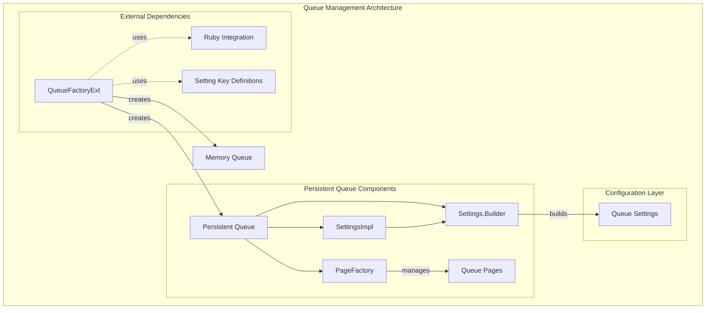
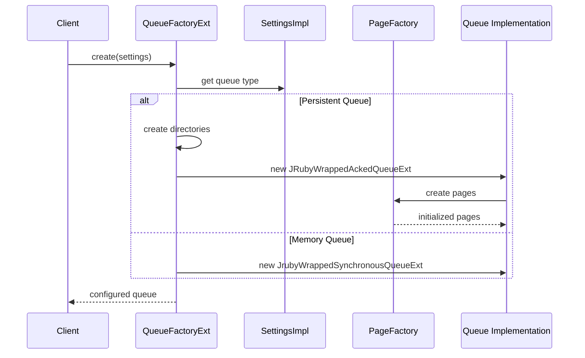

# Queue Management Module

## Overview

The Queue Management module is a critical component of the Logstash system responsible for managing event queuing, persistence, and flow control. It provides both persistent and in-memory queue implementations to handle event buffering between pipeline stages, ensuring data durability and system resilience.

## Purpose

The queue management system serves several key functions:

- **Event Buffering**: Provides temporary storage for events between pipeline stages
- **Persistence**: Offers durable storage options to prevent data loss during system failures
- **Flow Control**: Manages backpressure and throughput optimization
- **Memory Management**: Balances memory usage with performance requirements
- **Configuration Management**: Handles queue-specific settings and parameters

## Architecture Overview

The queue management module implements a factory pattern with pluggable queue implementations, supporting both persistent (disk-based) and memory-based queuing strategies.

## Core Components

### 1. QueueFactoryExt
**Primary Responsibility**: Factory for creating queue instances based on configuration

- Creates persistent or memory-based queues based on configuration
- Handles queue type validation and parameter setup
- Integrates with Ruby runtime for JRuby compatibility
- Manages queue directory creation and validation

**Key Features**:
- Support for `persisted` and `memory` queue types
- Dynamic queue parameter configuration
- Ruby-Java integration bridge
- Error handling for invalid configurations

### 2. PageFactory
**Primary Responsibility**: Factory for creating and managing queue pages in persistent queues

- Creates head pages for active writing
- Creates tail pages for reading operations
- Manages page state and acknowledgment tracking
- Handles page recovery from checkpoints

**Key Features**:
- Head page creation for new data
- Tail page creation from existing checkpoints
- BitSet-based acknowledgment tracking
- Page state validation and recovery

### 3. SettingsImpl
**Primary Responsibility**: Implementation of queue configuration settings

- Encapsulates all queue configuration parameters
- Provides builder pattern for settings construction
- Manages default values and validation
- Supports both file-based and programmatic configuration

**Key Features**:
- Fluent builder interface
- Default value management
- Configuration validation
- Immutable settings objects

### 4. Settings.Builder
**Primary Responsibility**: Builder interface for constructing queue settings

- Provides fluent API for settings configuration
- Ensures proper parameter validation
- Supports method chaining for ease of use
- Creates immutable settings instances

## Queue Types

### Persistent Queue (`persisted`)
- **Storage**: Disk-based with page files
- **Durability**: Survives system restarts
- **Use Case**: Production environments requiring data durability
- **Configuration**: Requires queue path, page capacity, and checkpoint settings

### Memory Queue (`memory`)
- **Storage**: In-memory synchronous queue
- **Durability**: Data lost on system restart
- **Use Case**: Development or high-performance scenarios where data loss is acceptable
- **Configuration**: Based on batch size and worker count

## Configuration Parameters

### Persistent Queue Settings
- `queue.page_capacity`: Maximum events per page
- `queue.max_events`: Maximum total events in queue
- `queue.max_bytes`: Maximum queue size in bytes
- `queue.checkpoint.writes`: Checkpoint frequency for writes
- `queue.checkpoint.acks`: Checkpoint frequency for acknowledgments
- `queue.checkpoint.retry`: Enable checkpoint retry on failure

### Memory Queue Settings
- `pipeline.batch.size`: Events per batch
- `pipeline.workers`: Number of worker threads

## Data Flow

## Integration Points

### Ruby Integration
- Seamless integration with JRuby runtime
- Ruby-accessible queue operations
- Configuration parameter mapping from Ruby settings

### Pipeline Integration
- Integration with [pipeline_execution](pipeline_execution.md) module
- Event flow management with [event_api](event_api.md)
- Metrics reporting to [metrics_system](metrics_system.md)

### Settings Management
- Configuration through [settings_management](settings_management.md)
- Dynamic parameter validation and type coercion

### Dead Letter Queue
- Integration with [dead_letter_queue](dead_letter_queue.md) for failed events
- Error handling and event routing

## Error Handling

The queue management system implements comprehensive error handling:

- **Configuration Errors**: Invalid queue types or parameters
- **I/O Errors**: Disk space, permissions, or file system issues
- **Memory Errors**: Out of memory conditions in memory queues
- **Checkpoint Errors**: Persistence and recovery failures

## Performance Considerations

### Persistent Queue Optimization
- Page-based storage for efficient I/O
- Configurable checkpoint intervals
- BitSet-based acknowledgment tracking
- Directory structure optimization

### Memory Queue Optimization
- Lock-free synchronous operations
- Batch size optimization
- Worker thread scaling

## Monitoring and Metrics

Queue management integrates with the monitoring system to provide:

- Queue depth and throughput metrics
- Page utilization statistics
- Checkpoint frequency and success rates
- Error rates and recovery statistics

## Thread Safety

All queue implementations are designed for concurrent access:
- Thread-safe page management
- Atomic operations for queue state
- Proper synchronization for Ruby integration
- Lock-free operations where possible

## Future Considerations

- Support for additional queue types
- Enhanced compression options
- Improved memory management
- Advanced monitoring capabilities
- Performance optimizations for high-throughput scenarios