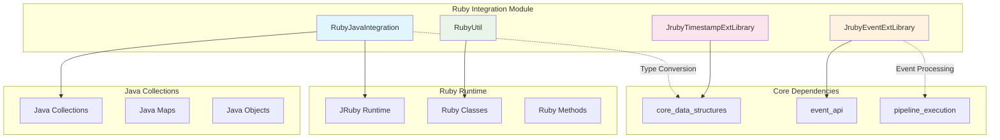
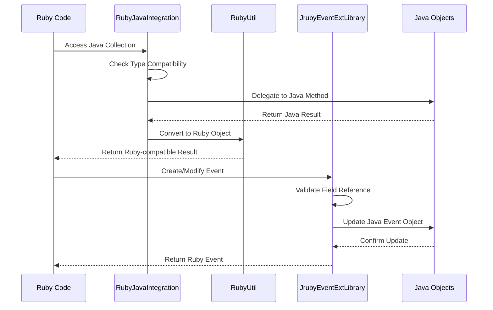
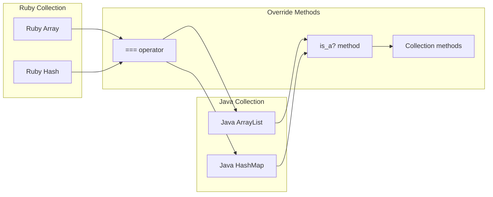
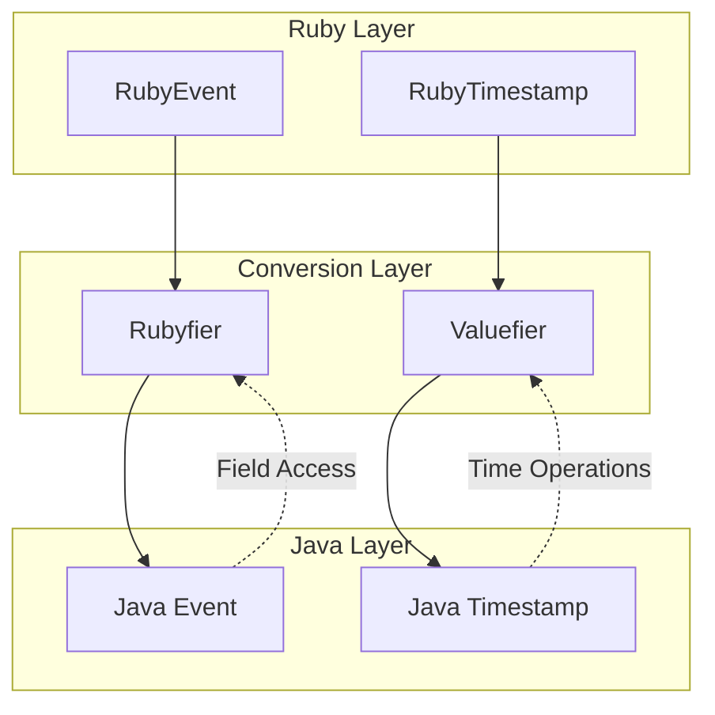

# Ruby Integration Module

## Overview

The Ruby Integration module serves as the critical bridge between Java and Ruby components within the Logstash ecosystem. This module enables seamless interoperability between JRuby and Java, providing type conversion, method overrides, and runtime utilities that allow Ruby code to work transparently with Java collections and objects.

## Purpose

The primary purpose of this module is to:

- **Enable Seamless Interoperability**: Bridge the gap between Java and Ruby runtime environments
- **Provide Type Conversion**: Convert between Java and Ruby data types transparently
- **Extend Ruby Classes**: Add Java-compatible methods to Ruby core classes
- **Support Event Processing**: Provide Ruby wrappers for core Logstash events and timestamps
- **Facilitate Collection Operations**: Enable Ruby-style operations on Java collections

## Architecture Overview



## Core Components

### 1. RubyJavaIntegration
**Primary Role**: Provides seamless integration between Ruby and Java collection types

**Key Responsibilities**:
- Sets up method overrides on Ruby Array and Hash classes
- Enables type equivalence between Ruby and Java collections
- Provides Ruby-style methods for Java collections
- Handles collection operations like intersection, union, and compaction

**Integration Points**:
- Extends Ruby Array class with Java ArrayList compatibility
- Extends Ruby Hash class with Java Map compatibility
- Provides `is_a?` method overrides for type checking
- Implements collection manipulation methods

### 2. RubyUtil
**Primary Role**: Central utility class for Ruby runtime management and class definitions

**Key Responsibilities**:
- Manages global Ruby runtime instance
- Defines and registers Ruby classes for Logstash components
- Provides type conversion utilities
- Handles Ruby class hierarchy setup

**Integration Points**:
- References [core_data_structures](core_data_structures.md) for type conversion
- Integrates with [event_api](event_api.md) for event processing
- Connects to [pipeline_execution](pipeline_execution.md) for runtime management

### 3. JrubyEventExtLibrary
**Primary Role**: Ruby wrapper for Logstash Event objects

**Key Responsibilities**:
- Provides Ruby interface for Event manipulation
- Handles field access and modification
- Supports event serialization and deserialization
- Manages event lifecycle operations

**Integration Points**:
- Uses [core_data_structures](core_data_structures.md) for field reference handling
- Integrates with [event_api](event_api.md) for event processing
- Connects to serialization framework for JSON operations

### 4. JrubyTimestampExtLibrary
**Primary Role**: Ruby wrapper for timestamp handling

**Key Responsibilities**:
- Provides Ruby interface for timestamp operations
- Handles timestamp parsing and formatting
- Supports timestamp arithmetic and comparison
- Manages timezone and precision handling

**Integration Points**:
- Uses [core_data_structures](core_data_structures.md) for timestamp conversion
- Integrates with serialization framework for JSON representation

## Data Flow Architecture



## Key Features

### Type System Integration

The module provides comprehensive type system integration:

- **Collection Compatibility**: Java ArrayList and LinkedHashMap work seamlessly with Ruby Array and Hash operations
- **Type Checking**: Enhanced `is_a?` methods that recognize Java types as Ruby equivalents
- **Method Delegation**: Ruby methods automatically delegate to appropriate Java implementations

### Event Processing

Advanced event processing capabilities:

- **Field Access**: Unified field access syntax for both simple and nested fields
- **Type Safety**: Automatic type validation and conversion for event fields
- **Serialization**: Built-in JSON serialization and deserialization support
- **Event Lifecycle**: Complete event lifecycle management including cloning and cancellation

### Timestamp Handling

Comprehensive timestamp support:

- **Multiple Formats**: Support for ISO8601, Unix timestamps, and Ruby Time objects
- **Precision**: Nanosecond precision timestamp handling
- **Arithmetic**: Full arithmetic operations on timestamps
- **Comparison**: Complete comparison operators for timestamp objects

## Integration Patterns

### Collection Override Pattern



### Event Wrapper Pattern



## Performance Considerations

### Optimization Strategies

1. **Lazy Conversion**: Objects are converted between Ruby and Java only when necessary
2. **Reference Caching**: Frequently accessed Ruby classes are cached in static fields
3. **Direct Method Calls**: Critical paths use direct Java method invocation
4. **Memory Efficiency**: Minimal object creation during type conversions

### Memory Management

- **Weak References**: Used for temporary conversion objects
- **Object Pooling**: Reuse of conversion utilities
- **Garbage Collection**: Optimized for JRuby's garbage collection patterns

## Error Handling

The module implements comprehensive error handling:

- **Type Validation**: Strict type checking with meaningful error messages
- **Exception Wrapping**: Java exceptions are wrapped in appropriate Ruby exceptions
- **Graceful Degradation**: Fallback mechanisms for unsupported operations
- **Debug Support**: Detailed error information for troubleshooting

## Usage Examples

### Collection Integration
```ruby
# Java ArrayList behaves like Ruby Array
java_list = Java::JavaUtil::ArrayList.new
java_list << "item1"
java_list.is_a?(Array)  # returns true

# Ruby Hash operations on Java Map
java_map = Java::JavaUtil::LinkedHashMap.new
java_map["key"] = "value"
java_map.has_key?("key")  # returns true
```

### Event Processing
```ruby
# Create and manipulate events
event = LogStash::Event.new("message" => "test")
event.set("[@metadata][index]", "logstash")
event.get("[message]")  # returns "test"

# Event serialization
json_string = event.to_json
events = LogStash::Event.from_json(json_string)
```

### Timestamp Operations
```ruby
# Create timestamps
ts = LogStash::Timestamp.now
ts_from_string = LogStash::Timestamp.parse_iso8601("2023-01-01T00:00:00.000Z")

# Timestamp arithmetic
future_ts = ts + 3600  # Add one hour
time_diff = future_ts - ts  # Calculate difference
```

## Dependencies

The Ruby Integration module depends on several other modules:

- **[core_data_structures](core_data_structures.md)**: For type conversion and field reference handling
- **[event_api](event_api.md)**: For event processing interfaces
- **[pipeline_execution](pipeline_execution.md)**: For runtime context and execution support

## Configuration

The module is automatically configured during Logstash startup:

1. **Ruby Runtime Initialization**: Global JRuby runtime is established
2. **Class Registration**: All Ruby classes are registered with the runtime
3. **Method Override Setup**: Collection and type overrides are installed
4. **Integration Activation**: Java-Ruby integration is activated

## Monitoring and Diagnostics

### Health Indicators

- **Runtime Status**: JRuby runtime health and memory usage
- **Conversion Performance**: Type conversion timing and success rates
- **Error Rates**: Exception frequency and types

### Debugging Support

- **Type Inspection**: Runtime type checking and validation
- **Conversion Tracing**: Detailed logging of type conversions
- **Performance Profiling**: Method call timing and optimization hints

## Future Enhancements

### Planned Improvements

1. **Enhanced Type Safety**: Stricter type validation and conversion
2. **Performance Optimization**: Further reduction in conversion overhead
3. **Extended Collection Support**: Support for additional Java collection types
4. **Improved Error Messages**: More descriptive error reporting

### Compatibility Considerations

- **JRuby Version Support**: Compatibility with future JRuby releases
- **Java Version Support**: Support for newer Java language features
- **Backward Compatibility**: Maintaining compatibility with existing Ruby plugins