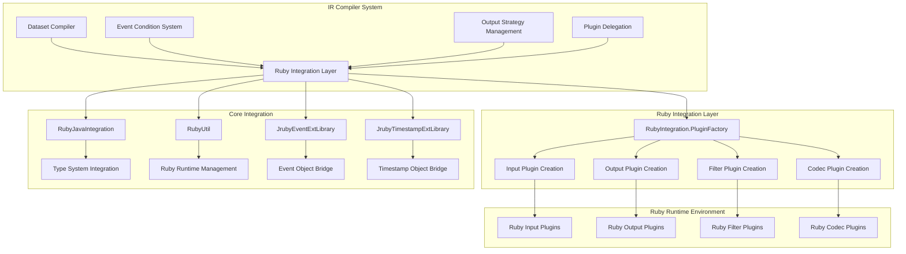
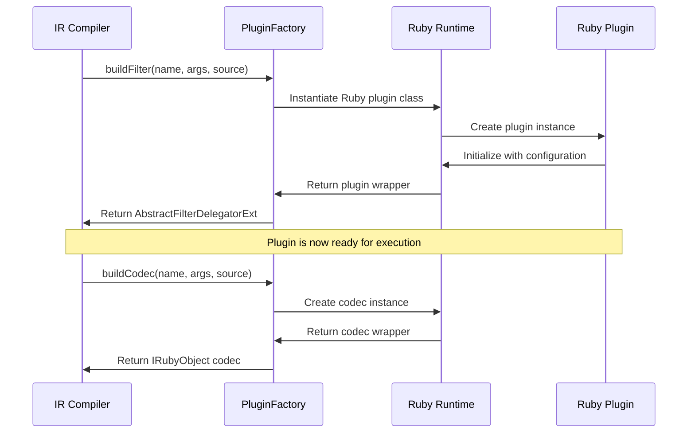
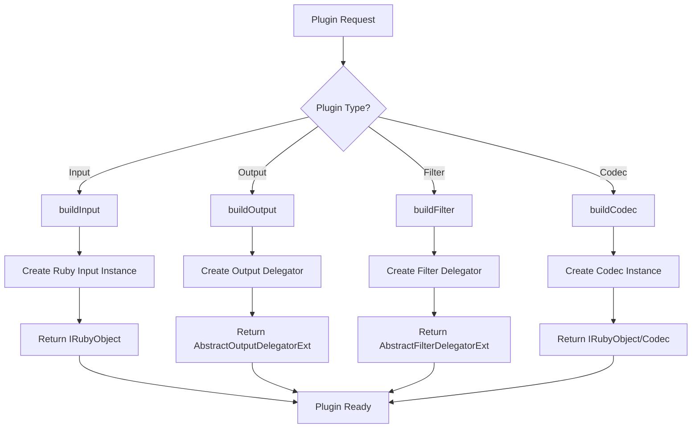
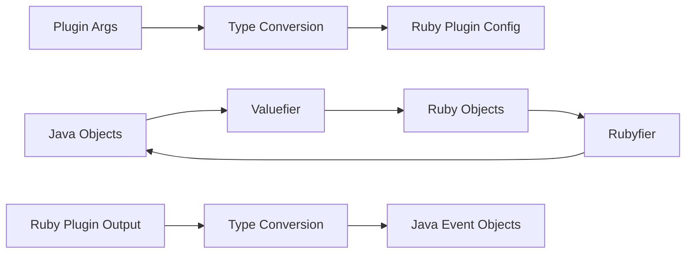

# Ruby Integration Layer

The Ruby Integration Layer serves as a critical bridge between Logstash's Java-based core infrastructure and its Ruby-based plugin ecosystem. This module provides the essential interfaces and mechanisms that enable seamless interoperability between Java and Ruby components within the IR (Intermediate Representation) compiler framework.

## Architecture Overview

The Ruby Integration Layer operates within the IR compiler subsystem, providing plugin factory interfaces that enable the compilation process to instantiate and manage Ruby-based plugins. It acts as an abstraction layer that allows the Java-based compiler to work with Ruby plugins without direct knowledge of Ruby implementation details.



## Core Components

### RubyIntegration.PluginFactory

The central interface that defines the contract for creating Ruby-based plugins within the compilation process.

**Key Responsibilities:**
- **Plugin Instantiation**: Creates instances of Ruby plugins (inputs, outputs, filters, codecs)
- **Type Bridge**: Handles conversion between Java and Ruby object representations
- **Source Metadata**: Maintains plugin source information for debugging and error reporting
- **Codec Management**: Provides both default and custom codec creation capabilities

**Interface Methods:**
```java
IRubyObject buildInput(RubyString name, IRubyObject args, SourceWithMetadata source)
AbstractOutputDelegatorExt buildOutput(RubyString name, IRubyObject args, SourceWithMetadata source)
AbstractFilterDelegatorExt buildFilter(RubyString name, IRubyObject args, SourceWithMetadata source)
IRubyObject buildCodec(RubyString name, IRubyObject args, SourceWithMetadata source)
Codec buildDefaultCodec(String codecName)
Codec buildRubyCodecWrapper(RubyObject rubyCodec)
```

## Integration Dependencies

The Ruby Integration Layer relies heavily on several core system components:

### Ruby Runtime Integration
- **[ruby_integration](ruby_integration.md)**: Provides the foundational Ruby-Java bridge
- **[core_data_structures](core_data_structures.md)**: Supplies type conversion and data access utilities

### Plugin System Integration
- **[plugin_delegation](plugin_delegation.md)**: Manages plugin lifecycle and execution
- **[output_strategy_management](output_strategy_management.md)**: Handles output plugin strategies

### Event Processing Integration
- **[event_api](event_api.md)**: Provides event object definitions and interfaces

## Data Flow Architecture



## Plugin Creation Process



## Type System Integration

The Ruby Integration Layer works closely with the core type conversion system to ensure seamless data exchange:

### Ruby-Java Object Mapping
- **Event Objects**: Bridges between Java Event instances and Ruby Event objects
- **Timestamp Objects**: Handles temporal data conversion between Java and Ruby representations
- **Configuration Objects**: Converts plugin configuration from Ruby hashes to Java maps
- **Metadata Objects**: Preserves source metadata across language boundaries

### Conversion Flow


## Error Handling and Debugging

The Ruby Integration Layer provides comprehensive error handling mechanisms:

### Source Metadata Tracking
- **File Information**: Tracks the source file where plugins are defined
- **Line Numbers**: Maintains line number information for error reporting
- **Configuration Context**: Preserves configuration context for debugging

### Exception Translation
- **Ruby Exceptions**: Translates Ruby exceptions to Java exceptions
- **Type Errors**: Provides clear error messages for type mismatches
- **Configuration Errors**: Reports configuration validation failures

## Performance Considerations

### Plugin Instantiation Optimization
- **Factory Caching**: Reuses factory instances where possible
- **Lazy Loading**: Defers plugin creation until actually needed
- **Memory Management**: Properly manages Ruby object lifecycle

### Runtime Efficiency
- **Minimal Overhead**: Reduces conversion overhead between Java and Ruby
- **Direct Delegation**: Uses direct method calls where possible
- **Resource Pooling**: Manages Ruby runtime resources efficiently

## Configuration and Lifecycle

### Plugin Factory Configuration
The PluginFactory interface is implemented by Ruby classes that handle the actual plugin instantiation logic. The factory is responsible for:

1. **Plugin Discovery**: Locating Ruby plugin classes
2. **Configuration Validation**: Ensuring plugin configurations are valid
3. **Dependency Injection**: Providing required dependencies to plugins
4. **Lifecycle Management**: Managing plugin initialization and cleanup

### Integration Points
- **Compilation Phase**: Plugins are instantiated during pipeline compilation
- **Runtime Phase**: Plugin instances are executed within the pipeline
- **Shutdown Phase**: Proper cleanup of Ruby resources

## Security Considerations

### Ruby Code Execution
- **Sandboxing**: Ruby plugin execution is contained within the JRuby runtime
- **Resource Limits**: Memory and CPU usage is monitored and limited
- **Permission Management**: Ruby plugins operate with restricted permissions

### Configuration Security
- **Input Validation**: All plugin configurations are validated before use
- **Sanitization**: User inputs are sanitized to prevent injection attacks
- **Access Control**: Plugin access to system resources is controlled

## Monitoring and Observability

### Plugin Metrics
- **Creation Time**: Tracks time taken to instantiate plugins
- **Memory Usage**: Monitors memory consumption of Ruby plugins
- **Error Rates**: Tracks plugin creation and execution errors

### Debugging Support
- **Stack Traces**: Provides detailed stack traces across Java-Ruby boundaries
- **Configuration Dumps**: Supports dumping plugin configurations for debugging
- **Runtime Inspection**: Allows inspection of Ruby plugin state

## Future Considerations

### Performance Enhancements
- **Native Compilation**: Potential for compiling Ruby plugins to native code
- **Caching Improvements**: Enhanced caching strategies for plugin instances
- **Memory Optimization**: Reduced memory footprint for Ruby objects

### Feature Extensions
- **Plugin Versioning**: Support for multiple versions of the same plugin
- **Hot Reloading**: Dynamic reloading of Ruby plugins without restart
- **Enhanced Debugging**: Improved debugging tools for Ruby-Java integration

## Related Documentation

- **[ir_compiler](ir_compiler.md)**: Parent module containing the Ruby Integration Layer
- **[dataset_compilation](dataset_compilation.md)**: Dataset compilation that uses Ruby plugins
- **[plugin_delegation](plugin_delegation.md)**: Plugin delegation mechanisms
- **[ruby_integration](ruby_integration.md)**: Core Ruby-Java integration utilities
- **[event_api](event_api.md)**: Event object definitions and interfaces
- **[core_data_structures](core_data_structures.md)**: Type conversion and data access utilities