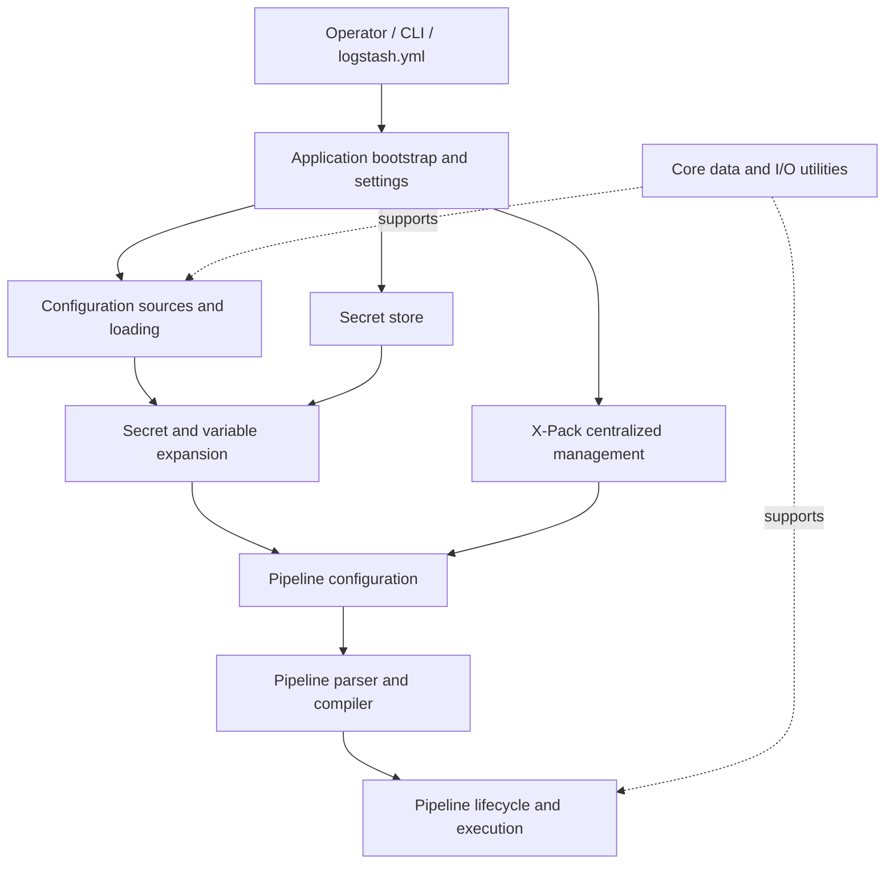
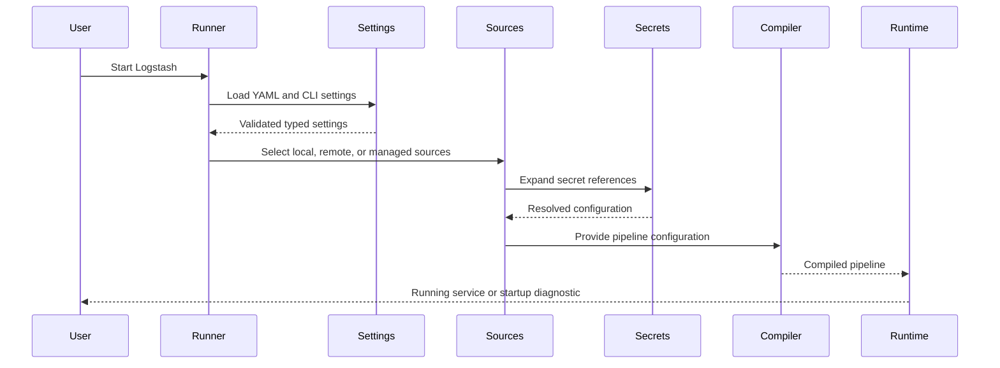

# Runtime Foundation and Configuration

The `runtime_foundation_and_configuration` module provides Logstash’s process-level foundation. It initializes and validates settings, selects and loads pipeline configuration, manages secrets, supports centralized X-Pack configuration, and supplies shared Ruby/Java data and I/O utilities. Together, these components prepare safe, validated inputs for pipeline compilation and execution.

## Architecture

## Core components

- [Application bootstrap and settings](application_bootstrap_and_settings.md) — runner orchestration, typed settings, validation, resource checks, locking, and startup lifecycle.
- [Configuration sources and loading](configuration_sources_and_loading.md) — inline, file, glob, HTTP(S), and `pipelines.yml` configuration loading.
- [Core data and I/O utilities](core_data_and_io_utilities.md) — tokenization, charset normalization, hashing, plugin-version handling, and JRuby interoperability.
- [Secret store](secret_store.md) — keystore CLI, PKCS#12-backed persistence, secure data handling, and configuration secret expansion.
- [X-Pack centralized pipeline management](xpack_centralized_pipeline_management.md) — Elasticsearch-backed pipeline selection, validation, polling, and reload integration.

These components hand off to the [pipeline configuration parser](pipeline_configuration_parser.md), [pipeline IR and compilation](pipeline_ir_and_compilation.md), and [pipeline lifecycle and execution](pipeline_lifecycle_and_execution.md). Operational visibility is provided by the [monitoring HTTP API](monitoring_http_api.md), [logging](logging.md), and related observability components.