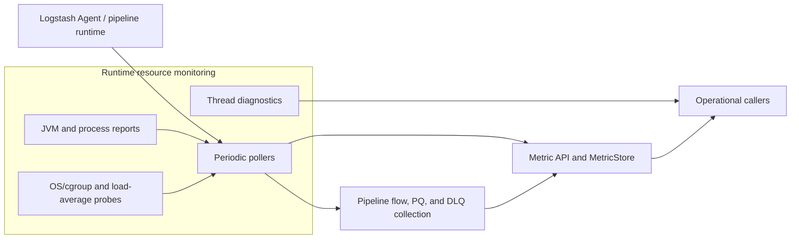
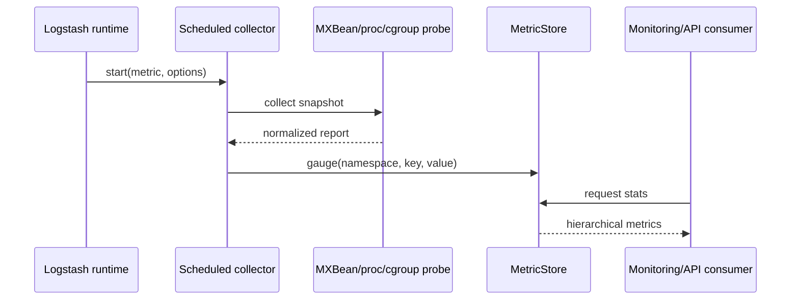

# Runtime Resource Monitoring

Runtime resource monitoring supplies Logstash with recurring operational gauges and on-demand JVM diagnostics. It bridges Ruby orchestration with Java MXBeans and Linux proc/cgroup files, then publishes normalized values through the hierarchical metrics system.

## Architecture overview

## Sub-modules

* [Periodic pollers](runtime_resource_monitoring_periodic_pollers.md) — scheduling, timeout handling, cgroup polling, load-average selection, and delegation to running pipelines.
* [JVM and process metrics](runtime_resource_monitoring_jvm_and_process_metrics.md) — MXBean reports, process statistics, heap/pool aggregation, GC classification, and platform behavior.
* [Thread diagnostics](runtime_resource_monitoring_thread_diagnostics.md) — hot-thread sampling, ranking, stack traces, and idle-thread filtering.

The module depends on the hierarchical metric implementation documented in [metrics_and_instrumentation.md](metrics_and_instrumentation.md), with lookup/storage details in [metric_store_and_hierarchical_lookup.md](metric_store_and_hierarchical_lookup.md). Pipeline-owned statistics and lifecycle context are covered by [pipeline_lifecycle_and_execution.md](pipeline_lifecycle_and_execution.md) and [pipeline_lifecycle_and_execution_reporting.md](pipeline_lifecycle_and_execution_reporting.md).

## End-to-end data flow

## Lifecycle and resilience

Collectors use a five-second default interval and 120-second timeout, configurable per instance. They collect immediately at startup, continue on subsequent timer executions, and log timeout failures as debug events while reporting other exceptions as errors. Optional platform data is intentionally best-effort: unavailable cgroups, load averages, file descriptors, or CPU-load APIs result in absent or sentinel-valued metrics rather than preventing Logstash from running.

