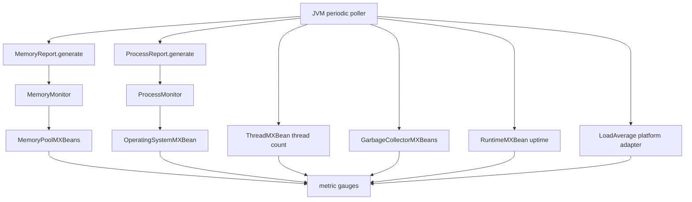

# Runtime Resource Monitoring: JVM and Process Metrics

This sub-module documents the Java MXBean-backed reports and their Ruby poller adapter. Java classes obtain snapshots with minimal policy; the Ruby `JVM` poller aggregates those snapshots into stable metric namespaces.

## Data path

## Java report and monitor responsibilities

* `MemoryMonitor` partitions memory pools into heap and non-heap maps and records current and peak init, committed, used, and maximum values. `MemoryReport.generate` returns both partitions in a simple map for JRuby consumption.
* `ProcessMonitor` reports open/max file descriptors on Unix, process CPU time and load, system CPU load, and committed virtual memory. Unsupported values use negative sentinel values. CPU-load method selection is reflective so Java 14+ can use `getCpuLoad` while older runtimes use `getSystemCpuLoad`; `JavaVersionUtils` supplies the version decision.
* `SystemMonitor` exposes static host identity/capacity data (OS name/version/architecture, available processors, and JVM-reported system load). It is a snapshot utility rather than a recurring poller.

## JVM metric mapping

`JVM#collect` emits:

| Namespace | Values |
|---|---|
| `jvm` | uptime in milliseconds |
| `jvm/memory/heap` | used, committed, max, peak values, plus calculated `used_percent` |
| `jvm/memory/non_heap` | used, committed, max, and peak values |
| `jvm/memory/pools/{young,old,survivor}` | aggregated pool values for common collector naming schemes |
| `jvm/threads` | live and peak thread counts |
| `jvm/process` | file descriptors, virtual memory, and process CPU |
| `jvm/process/cpu` | process percent, total CPU time, and load average |
| `jvm/gc/collectors/{young,old}` | collection count and time |

Pool names are normalized across CMS, Parallel GC, and G1 naming conventions. Unknown garbage-collector names are logged and do not create a classified gauge.

## Platform and container behavior

`LoadAverage.create` selects Linux `/proc/loadavg`, Windows no-op behavior, or the generic JVM operating-system bean. `Os` separately exposes cgroup data when the required files exist; missing files, unavailable controllers, and read failures degrade to absent or `-1` values and are logged at debug level. See [runtime_resource_monitoring_periodic_pollers.md](runtime_resource_monitoring_periodic_pollers.md) for scheduling and [metrics_and_instrumentation.md](metrics_and_instrumentation.md) for storage.

