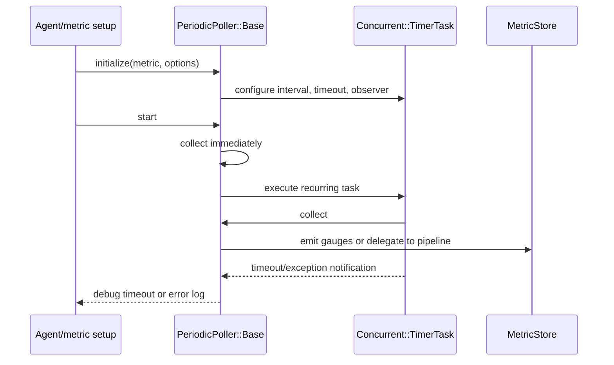
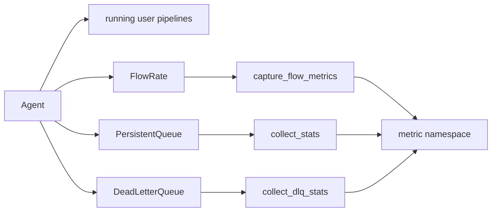

# Runtime Resource Monitoring: Periodic Pollers

This sub-module provides the recurring collection layer for runtime and pipeline-operational metrics. All collectors inherit from `LogStash::Instrument::PeriodicPoller::Base`, which schedules `collect` with `Concurrent::TimerTask`.

## Components

| Component | Responsibility |
|---|---|
| `Base` | Stores the metric sink, applies a five-second default interval and 120-second timeout, performs an immediate collection on `start`, and logs failures through the timer observer. |
| `JVM` | Collects JVM memory, garbage collection, thread counts, process metrics, uptime, and platform load average. |
| `Os` | Reads Linux cgroup CPU accounting/quota/throttling data and recursively emits it as gauges. |
| `Cgroup` | Detects supported cgroup controllers, reads `/proc/self/cgroup` and controller files, and supports Java system-property path overrides. |
| `LoadAverage` | Selects a platform implementation: `/proc/loadavg` on Linux, no value on Windows, or JVM MXBean data elsewhere. |
| `FlowRate` | Asks the agent and each running user pipeline to capture flow metrics. |
| `PersistentQueue` | Asks each running user pipeline to collect persistent-queue statistics. `queue_type` is retained by the collector for its surrounding registration/configuration. |
| `DeadLetterQueue` | Asks each running user pipeline to collect dead-letter-queue statistics. |

## Scheduling and failure behavior

`start` deliberately collects once before scheduling the recurring task, so newly exposed statistics do not wait for the first interval. A timeout is logged at debug level because JVM and OS calls can block on busy systems; other exceptions are logged as errors. `stop` shuts down the timer task.

## Pipeline-scoped collectors

The agent supplies `running_user_defined_pipelines`. Each collector skips nil pipeline entries and delegates collection to the pipeline object. This keeps pipeline-specific metric ownership with pipeline execution code while the poller controls cadence. The surrounding pipeline lifecycle and reporting responsibilities are documented in [pipeline_lifecycle_and_execution.md](pipeline_lifecycle_and_execution.md) and [pipeline_lifecycle_and_execution_reporting.md](pipeline_lifecycle_and_execution_reporting.md).

## Metric integration

Collectors write into the hierarchical metric API; see [metrics_and_instrumentation.md](metrics_and_instrumentation.md) and [metric_store_and_hierarchical_lookup.md](metric_store_and_hierarchical_lookup.md) for namespace lookup and storage. `JVM` and `Os` flatten nested hashes into gauge paths, preserving dimensions such as `jvm/memory/heap` and `os/cgroup/cpu`.

