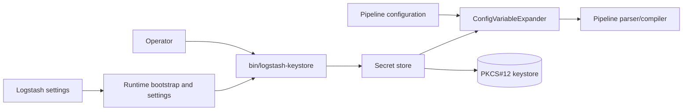
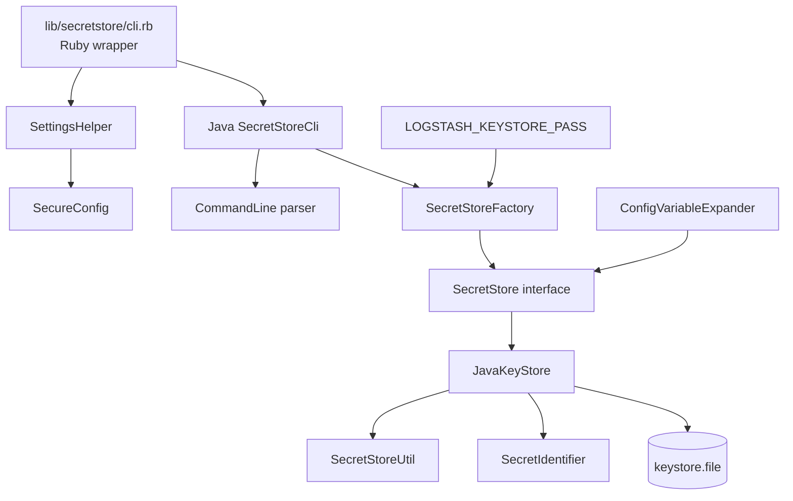
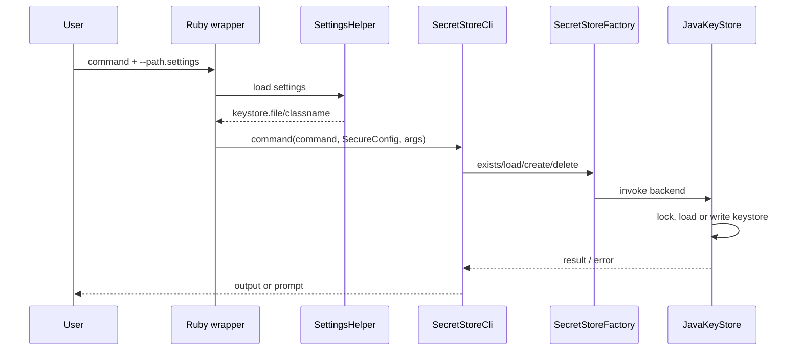

# Secret store

Logstash’s `secret_store` module provides the secure configuration-value path used by `bin/logstash-keystore` and by configuration variable expansion. It combines a Ruby/JRuby bootstrap wrapper with Java command handling and a pluggable `SecretStore` contract. The default implementation is `JavaKeyStore`, a file-backed PKCS#12 keystore.

## Position in Logstash

The module sits between startup/settings processing and pipeline configuration. Settings provide the keystore path and implementation class; the secret store supplies values when `${name}` references are expanded. Pipeline compilation consumes the expanded configuration, but does not own keystore persistence.



For settings ownership and startup sequencing, see [application_bootstrap_and_settings.md](application_bootstrap_and_settings.md). For configuration parsing and compilation, see [pipeline_configuration_parser.md](pipeline_configuration_parser.md) and [pipeline_ir_and_compilation.md](pipeline_ir_and_compilation.md).

## Architecture



### Sub-modules

| Sub-module | Role | Documentation |
| --- | --- | --- |
| CLI | Bootstraps settings, parses commands, prompts for values, and dispatches lifecycle or entry operations. | [secret_store_cli.md](secret_store_cli.md) |
| Backend and bridge | Implements the `SecretStore` contract, bridges JRuby callers, manages the PKCS#12 file, locking, password metadata, and sensitive buffers. | [secret_store_backend.md](secret_store_backend.md) |
| Password conversion | Converts supported password parameter strings into typed Java values and rejects empty or unsupported inputs. | [secret_store_passwords.md](secret_store_passwords.md) |
| Secure data utilities | Performs ASCII/Base64 conversion, best-effort zeroing, and reversible default-password obfuscation. | [secure_data_utilities.md](secure_data_utilities.md) |

## Main flows

### CLI lifecycle



### Secret resolution

```mermaid
flowchart TD
    VALUE[Configuration value `${name}`] --> ID[SecretIdentifier(name)]
    ID --> LOOKUP[SecretStore.retrieveSecret]
    LOOKUP --> FOUND{Found?}
    FOUND -- yes --> SECRET[Secret value\noptionally retained as SecretVariable]
    FOUND -- no --> ENVLOOKUP[Environment variable lookup]
    ENVLOOKUP --> DEFAULT{Default in `${name:default}`?}
    DEFAULT -- yes --> FALLBACK[Default value]
    DEFAULT -- no --> ERROR[Expansion error]
```

The lookup precedence is secret store, environment, then inline default. Secret identifiers are represented internally as versioned URNs (`urn:logstash:secret:v1:<key>`), while CLI users operate on the short key. CLI `add` enforces the documented key pattern; the identifier object also normalizes keys to lowercase.

## Operational and security notes

- `LOGSTASH_KEYSTORE_PASS` supplies an explicit keystore password. Without it, creation warns and can generate a default password whose obfuscated metadata is appended to the keystore file.
- `JavaKeyStore` reloads the file before operations and uses JVM locks plus an OS file lock while saving, so it is intended for low-volume configuration access rather than high-throughput storage.
- Secret values are represented as `char[]`/`byte[]` where possible and are cleared after conversions or persistence. This is best-effort memory hygiene; immutable `String` copies may still exist.
- The keystore marker entry (`keystore.seed`) distinguishes a Logstash keystore from an arbitrary PKCS#12 file; `list` hides this marker from users.
- `create` may overwrite an existing keystore only after confirmation. `add` validates identifiers, rejects empty/non-ASCII values, and confirms overwrites. `remove` reports missing identifiers.

## Extension points

`SecretStoreFactory` resolves the class named by `keystore.classname`, defaulting to `org.logstash.secret.store.backend.JavaKeyStore`. A replacement backend must implement the `SecretStore` lifecycle and entry-operation methods and honor the sensitive-config clearing contract. Consumers should use `SecretStoreExt` or the interface rather than coupling to the PKCS#12 implementation.
