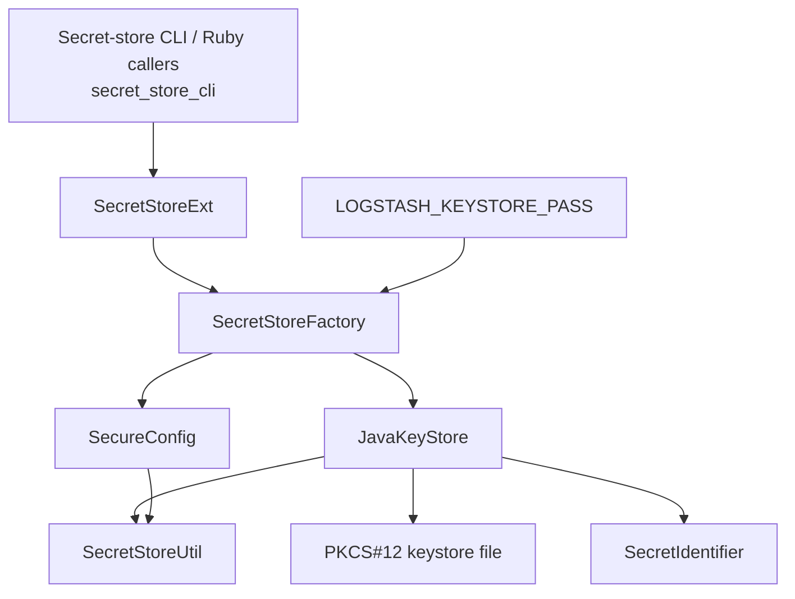
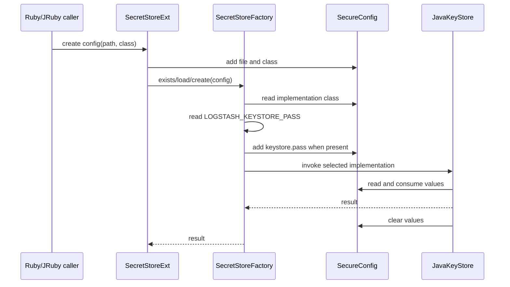
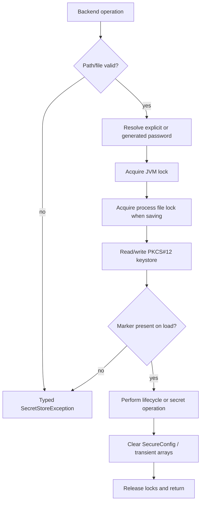
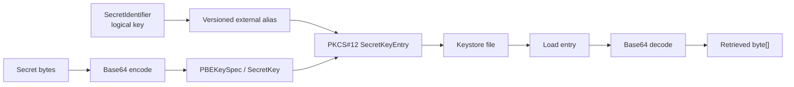

# Secret Store Backend

## Purpose

The `secret_store_backend` module provides Logstash’s file-backed secret-store implementation. It adapts the generic `SecretStore` contract to a Java PKCS#12 keystore, while minimizing the lifetime of passwords and secret bytes in memory.

The module is intended for configuration secrets and administrative operations rather than high-volume data storage. Its public surface is exposed to Ruby/JRuby through `SecretStoreExt`; implementation selection and credential injection are handled by `SecretStoreFactory`.

## Position in the system

The backend is a child module of the broader secret-store subsystem. The command-line and Ruby entry points are documented in [secret_store_cli.md](secret_store_cli.md), while low-level sensitive-data conversion is documented in [secure_data_utilities.md](secure_data_utilities.md).

## Architecture

| Component | Responsibility | Detailed documentation |
|---|---|---|
| `SecretStoreExt` | JRuby bridge; builds secure configuration from the keystore path, optional environment password, and implementation class; delegates existence/loading operations to the factory. | [keystore_operations_and_secure_data_handling.md](keystore_operations_and_secure_data_handling.md) |
| `SecretStoreUtil` | Converts between ASCII bytes/chars and Base64; clears arrays; provides reversible obfuscation used for transient values and embedded default-password metadata. | [keystore_operations_and_secure_data_handling.md](keystore_operations_and_secure_data_handling.md) |
| `JavaKeyStore` | Thread-safe PKCS#12 implementation of create, load, delete, list, persist, retrieve, contains, and purge operations. | [keystore_operations_and_secure_data_handling.md](keystore_operations_and_secure_data_handling.md) |

Supporting contracts are supplied by the surrounding secret-store package:

- `SecretStore` defines the lifecycle and CRUD operations implemented by `JavaKeyStore`.
- `SecretStoreFactory` selects the implementation using `keystore.classname`, defaults to `org.logstash.secret.store.backend.JavaKeyStore`, and injects `LOGSTASH_KEYSTORE_PASS` as `keystore.pass`.
- `SecureConfig` stores configuration values in obfuscated character buffers and clears them after backend lifecycle operations.
- `SecretIdentifier` maps logical keys to versioned external aliases such as `urn:logstash:secret:v1:db.pass`.
- `SecretStoreException` provides operation-specific failures for create, load, access, persist, retrieval, purge, and implementation errors.

## Configuration and credential flow

`SecretStoreExt.getConfig` creates a `SecureConfig` containing `keystore.file` and `keystore.classname`. The factory may add `keystore.pass` from `LOGSTASH_KEYSTORE_PASS` before reflective dispatch. The backend consumes the resulting configuration and clears it in lifecycle paths.

## Keystore lifecycle

### Create

The backend validates the path, rejects an existing file, resolves an explicit or generated password, creates a PKCS#12 keystore, and writes the Logstash marker alias `keystore.seed`. When no explicit password is supplied, it appends obfuscated password metadata and a one-byte length to the file. POSIX systems receive the default `rw-r--r--` permissions.

### Load and delete

Load opens the PKCS#12 file and verifies the marker alias; a file without that marker is rejected as not being a Logstash keystore. Delete is serialized and removes the configured file when present. Malformed files, bad passwords, missing paths, and permission failures become typed `SecretStoreException` subclasses.

## Secret operations

Logical identifiers become keystore aliases through `SecretIdentifier.toExternalForm()`. Secret values are stored as PBE-derived `SecretKey` entries:

- `persistSecret` overwrites an alias and clears the supplied secret byte array after saving.
- `retrieveSecret` returns `null` for an invalid/missing identifier or absent alias; otherwise it decodes the stored Base64 payload.
- `containsSecret` checks the alias after reloading the file.
- `list` reloads the keystore and converts aliases back into `SecretIdentifier` objects.
- `purgeSecret` deletes the alias and saves the keystore.

## Concurrency and file integrity

`JavaKeyStore` is thread-safe and serializes operations with a `ReentrantLock`. It reloads the file before operations so external changes are observed. During saves, non-Windows systems use a channel-level `FileLock`; Windows uses a separate append stream because the JDK keystore implementation rejects interaction with an already locked file.

Each operation works with the complete keystore file, so this backend is not intended for high-volume or large datasets.

## Sensitive-data handling

The implementation favors `char[]` and `byte[]` over long-lived Java `String` instances. `SecretStoreUtil` zeroes source arrays during conversions, clears arrays with `Arrays.fill`, and provides reversible XOR obfuscation for transient values and default-password metadata.

That obfuscation is not cryptographic security. PKCS#12 password protection provides keystore confidentiality; obfuscation only reduces casual exposure of transient/default-password metadata.

## Error and validation boundaries

Important failure cases include missing or empty `keystore.file`, empty explicit passwords, unreadable or malformed keystores, incorrect passwords or permissions, file-lock contention, invalid implementation classes, and invalid secret identifiers. Callers should use typed exception categories to distinguish configuration, access, lifecycle, and per-secret failures. CLI dispatch remains documented in [secret_store_cli.md](secret_store_cli.md).

## Maintenance invariants

1. A valid Logstash keystore contains the `keystore.seed` marker.
2. Consumed `SecureConfig` values are cleared.
3. Secret byte arrays passed to `persistSecret` are cleared after persistence.
4. Saves remain serialized across threads and processes.
5. External aliases round-trip through `SecretIdentifier`.
6. Existing default-password metadata remains readable.
