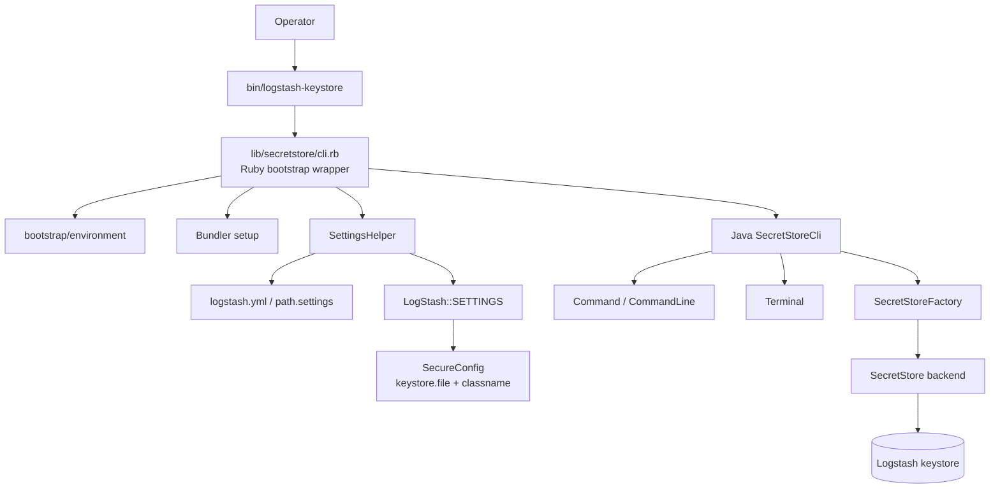
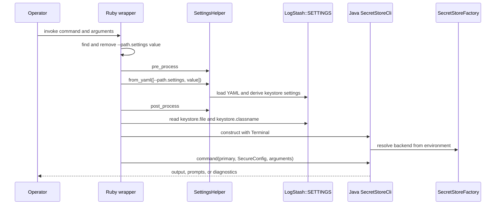
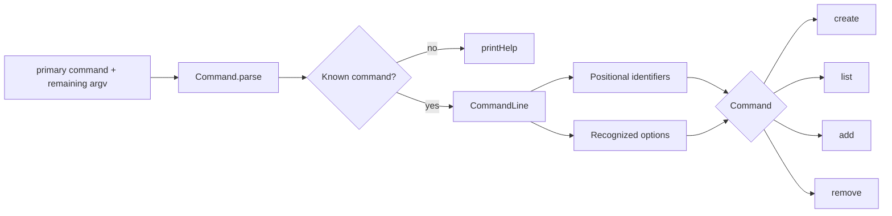
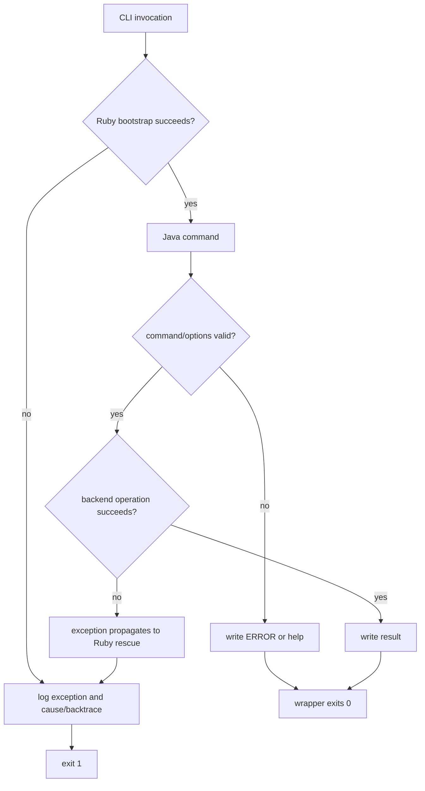
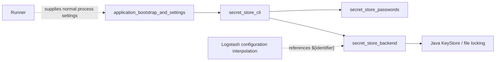

# Secret store CLI

The `secret_store_cli` module implements Logstash’s `bin/logstash-keystore` command-line interface. It loads Logstash settings, resolves the configured secret-store backend, parses a small command language, and performs keystore creation, listing, insertion, and removal through a terminal-oriented Java service.

The module is deliberately thin. Ruby owns process bootstrap and settings resolution; Java owns command parsing, prompts, validation, and secret-store operations. Keystore persistence and password conversion are delegated to [secret_store_backend.md](secret_store_backend.md) and [secret_store_passwords.md](secret_store_passwords.md).

## Architecture



### Responsibilities

| Component | Responsibility |
| --- | --- |
| `LogStash::SecretStoreCli` (Ruby) | Initializes the JRuby process, removes `--path.settings` from the command arguments, loads settings, creates `SecureConfig`, and translates exceptions into logging plus exit status. |
| `SecretStoreCli` (Java) | Dispatches `create`, `list`, `add`, and `remove`; prints help and diagnostics; performs prompts and input validation. |
| `CommandLine` | Separates positional arguments from recognized options and rejects options invalid for the selected command. |
| `Terminal` | Abstracts line output, confirmation input, and secret input. |
| `SecretStoreFactory` | Selects and constructs the configured secret-store implementation. |
| `SecretStore` | Backend contract used for existence checks, loading, listing, persistence, retrieval, and purging. |
| `SecretStoreUtil` | Converts and clears secret byte arrays; see [secret_store_backend.md](secret_store_backend.md). |

The settings lifecycle belongs to the broader [application_bootstrap_and_settings.md](application_bootstrap_and_settings.md) module. The CLI only consumes its result: it does not own the general Logstash startup or pipeline configuration lifecycle.

## Startup and configuration flow



`--path.settings` is a bootstrap option, not a Java command option. The Ruby wrapper removes it before passing the remaining arguments to Java. It also rejects a missing value and exits with status `1`. The settings helper then derives the keystore path from the selected settings directory; the default settings define `keystore.classname` as `org.logstash.secret.store.backend.JavaKeyStore` and place the keystore under the Logstash config directory.

The `SecureConfig` object contains sensitive configuration values. Backend calls generally receive a clone, and backend loading clears configuration values after use. Password sourcing and conversion details are documented in [secret_store_passwords.md](secret_store_passwords.md).

## Command model



The supported commands and options are:

| Command | Positional values | Additional option | Behavior |
| --- | --- | --- | --- |
| `create` | none | `--help` | Creates a new store; asks before overwriting an existing store. |
| `list` | none | `--help` | Lists sorted secret identifiers, excluding the internal Logstash marker. Secret values are never printed. |
| `add` | one or more identifiers | `--help`, `--stdin` | Reads one secret per identifier from the terminal, validates it, and persists it. `--stdin` is accepted for compatibility but has no behavioral effect. |
| `remove` | one or more identifiers | `--help` | Removes each existing identifier and reports missing identifiers. |

Every command accepts `--help`. Unknown `--...` arguments, including options not valid for the selected command, produce an error without executing the operation. Positional arguments are collected up to the first recognized command option, while option parsing scans all supplied arguments.

## Command behavior

### `create`

The command checks whether the configured store exists. If it does, the operator must answer `y` or `yes` before replacement. When the `LOGSTASH_KEYSTORE_PASS` environment variable is absent, creation emits a warning and requires explicit confirmation to continue without password protection. A confirmed creation deletes the existing store if present and creates a fresh store through the factory.

The backend creates its identifying marker and controls file-level protection. See [secret_store_backend.md](secret_store_backend.md) for the Java keystore implementation and locking behavior.

### `list`

`list` loads the store, obtains `SecretIdentifier` objects, filters out `SecretStoreFactory.LOGSTASH_MARKER`, extracts keys, sorts them lexicographically, and writes one identifier per line. It exposes metadata only; it does not retrieve or display secret values.

### `add`

The command requires an existing keystore. Each identifier must match `ConfigVariableExpander.KEY_PATTERN`; invalid names raise an argument error and abort the current invocation. For an existing identifier, the current value is retrieved only to determine existence and is immediately cleared with `SecretStoreUtil.clearBytes`.

Each new value is read with `Terminal.readSecret()` and must satisfy both rules:

- it is non-empty;
- it can be encoded as US-ASCII.

The accepted character restriction is intentional: the CLI converts the character array to ASCII bytes before calling `persistSecret`. After persistence, the byte array is cleared. Multiple identifiers are processed sequentially, so a later failure can leave earlier additions committed.

### `remove`

The command loads the store and processes each identifier independently. Existing entries are purged and acknowledged; absent entries produce an error line. The implementation does not apply the add-command key-pattern validation before constructing a `SecretIdentifier`, so backend/identifier validation remains relevant for removal inputs.

## Data and security flow

```mermaid
flowchart TD
    INPUT[Terminal.readSecret] --> CHARS[char[] secret]
    CHARS --> NONEMPTY{non-empty?}
    NONEMPTY -- no --> REJECT1[error and retry]
    NONEMPTY -- yes --> ASCII{US-ASCII encodable?}
    ASCII -- no --> REJECT2[error and retry]
    ASCII -- yes --> BYTES[ASCII byte[]]
    BYTES --> STORE[SecretStore.persistSecret]
    STORE --> CLEAR[SecretStoreUtil.clearBytes]
    CLEAR --> DONE[confirmation]
    EXISTING[SecretStore.retrieveSecret] --> CLEAR_EXISTING[clear retrieved bytes]
    CLEAR_EXISTING --> PROMPT[overwrite confirmation]
    PROMPT --> STORE
```

The CLI avoids printing secret values and clears temporary byte arrays after use. Java `char[]` input is held while the value is validated and converted; the backend is responsible for clearing or protecting its own derived material. The CLI’s ASCII check is separate from keystore encryption: it is an input policy, while encryption, password handling, and file permissions belong to the backend modules.

## Error and exit behavior



There are two diagnostic paths. Java-level command validation generally writes an error and returns from `command`; because the Ruby wrapper then executes `exit 0`, those expected usage errors may still produce process status `0`. Failures raised by settings loading, backend operations, invalid add identifiers, or other unexpected exceptions reach the Ruby rescue block, are logged with cause and backtrace, and produce status `1`.

This distinction matters to scripts: callers should inspect command output for some usage errors and reserve exit status `1` as the signal for bootstrap or exceptional failure.

## Dependencies and integration boundaries



- [application_bootstrap_and_settings.md](application_bootstrap_and_settings.md) owns settings registration, YAML loading, defaults, and post-processing.
- [secret_store_backend.md](secret_store_backend.md) owns the `SecretStore` abstraction, factory integration, Java KeyStore persistence, marker validation, file locking, and backend exceptions.
- [secret_store_passwords.md](secret_store_passwords.md) owns password parameter conversion and password-related secret material handling.
- Configuration consumers interpolate stored identifiers such as `${my-secret}`; pipeline parsing and execution are documented in [pipeline_configuration_parser.md](pipeline_configuration_parser.md) and [pipeline_lifecycle_and_execution.md](pipeline_lifecycle_and_execution.md).

The CLI therefore sits at the operational edge of the secret-store subsystem. It is not used during ordinary event processing; it prepares or administers encrypted configuration material that other Logstash components later resolve.

## Operational examples

```text
bin/logstash-keystore create
bin/logstash-keystore --path.settings /etc/logstash create
bin/logstash-keystore add elastic-password api-token
bin/logstash-keystore list
bin/logstash-keystore remove api-token
bin/logstash-keystore add --help
```

The `--path.settings` directory should be the same directory used for `logstash.yml`. The `add --stdin` option is accepted for command-line compatibility, but this implementation still obtains values through the terminal abstraction’s default secret-input path.

## Maintenance notes

Changes to command names, option validity, prompts, or exit behavior belong in `SecretStoreCli.java`. Changes to settings discovery or `--path.settings` preprocessing belong in `lib/secretstore/cli.rb` and should remain aligned with [application_bootstrap_and_settings.md](application_bootstrap_and_settings.md). Changes to storage format, password semantics, or byte clearing belong in the linked backend/password modules.

Tests should cover command parsing independently from terminal interaction, confirmation branches, marker filtering, identifier validation, ASCII rejection, overwrite behavior, missing-store behavior, and the Ruby wrapper’s settings/exit handling.
