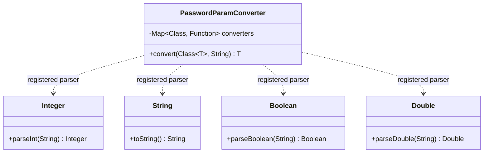
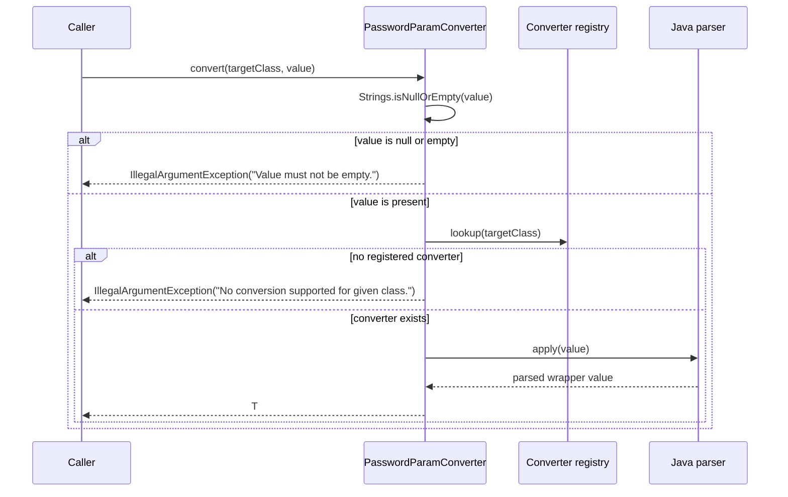
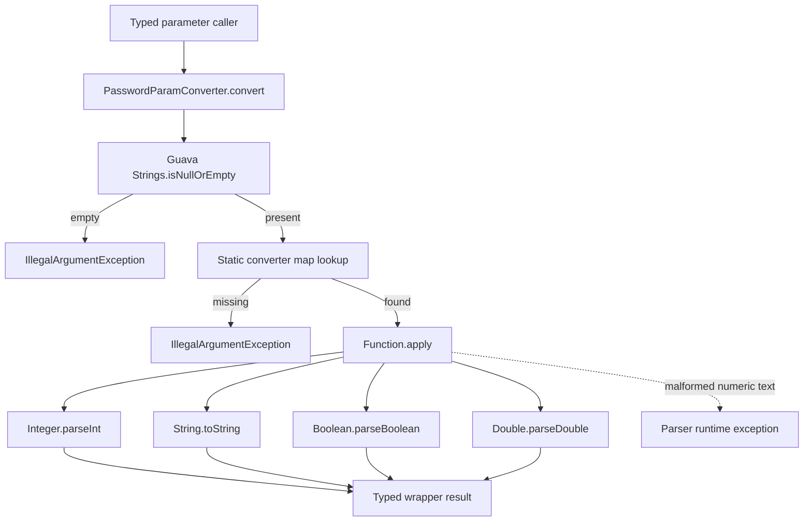
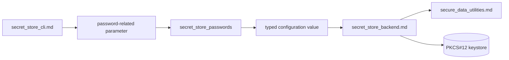
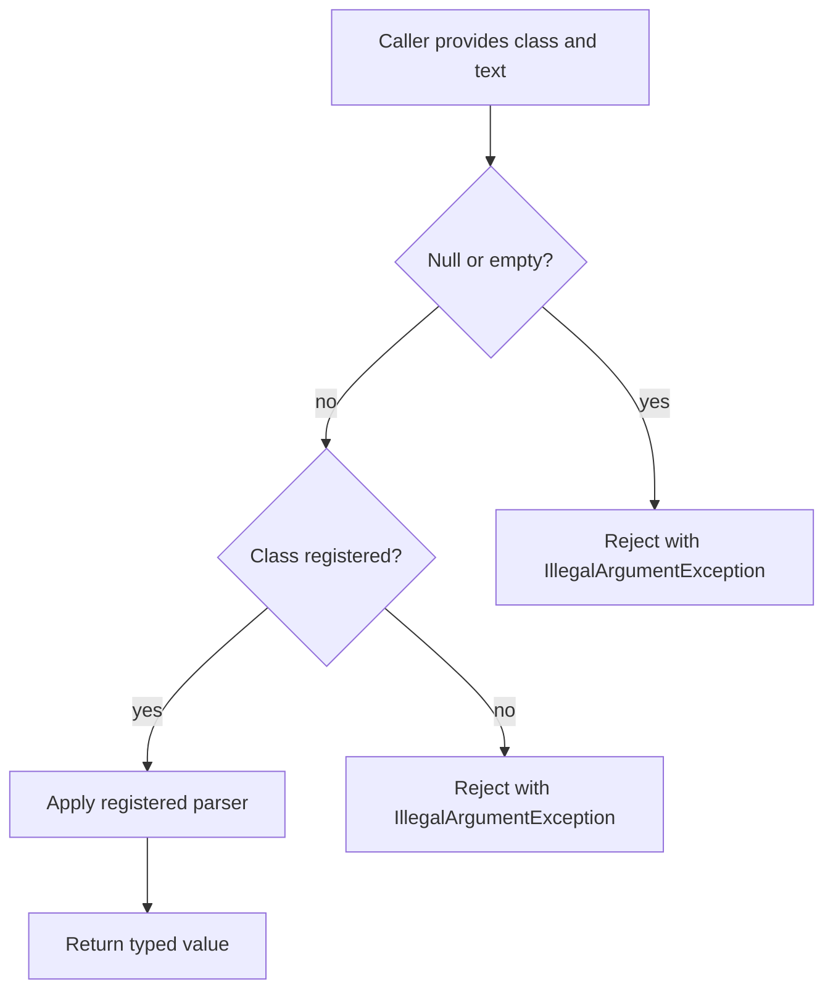
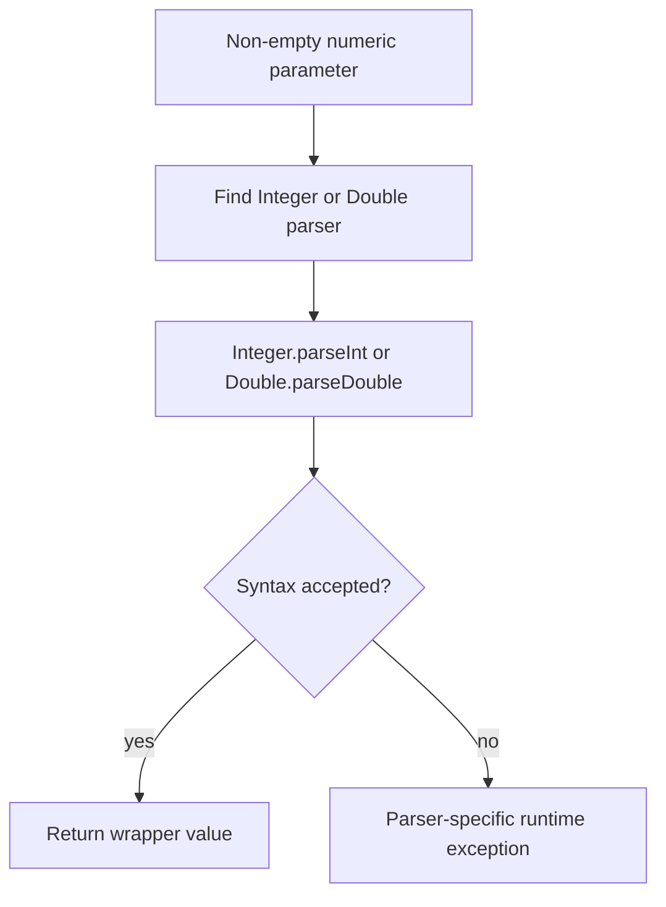

# Secret Store Passwords

## Introduction

The `secret_store_passwords` module provides the typed conversion boundary for password-related parameters in Logstash’s secret-store implementation. Its only component, `PasswordParamConverter`, converts a non-empty textual parameter into one of four supported Java wrapper types: `Integer`, `String`, `Boolean`, or `Double`.

The class does not store passwords, encrypt values, validate password strength, or access the keystore. Keystore persistence and password protection are owned by [secret_store_backend.md](secret_store_backend.md), while buffer conversion and clearing are covered by [secure_data_utilities.md](secure_data_utilities.md). The command-line entry point and operator-facing input rules are documented in [secret_store_cli.md](secret_store_cli.md).

## Position in the system

`PasswordParamConverter` sits at the boundary between string-valued configuration/command parameters and typed Java APIs. A caller supplies the desired target class explicitly; the converter selects a registered parser and returns the parsed value.

```mermaid
flowchart LR
    INPUT[Password-related parameter\nString value] --> CONVERTER[PasswordParamConverter]
    TARGET[Requested Java wrapper\nClass&lt;T&gt;] --> CONVERTER
    CONVERTER --> RESULT[Typed value\nInteger | String | Boolean | Double]
    CONVERTER --> ERROR[IllegalArgumentException\nempty or unsupported input]
    RESULT --> CONSUMER[Secret-store or configuration consumer]
```

This module is a child of the broader `secret_store` area and is independent of the backend implementation. The dependency relationship is therefore one-way: callers may use the converter before invoking backend operations, but the converter does not construct or load `JavaKeyStore` instances.

## Architecture

There is one public class and one private registry:

| Component | Responsibility |
|---|---|
| `org.logstash.secret.password.PasswordParamConverter` | Validates that the input is non-empty, resolves a converter for the requested class, applies it, and returns the typed result. |
| `converters` (private static map) | Maps supported `Class` objects to `Function<String, ?>` parser functions. |

The registry is initialized once when the class is loaded. It is private static state and is not exposed for runtime extension.



## Supported conversions

The supported mapping is fixed by the static initializer:

| Requested class | Conversion function | Result behavior |
|---|---|---|
| `Integer.class` | `Integer::parseInt` | Parses a base-10 signed integer according to Java’s parser. |
| `String.class` | `String::toString` | Returns the supplied string value. |
| `Boolean.class` | `Boolean::parseBoolean` | Returns `true` only for a case-insensitive `"true"`; other non-empty text becomes `false` according to Java semantics. |
| `Double.class` | `Double::parseDouble` | Parses a floating-point value according to Java’s parser. |

The generic method signature, `convert(Class<T> klass, String value)`, communicates the requested result type to callers. Internally, the registry is raw and the result is cast back to `T`; correctness depends on the class-to-function registrations remaining aligned.

Unsupported classes—including primitive types such as `int.class`, `boolean.class`, and `double.class`—are rejected. The converter registers wrapper classes only.

## Conversion process



The empty-value check occurs before class lookup. Consequently, a call with both an unsupported class and an empty value reports the empty-value error first.

## API contract

### `convert(Class<T> klass, String value)`

**Inputs**

- `klass`: the requested wrapper class. The implementation supports `Integer.class`, `String.class`, `Boolean.class`, and `Double.class`.
- `value`: the textual parameter to parse. It must be neither `null` nor the empty string.

**Output**

Returns a value of the requested generic type `T`. For `String.class`, the returned value is the same textual content; no trimming, normalization, or secret redaction is performed.

**Failures**

- `IllegalArgumentException("Value must not be empty.")` when `value` is `null` or empty.
- `IllegalArgumentException("No conversion supported for given class.")` when no parser is registered for `klass`.
- Parser-specific runtime failures for syntactically invalid numeric values. For example, invalid integer text is rejected by `Integer.parseInt`, and invalid floating-point text is rejected by `Double.parseDouble`.

`Boolean.parseBoolean` is deliberately permissive: arbitrary non-empty strings do not raise a parse exception and normally produce `false`. Callers requiring strict boolean syntax must validate before or after calling this method.

## Data-flow and dependency relationships



Direct dependencies are intentionally minimal:

- Guava `Strings` supplies the null-or-empty check.
- `java.util.HashMap` and `java.util.Map` hold the parser registry.
- `java.util.function.Function` represents each parser.
- `java.util.Objects` checks whether a parser was found.
- Java wrapper parsers perform the actual conversion.

The converter has no direct dependency on `SecretStoreUtil`, `JavaKeyStore`, `SecretStoreExt`, or the Ruby CLI wrapper. Those components belong to adjacent modules and are linked here only at the system boundary:



The dotted conceptual relationship is important: converting a password parameter into a `String` or numeric wrapper does not itself make the value secure. Sensitive buffer handling, keystore encryption, and file locking remain responsibilities of the linked modules.

## Process flows and operational behavior

### Successful conversion



### Invalid numeric input



There is no retry, logging, masking, or fallback behavior in this class. Error policy belongs to the caller that owns the surrounding command or configuration lifecycle.

## Security considerations

The class name reflects its use in a password-related subsystem, but the implementation is a converter rather than a security primitive.

- Values arrive as immutable `String` instances and may remain subject to JVM garbage-collection behavior after conversion.
- The class does not clear inputs, because it does not receive mutable character or byte buffers.
- The `String` conversion does not copy or protect the input.
- Numeric conversion may expose parser error details through exceptions if callers surface them directly.
- Encryption, password derivation, keystore protection, and sensitive-array cleanup are documented in [secret_store_backend.md](secret_store_backend.md) and [secure_data_utilities.md](secure_data_utilities.md).

Callers handling actual secret material should keep the conversion boundary narrow and avoid logging the source value or converted result. Where mutable buffers are available, use the secure-data utilities and backend lifecycle contracts rather than introducing additional `String` copies.

## Maintenance guidance

When extending the converter:

1. Add a wrapper-class registration and a parser with behavior compatible with the public generic contract.
2. Decide whether malformed input should propagate the parser’s exception or be translated into a stable module-level error.
3. Add tests for null, empty, unsupported wrapper and primitive classes, valid values, whitespace, overflow, malformed numeric input, and Boolean’s permissive behavior.
4. Update this table and the architecture diagram whenever the supported type set changes.

Changing keystore password storage, generated-password metadata, or secure buffer handling belongs in [secret_store_backend.md](secret_store_backend.md) and [secure_data_utilities.md](secure_data_utilities.md), not in this converter.

## Summary

`PasswordParamConverter` is a small, static, registry-driven adapter from non-empty strings to four Java wrapper types. Its main invariants are a fixed supported-type set, empty-input rejection before lookup, propagation of parser semantics, and no ownership of persistence or cryptographic concerns. It enables typed parameter consumption while leaving secret storage and memory hygiene to the neighboring secret-store modules.
