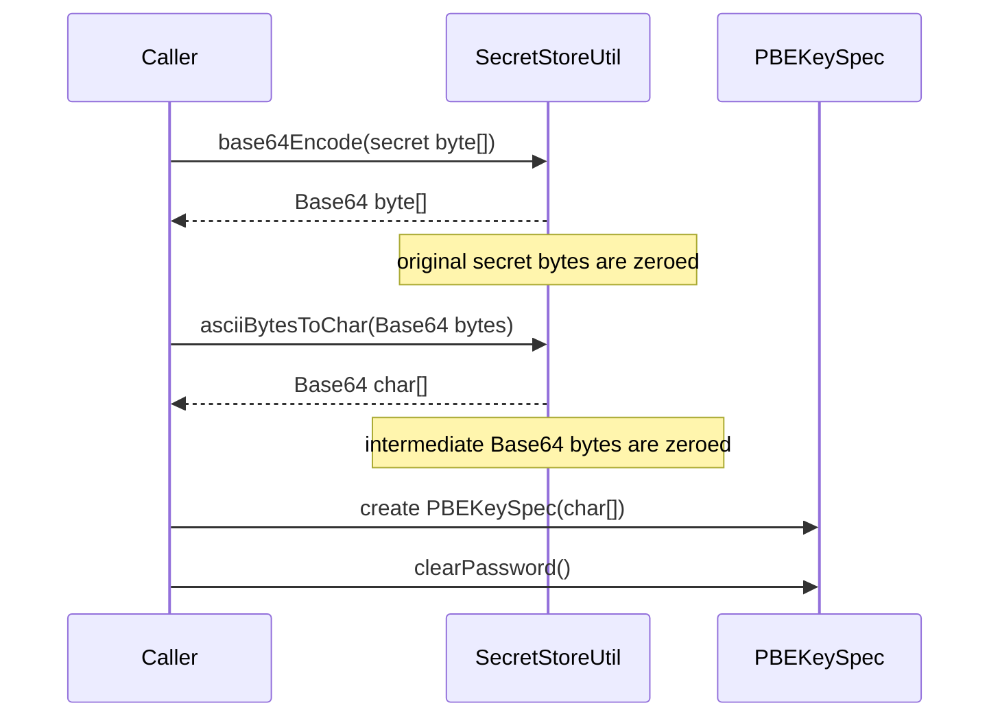
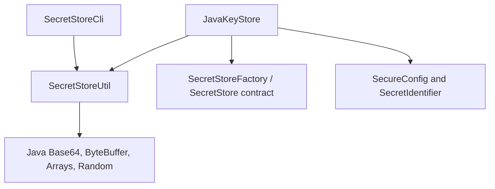
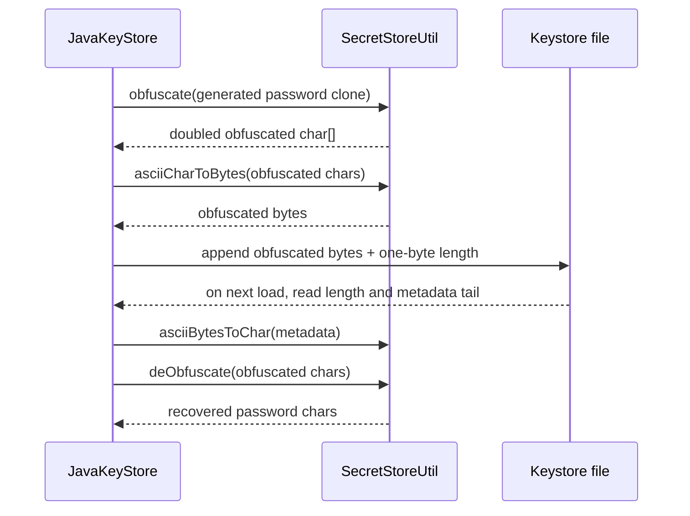

# Secure data utilities

`secure_data_utilities` is the low-level buffer and representation utility used by Logstash’s secret-store implementation. `SecretStoreUtil` converts between ASCII `char[]` and `byte[]`, performs Base64 transformations, clears sensitive arrays, and implements the reversible obfuscation used for the default keystore-password metadata.

It does not provide encryption, key management, authentication, or secure memory outside the arrays it directly receives. The keystore lifecycle and persistence model belong to [keystore_backend.md](keystore_backend.md); command-line input and validation belong to [secret_store_cli.md](secret_store_cli.md).

## Scope and position in the system

```mermaid
flowchart TB
    CLI[secret_store_cli\noperator input] --> CONVERT[SecretStoreUtil\nchar[] ⇄ byte[]]
    CONVERT --> STORE[keystore_backend\nJavaKeyStore]
    STORE --> B64[Base64 representation\nfor PBE key material]
    STORE --> OBF[default-password metadata\nobfuscate / deObfuscate]
    STORE --> FILE[(PKCS#12 keystore file)]
    CONFIG[secret-store configuration] --> STORE
    RESOLVE[configuration secret resolution] --> STORE
```

The utility is a static class in `org.logstash.secret.store`. It has no instance state exposed to callers; its only internal state is a shared `java.util.Random` used by `obfuscate(char[])`.

## Responsibilities and boundaries

| Area | `SecretStoreUtil` provides | Responsibility it does not provide |
| --- | --- | --- |
| Character/byte conversion | Direct ASCII-oriented casts and source-array clearing | ASCII validation or charset decoding |
| Encoding | Base64 encode/decode helpers with source clearing on successful transformation | Confidentiality; Base64 is reversible encoding |
| Memory hygiene | Best-effort zeroing of caller-provided `char[]` and `byte[]` | Control over copies made by the JVM, libraries, or immutable `String` values |
| Password metadata | Reversible XOR-plus-random obfuscation | Cryptographic protection; the source explicitly describes it as non-security obfuscation |
| Store operations | None | Keystore creation, loading, locking, aliases, persistence, and retrieval |

## API reference

All methods are `public static`; the class has a private constructor and is intended to be used as a utility namespace.

| Method | Input → result | Source-array effect | Primary use |
| --- | --- | --- | --- |
| `asciiBytesToChar(byte[])` | ASCII-oriented bytes → `char[]` | Every input byte is set to `0` | Turn encoded bytes into a password/PBE character array |
| `asciiCharToBytes(char[])` | ASCII-oriented chars → `byte[]` | Every input char is set to `\0` | Convert terminal or keystore character buffers to bytes |
| `base64Encode(byte[])` | bytes → Base64 bytes | Clears input after successful `Base64.getEncoder().encode` | Encode secret values and marker data |
| `base64EncodeToChars(byte[])` | bytes → Base64 `char[]` | Clears the original bytes and the intermediate encoded bytes | Produce ASCII-compatible password characters |
| `base64Encode(char[])` | chars → Base64 `char[]` | Clears the input chars | Encode non-ASCII-capable password material into ASCII form |
| `base64Decode(byte[])` | Base64 bytes → decoded bytes | Clears input after successful decode | Recover stored secret bytes |
| `base64Decode(char[])` | Base64 chars → decoded bytes | Clears input chars and the intermediate bytes on successful decode | Recover values from PBE character material |
| `clearChars(char[])` | array → `void` | Fills all elements with `\0` | Explicit cleanup by callers |
| `clearBytes(byte[])` | array → `void` | Fills all elements with byte `0` | Explicit cleanup by callers |
| `obfuscate(char[])` | chars → doubled-length obfuscated `char[]` | Clears the input and temporary byte buffer | Store default keystore-password metadata |
| `deObfuscate(char[])` | obfuscated chars → original chars | Clears the input and intermediate decoded bytes | Read default keystore-password metadata |

The conversion methods do not verify that values are ASCII. They narrow each `char` or `byte` directly. Callers that require ASCII must validate first; the CLI does this before invoking `asciiCharToBytes`, while the keystore password path checks encodability before deciding whether to Base64-encode.

## Conversion and clearing flow

```mermaid
flowchart LR
    C[char[]] -->|asciiCharToBytes| B[byte[]]
    C -->|base64Encode| CB[Base64 char[]]
    B -->|base64Encode| E[Base64 byte[]]
    E -->|asciiBytesToChar| EC[Base64 char[]]
    E2[Base64 byte[]] -->|base64Decode| D[decoded byte[]]
    CB -->|base64Decode| D
    B -. source zeroed .-> ZB((cleared))
    C -. source zeroed .-> ZC((cleared))
```

### Mutation contract

These helpers intentionally consume their input buffers. A caller must not use an input array after passing it to a conversion method, except to observe that it has been cleared. This is visible in the keystore path:



`JavaKeyStore.persistSecret` also clears its input in a `finally` block, and the CLI clears the byte array after persistence. This layered cleanup is intentional, but it does not eliminate transient copies created by `Base64`, `PBEKeySpec`, the JCA provider, or logging/runtime infrastructure. Avoid converting secrets to `String` before using this API.

## Base64 behavior

`base64Encode` and `base64Decode` delegate to Java’s standard Base64 encoder/decoder. The returned array is a new allocation, while the supplied array is cleared only after the delegated operation returns successfully.

Consequences for callers:

- Base64 is an interoperability representation, not encryption.
- Invalid Base64 input raises the decoder’s runtime exception; because decoding occurs before `clearBytes`, the original byte input is not guaranteed to be cleared on that failure path.
- Null inputs are not handled specially and will fail through the underlying array or Base64 operations.
- The char overloads first perform the ASCII-oriented narrowing conversion, so non-ASCII characters must be rejected or deliberately normalized by the caller.

## Obfuscation format

`obfuscate(char[])` is used only for the generated/default keystore password appended by `JavaKeyStore`. It uses a shared `Random` to create one random byte per input byte, then writes:

```text
obfuscated = (input_byte XOR random_byte)[0..n-1] || random_byte[0..n-1]
```

The result is therefore `2n` bytes represented as ASCII-oriented chars. `deObfuscate` converts those chars back to bytes, splits the array in half, and XORs the first half with the second half to recover the original value.

```mermaid
flowchart TD
    INPUT[password char[] length n] --> TOBYTES[asciiCharToBytes]
    TOBYTES --> RANDOM[Random bytes length n]
    TOBYTES --> XOR[(input XOR random)]
    RANDOM --> JOIN[concatenate XOR half + random half]
    XOR --> JOIN
    JOIN --> CHARS[asciiBytesToChar]
    CHARS --> TAIL[(keystore metadata)]
    TAIL --> SPLIT[split into two equal halves]
    SPLIT --> RECOVER[first half XOR second half]
    RECOVER --> OUTPUT[original password chars]
```

The format is reversible for anyone who can read the metadata and is explicitly not a security mechanism. It deters casual inspection only. The trailing length byte and file placement are managed by `JavaKeyStore.saveKeyStore` and `getKeyStorePassword`, not by this utility. See [keystore_backend.md](keystore_backend.md) for the complete file format and lifecycle.

## Dependency and usage relationships



### `JavaKeyStore` integration

`JavaKeyStore` uses the utility to:

1. Encode the internal marker and persisted secret bytes as Base64 before creating `PBEKeySpec` values.
2. Convert Base64 bytes to the ASCII `char[]` expected by the PBE API.
3. Decode retrieved PBE material back to secret bytes.
4. Obfuscate generated keystore passwords before appending metadata and de-obfuscate them when loading a passwordless store.
5. Clear sensitive inputs and intermediate arrays during create, persist, retrieve, and save paths.

### `SecretStoreCli` integration

For `add`, the CLI reads a secret into `char[]`, validates that it is non-empty and ASCII-encodable, converts it with `asciiCharToBytes`, and passes the resulting bytes to the backend. Existing retrieved values are cleared before overwrite confirmation. The CLI never prints secret values; its command behavior is documented in [secret_store_cli.md](secret_store_cli.md).

## Process flows

### Persisting a secret

```mermaid
flowchart TD
    INPUT[caller owns secret byte[]] --> ENC[base64Encode]
    ENC --> CHARS[asciiBytesToChar]
    CHARS --> PBE[create PBEKeySpec and SecretKey]
    PBE --> ENTRY[store SecretKeyEntry in JavaKeyStore]
    ENTRY --> SAVE[persist keystore]
    SAVE --> CLEAN[clear PBE password and caller bytes]
    ENC -. on successful encode .-> CLEAN
```

### Retrieving a secret

```mermaid
flowchart TD
    ID[SecretIdentifier] --> LOAD[JavaKeyStore loads entry]
    LOAD --> SPEC[extract PBEKeySpec password chars]
    SPEC --> DEC[base64Decode]
    DEC --> RESULT[return decoded byte[]]
    SPEC --> CLEAR[clear PBE password]
    DEC -. encoded input cleared on success .-> CLEAR
    LOAD -->|missing alias| NULL[return null]
```

### Default-password metadata



## Security and maintenance guidance

The utility improves hygiene by favoring mutable arrays and clearing buffers, but zeroing is best effort: Java does not guarantee immediate memory erasure, and immutable strings or provider-owned copies may remain. Treat every returned array as sensitive and clear it when ownership ends.

When changing this class or its callers:

- Preserve the consume-and-clear contract or update every caller that depends on it.
- Keep the obfuscation format compatible with existing passwordless keystores; changing it requires a migration strategy in [keystore_backend.md](keystore_backend.md).
- Do not replace `obfuscate` with language suggesting encryption or protection.
- Add failure-path tests for invalid Base64 and malformed/odd-length obfuscation input.
- Test that successful conversions clear their inputs, that round trips preserve ASCII data, and that the keystore can still load default-password metadata.
- Use a cryptographically secure design and separately managed key material if stronger protection is required; this utility’s `Random`-based obfuscation is not suitable for that purpose.

## Source reference

Primary implementation: `logstash-core/src/main/java/org/logstash/secret/store/SecretStoreUtil.java` (`org.logstash.secret.store.SecretStoreUtil`).
