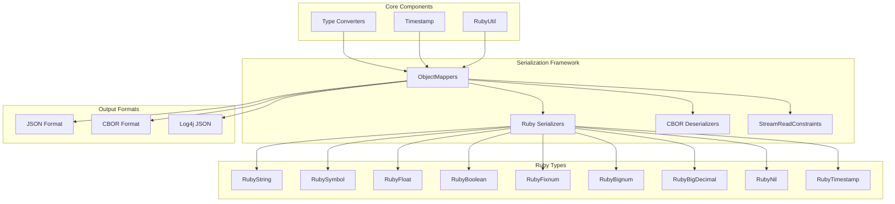
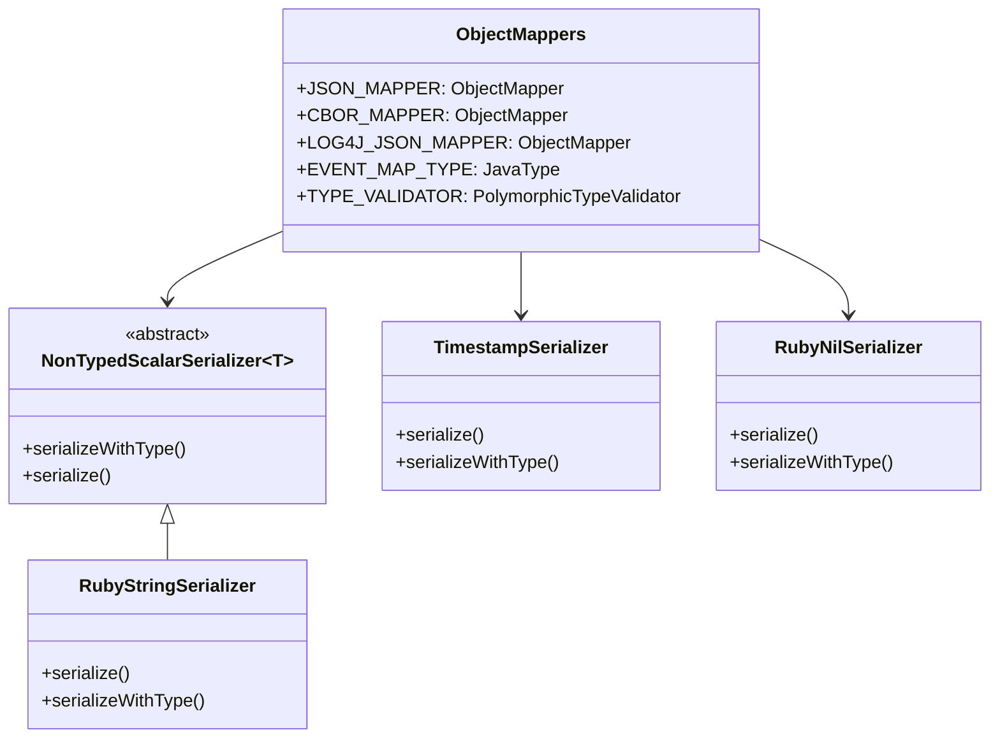
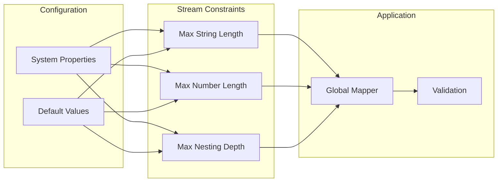
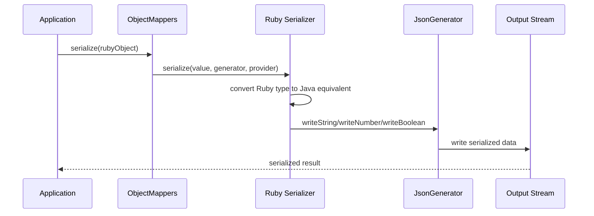
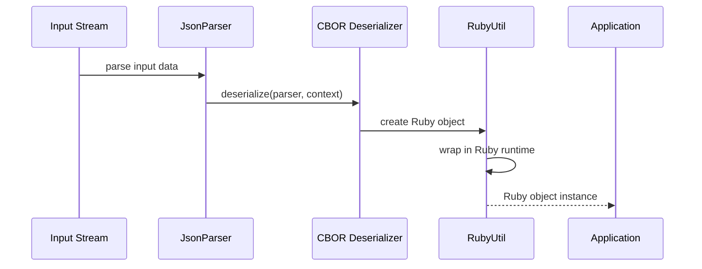
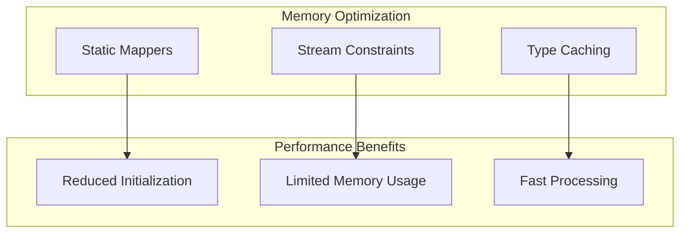

# Serialization Framework Module

## Overview

The Serialization Framework module provides comprehensive JSON and CBOR serialization capabilities for Logstash's core data structures. It serves as the central serialization layer that handles the conversion between Java objects, Ruby objects, and various serialized formats, enabling seamless data interchange across Logstash's multi-language architecture.

## Core Purpose

This module bridges the gap between Java and Ruby object representations by providing:
- **Unified Serialization**: Consistent serialization across JSON and CBOR formats
- **Ruby-Java Integration**: Seamless conversion between Ruby and Java object types
- **Type Safety**: Polymorphic type handling with configurable validation
- **Performance Optimization**: Efficient serialization with minimal overhead
- **Stream Constraints**: Configurable limits for secure data processing

## Architecture Overview



## Component Details

### ObjectMappers Class

The `ObjectMappers` class is the central hub of the serialization framework, providing pre-configured Jackson `ObjectMapper` instances for different serialization needs.

#### Key Features

1. **Multiple Mapper Types**:
   - `JSON_MAPPER`: Standard JSON serialization
   - `CBOR_MAPPER`: Binary CBOR serialization with type information
   - `LOG4J_JSON_MAPPER`: Specialized JSON mapper for logging

2. **Ruby Type Support**: Custom serializers for all Ruby primitive types
3. **Type Safety**: Polymorphic type validation and handling
4. **Stream Constraints**: Configurable limits for secure processing

#### Serializer Architecture



### Ruby Type Serializers

The framework includes specialized serializers for each Ruby type:

#### Scalar Type Serializers
- **RubyStringSerializer**: Converts Ruby strings to JSON strings
- **RubySymbolSerializer**: Serializes Ruby symbols as strings
- **RubyFloatSerializer**: Handles Ruby float to JSON number conversion
- **RubyBooleanSerializer**: Converts Ruby boolean values
- **RubyFixnumSerializer**: Serializes Ruby integers as JSON numbers

#### Complex Type Serializers
- **RubyBignumSerializer**: Handles arbitrary precision integers
- **RubyBigDecimalSerializer**: Manages high-precision decimal numbers
- **RubyNilSerializer**: Special handling for Ruby nil values
- **TimestampSerializer**: ISO8601 timestamp serialization
- **RubyTimestampSerializer**: Ruby timestamp wrapper serialization

### Stream Read Constraints

The `StreamReadConstraintsUtil` provides configurable security constraints for JSON/CBOR parsing:



#### Default Constraints
- **Max String Length**: 200,000,000 characters
- **Max Number Length**: 10,000 characters
- **Max Nesting Depth**: 1,000 levels

## Data Flow

### Serialization Process



### Deserialization Process



## Integration Points

### Dependencies

The serialization framework integrates with several other modules:

- **[type_conversion_system](type_conversion_system.md)**: Provides Ruby-Java type conversion utilities
- **[ruby_integration](ruby_integration.md)**: Supplies Ruby runtime and object creation utilities
- **[event_api](event_api.md)**: Serializes Event objects and metadata
- **[logging_system](logging_system.md)**: Provides specialized logging serialization

### Usage Patterns

#### Standard JSON Serialization
```java
// Serialize Ruby objects to JSON
String json = ObjectMappers.JSON_MAPPER.writeValueAsString(rubyObject);

// Deserialize from JSON
Object result = ObjectMappers.JSON_MAPPER.readValue(json, Object.class);
```

#### CBOR with Type Information
```java
// Serialize with type information for round-trip compatibility
byte[] cbor = ObjectMappers.CBOR_MAPPER.writeValueAsBytes(complexObject);

// Deserialize preserving original types
Object restored = ObjectMappers.CBOR_MAPPER.readValue(cbor, Object.class);
```

#### Event Serialization
```java
// Serialize Event as HashMap
HashMap<String, Object> eventMap = ObjectMappers.CBOR_MAPPER
    .convertValue(event, ObjectMappers.EVENT_MAP_TYPE);
```

## Configuration

### System Properties

Stream read constraints can be configured via system properties:

```properties
# Maximum string length (default: 200,000,000)
logstash.jackson.stream-read-constraints.max-string-length=100000000

# Maximum number length (default: 10,000)
logstash.jackson.stream-read-constraints.max-number-length=5000

# Maximum nesting depth (default: 1,000)
logstash.jackson.stream-read-constraints.max-nesting-depth=500
```

### Module Registration

The framework automatically registers serialization modules:

```java
// Ruby serializers for all Ruby types
RUBY_SERIALIZERS = new SimpleModule("RubySerializers")
    .addSerializer(RubyString.class, new RubyStringSerializer())
    .addSerializer(RubySymbol.class, new RubySymbolSerializer())
    // ... additional serializers

// CBOR-specific deserializers
CBOR_DESERIALIZERS = new SimpleModule("CborRubyDeserializers")
    .addDeserializer(RubyString.class, new RubyStringDeserializer())
    .addDeserializer(RubyNil.class, new RubyNilDeserializer());
```

## Performance Considerations

### Optimization Strategies

1. **Scalar Type Optimization**: Non-typed scalar serializers avoid unnecessary type information
2. **Stream Constraints**: Prevent memory exhaustion from malicious input
3. **Reusable Mappers**: Pre-configured mappers reduce initialization overhead
4. **Type Caching**: JavaType instances cached for frequent operations

### Memory Management



## Error Handling

### Exception Types

The framework handles various serialization errors:

- **JsonProcessingException**: JSON serialization/deserialization errors
- **IllegalArgumentException**: Invalid stream constraint values
- **IllegalStateException**: Constraint validation failures

### Validation

Stream constraints are validated at startup:

```java
// Validate that global defaults match configuration
CONFIGURED_STREAM_READ_CONSTRAINTS.validateIsGlobalDefault();
```

## Security Features

### Input Validation

1. **String Length Limits**: Prevent memory exhaustion from large strings
2. **Number Length Limits**: Avoid processing of extremely long numbers
3. **Nesting Depth Limits**: Prevent stack overflow from deep object hierarchies
4. **Type Validation**: Polymorphic type validator controls deserialization

### Safe Defaults

The framework provides secure default values that balance functionality with security:

- Conservative memory limits
- Reasonable processing constraints
- Type safety enforcement

## Future Considerations

### Extensibility

The modular design allows for:
- Additional serializer registration
- Custom type validators
- Extended format support
- Performance optimizations

### Compatibility

The framework maintains backward compatibility while supporting:
- Jackson library updates
- Ruby runtime changes
- New data types
- Enhanced security features

## Related Documentation

- **[core_data_structures](core_data_structures.md)**: Parent module containing shared data handling components
- **[type_conversion_system](type_conversion_system.md)**: Ruby-Java type conversion utilities
- **[ruby_integration](ruby_integration.md)**: Ruby runtime integration and object management
- **[event_api](event_api.md)**: Event serialization and API integration
- **[logging_system](logging_system.md)**: Specialized logging serialization support