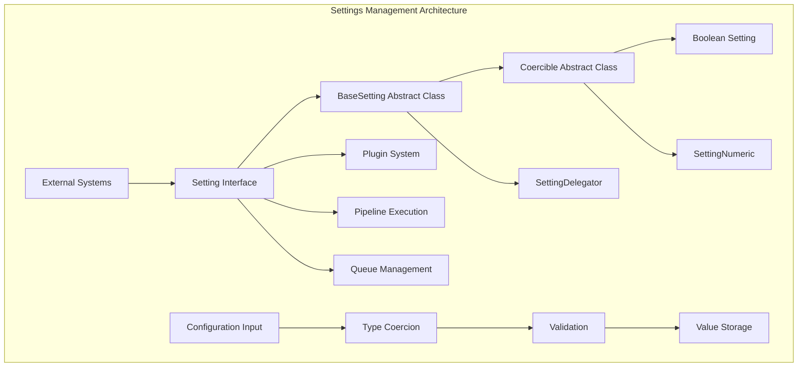
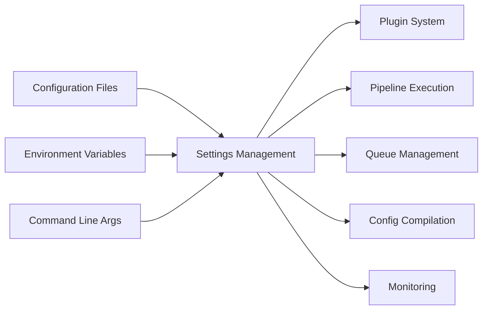
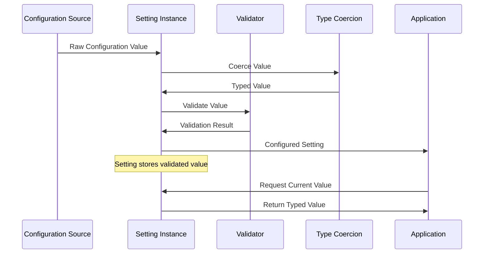

# Settings Management Module

## Overview

The Settings Management module is a core component of the Logstash system responsible for managing configuration settings throughout the application lifecycle. This module provides a robust framework for defining, validating, coercing, and managing various types of configuration parameters with type safety and validation capabilities.

## Purpose

The Settings Management module serves as the foundation for:
- **Configuration Parameter Management**: Centralized handling of all configuration settings
- **Type Safety**: Ensuring configuration values are properly typed and validated
- **Value Coercion**: Automatic conversion of input values to appropriate types
- **Validation Framework**: Comprehensive validation of configuration parameters
- **Default Value Management**: Handling of default values and fallback mechanisms

## Architecture Overview

The Settings Management module follows a layered architecture with clear separation of concerns:



## Core Components

### 1. SettingDelegator
**File**: `SettingDelegator.java`
**Purpose**: Provides a delegation pattern for wrapping and extending setting functionality

The `SettingDelegator` acts as a wrapper around `BaseSetting` instances, implementing the decorator pattern to add additional functionality while maintaining the same interface.

**Key Features**:
- Wraps existing settings with additional behavior
- Maintains full compatibility with the Setting interface
- Enables composition of setting behaviors
- Provides safe delegation of all setting operations

### 2. Coercible Settings Framework
**File**: `Coercible.java`
**Purpose**: Abstract base class for settings that support automatic type coercion

The `Coercible` class extends `BaseSetting` to provide automatic type conversion capabilities, ensuring that input values are properly converted to the expected type before validation and storage.

**Key Features**:
- Automatic type coercion from various input types
- Strict mode validation during construction
- Template-based type safety
- Integration with validation framework

### 3. Boolean Setting Implementation
**File**: `Boolean.java`
**Purpose**: Specialized setting for boolean configuration parameters

Provides robust boolean value handling with support for string-to-boolean conversion and validation.

**Supported Input Types**:
- Native boolean values
- String representations ("true", "false")
- Automatic coercion with error handling

### 4. Numeric Setting Implementation
**File**: `SettingNumeric.java`
**Purpose**: Specialized setting for numeric configuration parameters

Handles various numeric types with intelligent parsing and coercion capabilities.

**Supported Numeric Types**:
- Integer values
- Float/Double values
- String representations of numbers
- Automatic type detection and conversion

## System Integration

The Settings Management module integrates with multiple other modules in the Logstash ecosystem:



### Integration Points

1. **[Plugin System](plugin_system.md)**: Settings management provides configuration parameters for plugin initialization and runtime behavior
2. **[Pipeline Execution](pipeline_execution.md)**: Pipeline settings are managed through this module for execution control
3. **[Queue Management](queue_management.md)**: Queue configuration parameters are handled by the settings framework
4. **[Config Compilation](config_compilation.md)**: Compilation settings and parameters are managed here
5. **[Monitoring](monitoring.md)**: Monitoring configuration relies on the settings management system

## Data Flow

The settings management system follows a clear data flow pattern:



## Key Features

### Type Safety
- **Compile-time Type Checking**: Generic-based type safety ensures configuration values match expected types
- **Runtime Validation**: Additional validation during value assignment
- **Coercion Safety**: Safe type conversion with comprehensive error handling

### Validation Framework
- **Custom Validators**: Support for custom validation predicates
- **Built-in Validation**: Common validation patterns for standard types
- **Strict Mode**: Optional strict validation during initialization

### Flexibility
- **Delegation Pattern**: Extensible through delegation and composition
- **Default Values**: Comprehensive default value management
- **Reset Capability**: Ability to reset settings to default values

### Error Handling
- **Descriptive Error Messages**: Clear error messages for configuration issues
- **Graceful Degradation**: Fallback to default values when appropriate
- **Validation Feedback**: Detailed validation failure information

## Usage Patterns

### Basic Setting Creation
```java
// Boolean setting with default value
Boolean enableFeature = new Boolean("feature.enabled", false);

// Numeric setting with validation
SettingNumeric maxConnections = new SettingNumeric("max.connections", 100);
```

### Setting Delegation
```java
// Wrapping existing setting with additional behavior
SettingDelegator<Boolean> wrappedSetting = new CustomSettingDelegator(baseSetting);
```

### Value Management
```java
// Setting values with automatic coercion
setting.set("true");  // String coerced to boolean
setting.set(42);      // Integer value

// Retrieving typed values
Boolean value = setting.value();
```

## Configuration Sources

The settings management system supports multiple configuration sources:

1. **Configuration Files**: YAML, JSON, and properties files
2. **Environment Variables**: System environment variable mapping
3. **Command Line Arguments**: Runtime parameter override
4. **Programmatic Configuration**: Direct API-based configuration
5. **Default Values**: Built-in fallback values

## Best Practices

### Setting Design
- Use appropriate setting types for configuration parameters
- Provide meaningful default values
- Implement custom validation when needed
- Use delegation for extending functionality

### Error Handling
- Provide clear error messages for validation failures
- Handle coercion errors gracefully
- Log configuration issues appropriately

### Performance
- Cache setting values when appropriate
- Minimize validation overhead in hot paths
- Use strict mode judiciously

## Related Documentation

- **[Plugin System](plugin_system.md)**: Plugin configuration management
- **[Config Compilation](config_compilation.md)**: Configuration compilation process
- **[Queue Management](queue_management.md)**: Queue-specific settings
- **[Pipeline Execution](pipeline_execution.md)**: Pipeline configuration
- **[Monitoring](monitoring.md)**: Monitoring and metrics configuration

## Future Enhancements

The Settings Management module continues to evolve with planned enhancements:

1. **Dynamic Configuration**: Runtime configuration updates without restart
2. **Configuration Validation**: Enhanced validation with dependency checking
3. **Configuration Templates**: Template-based configuration generation
4. **Audit Trail**: Configuration change tracking and auditing
5. **Schema Validation**: JSON Schema-based configuration validation

---

*This documentation provides a comprehensive overview of the Settings Management module. For implementation details and API reference, please refer to the individual component documentation and source code.*