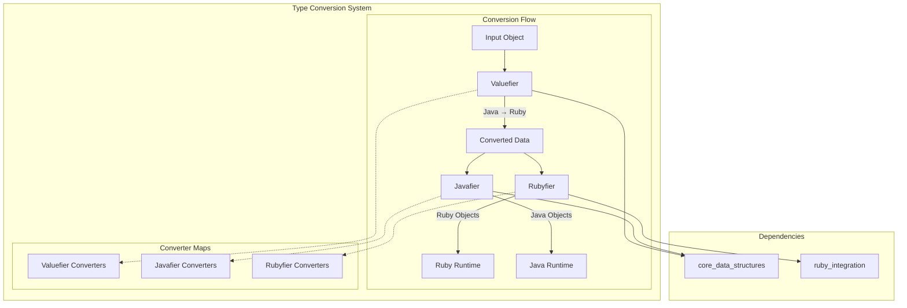
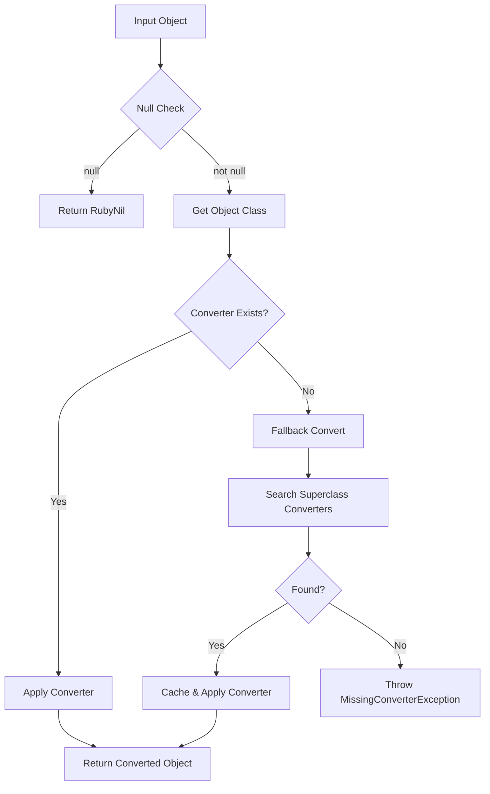
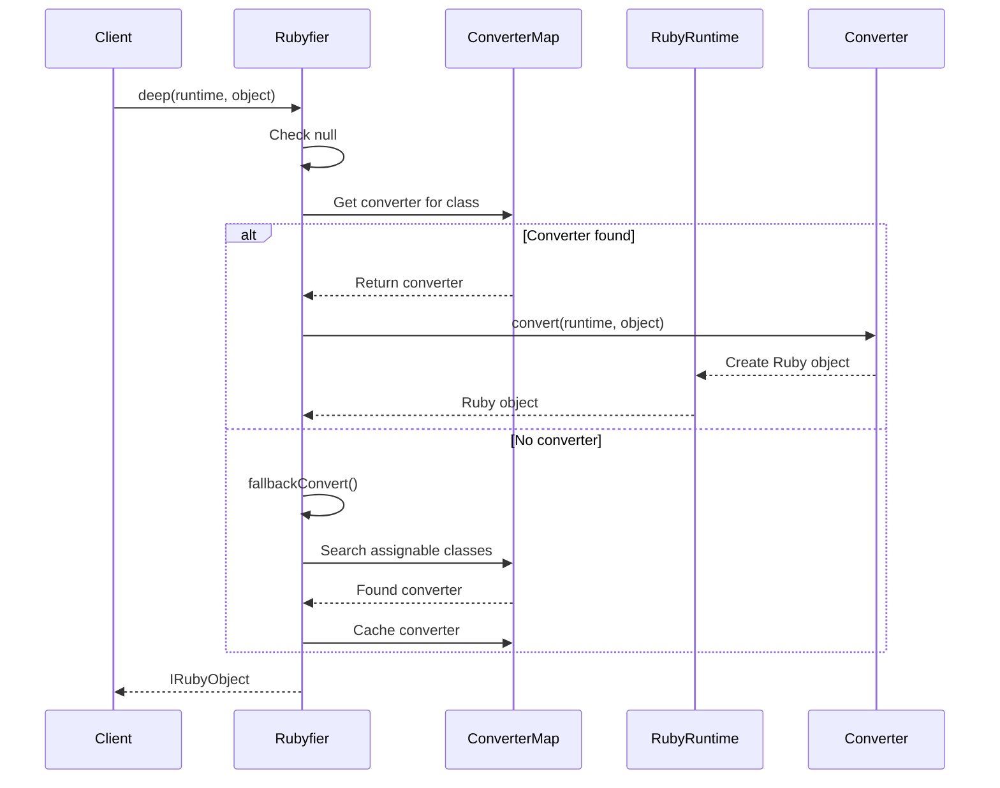
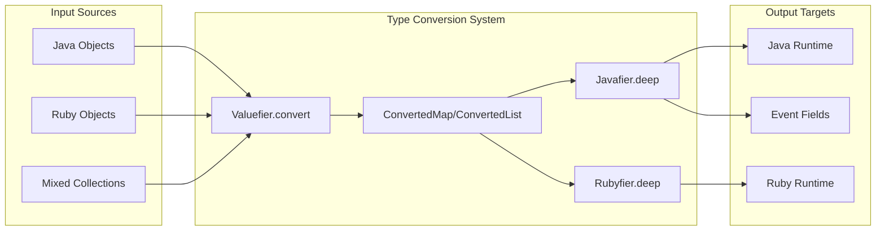
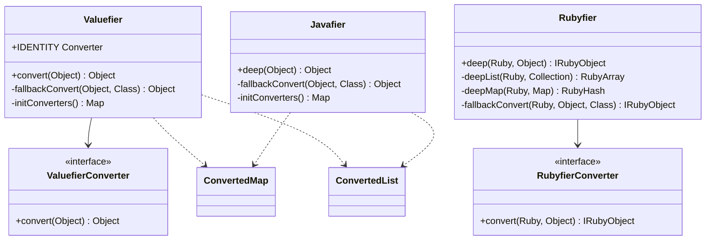

# Type Conversion System

The Type Conversion System is a critical component of Logstash's core data processing infrastructure, responsible for seamless conversion between Java and Ruby object types. This system enables Logstash to efficiently handle data transformation across the JRuby runtime boundary while maintaining type safety and performance.

## Overview

The Type Conversion System provides bidirectional type conversion capabilities that allow Logstash to:
- Convert Java objects to Ruby objects for JRuby runtime compatibility
- Convert Ruby objects back to Java objects for efficient processing
- Maintain type fidelity during conversions
- Handle complex nested data structures (maps, lists, arrays)
- Support specialized Logstash types like Timestamps

## Architecture



## Core Components

### Valuefier
The entry point for type conversion that normalizes input objects into Logstash's internal representation.

**Key Responsibilities:**
- Primary conversion interface for all input data
- Handles Java primitives, Ruby objects, and complex collections
- Creates ConvertedMap and ConvertedList wrappers for collections
- Manages timestamp conversions from various date/time formats

**Conversion Strategy:**


### Javafier
Converts objects from Logstash's internal representation back to pure Java objects.

**Key Responsibilities:**
- Extracts Java values from BiValue objects
- Converts ConvertedMap/ConvertedList back to HashMap/ArrayList
- Handles Ruby object to Java primitive conversions
- Used primarily by getField operations

**Supported Conversions:**
- Ruby strings/symbols → Java String
- Ruby numerics → Java primitives (Long, Double, BigInteger, etc.)
- Ruby collections → Java collections
- Ruby timestamps → Logstash Timestamp objects

### Rubyfier
Converts Java objects and Logstash internal objects to Ruby objects for JRuby runtime compatibility.

**Key Responsibilities:**
- Deep conversion of nested structures to Ruby objects
- Creates RubyHash and RubyArray from Java collections
- Maintains Ruby object identity where appropriate
- Handles specialized conversions for Logstash types

**Deep Conversion Process:**


## Data Flow



## Component Interactions



## Performance Optimizations

### Converter Caching
All three components use `ConcurrentHashMap` for thread-safe converter caching:
- **Initial Capacity**: 50 converters
- **Load Factor**: 0.2 for minimal collision
- **Concurrency Level**: 1 for single-threaded optimization

### Fallback Strategy
When a direct converter isn't found:
1. Search through registered converters for assignable classes
2. Cache the found converter for the specific class
3. Throw `MissingConverterException` if no converter is found

### Identity Conversions
Objects that don't require conversion use `IDENTITY` converters to avoid unnecessary processing overhead.

## Type Support Matrix

| Java Type | Valuefier | Javafier | Rubyfier | Notes |
|-----------|-----------|----------|----------|-------|
| String | ✓ | ✓ | ✓ | Direct conversion |
| Primitives (int, long, float, double) | ✓ | ✓ | ✓ | Numeric conversions |
| Boolean | ✓ | ✓ | ✓ | Boolean handling |
| BigInteger/BigDecimal | ✓ | ✓ | ✓ | Large number support |
| Collections (List, Map) | ✓ | ✓ | ✓ | Deep conversion |
| Ruby Objects | ✓ | ✓ | ✓ | JRuby integration |
| Timestamp | ✓ | ✓ | ✓ | Logstash timestamp |
| Date/Time variants | ✓ | - | - | Multiple date formats |

## Integration Points

### With Core Data Structures
- Uses `ConvertedMap` and `ConvertedList` from [core_data_structures](core_data_structures.md)
- Integrates with `Timestamp` objects for time handling
- Leverages `RubyUtil` for Ruby runtime access

### With Ruby Integration
- Depends on [ruby_integration](ruby_integration.md) for JRuby types
- Uses `JrubyTimestampExtLibrary` for timestamp conversions
- Integrates with Ruby runtime for object creation

### With Event Processing
- Supports [event_api](event_api.md) field access operations
- Enables data transformation in [pipeline_execution](pipeline_execution.md)
- Facilitates plugin data handling in [plugin_system](plugin_system.md)

## Error Handling

### MissingConverterException
Thrown when no suitable converter is found for a given type:
```java
throw new MissingConverterException(cls);
```

### Fallback Mechanisms
- Searches parent classes and interfaces for compatible converters
- Caches successful fallback discoveries for future use
- Provides detailed error messages for debugging

## Thread Safety

All converter maps use `ConcurrentHashMap` with optimized parameters:
- Thread-safe read/write operations
- Minimal lock contention
- Efficient caching strategy

## Usage Patterns

### Event Field Access
```java
// Getting field value (uses Javafier)
Object value = Javafier.deep(event.getField("fieldName"));

// Setting field value (uses Valuefier)
event.setField("fieldName", Valuefier.convert(inputValue));
```

### Ruby Integration
```java
// Converting for Ruby runtime (uses Rubyfier)
IRubyObject rubyValue = Rubyfier.deep(runtime, javaObject);
```

## Best Practices

1. **Type Consistency**: Ensure all data passes through Valuefier.convert when entering the system
2. **Performance**: Leverage cached converters by using consistent object types
3. **Error Handling**: Handle MissingConverterException for unsupported types
4. **Memory Management**: Be aware of object creation overhead in deep conversions

## Future Considerations

- Support for additional Java 8+ time types
- Performance optimizations for large collection conversions
- Enhanced error reporting and debugging capabilities
- Integration with new Ruby runtime versions