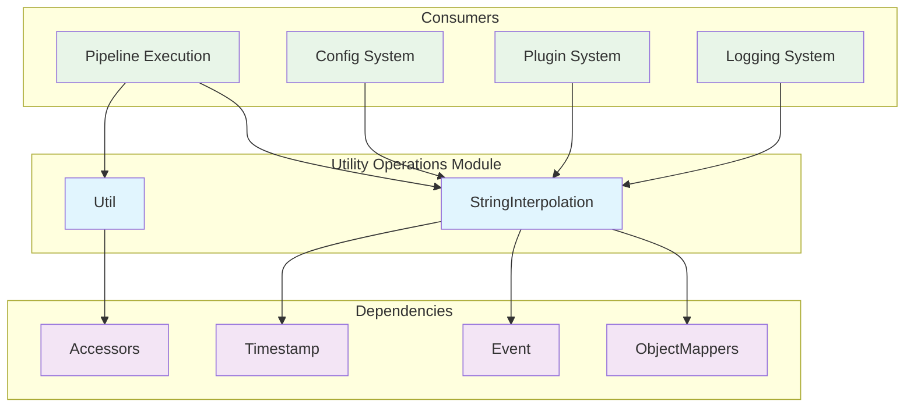
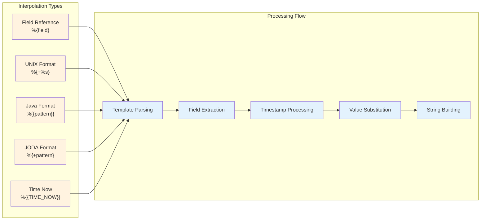
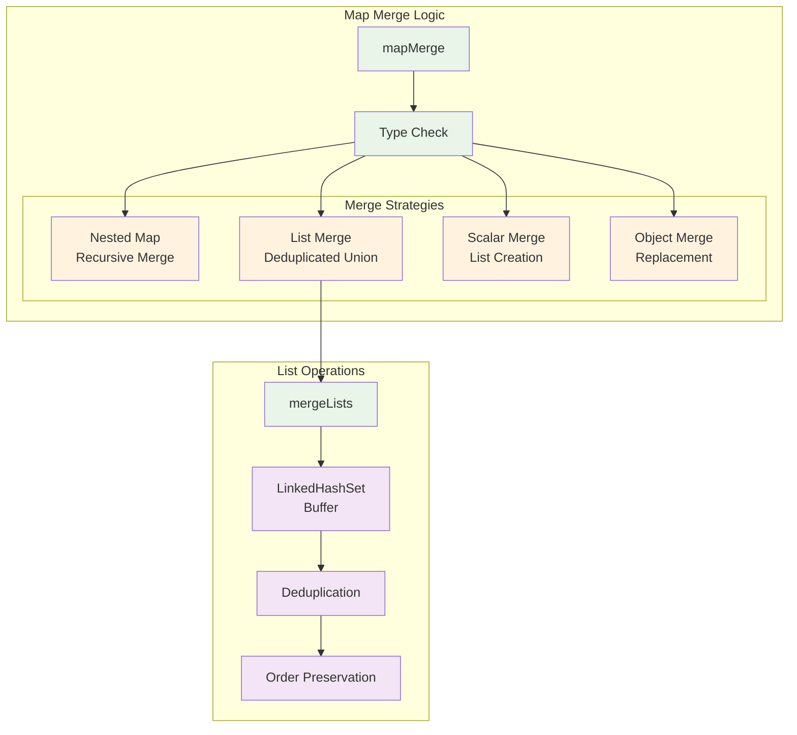
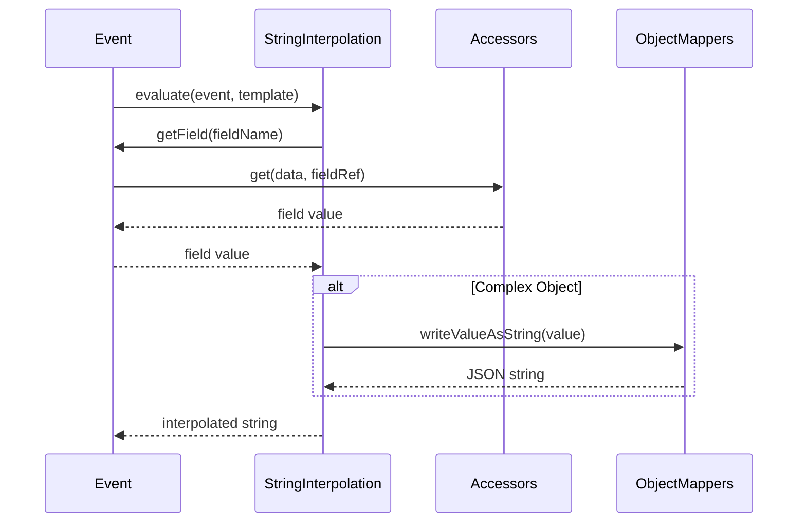
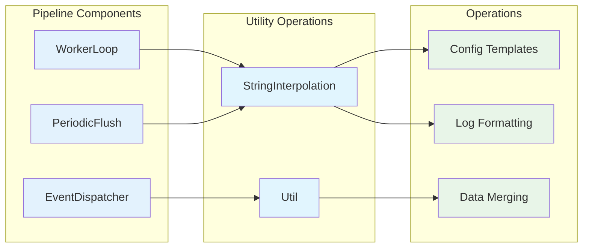
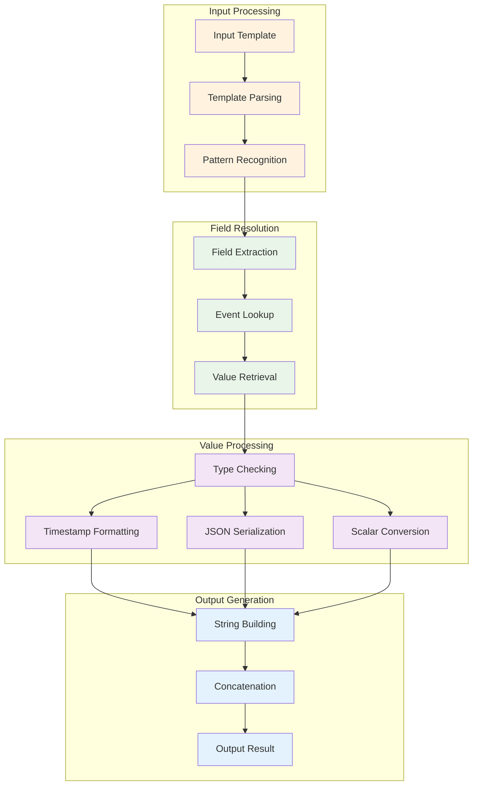
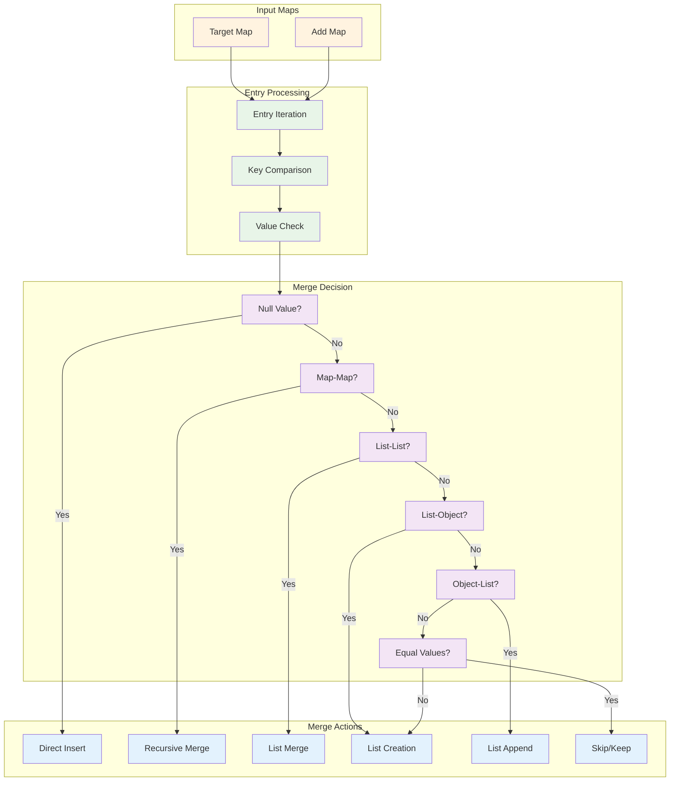

# Utility Operations Module

The utility_operations module provides essential utility functions and string interpolation capabilities that support various operations throughout the Logstash system. This module is part of the broader [core_data_structures](core_data_structures.md) module and serves as a foundational layer for data manipulation and formatting operations.

## Overview

The utility_operations module consists of two core components:
- **StringInterpolation**: Advanced string templating and field interpolation system
- **Util**: Collection of utility methods for data structure manipulation

These components provide critical functionality for event processing, configuration templating, and data merging operations across the Logstash pipeline.

## Architecture



## Core Components

### StringInterpolation

The StringInterpolation class provides sophisticated string templating capabilities with support for field references, timestamp formatting, and dynamic value substitution.

#### Key Features

- **Field Reference Interpolation**: Supports `%{field_name}` syntax for dynamic field substitution
- **Timestamp Formatting**: Multiple timestamp format patterns including UNIX, JODA, and Java time formats
- **Special Patterns**: Support for current time generation and complex nested field access
- **Thread-Safe Operations**: Uses ThreadLocal StringBuilder for efficient string building

#### Interpolation Patterns



#### Usage Examples

```java
// Field interpolation
String template = "Host: %{host}, Message: %{message}";
String result = StringInterpolation.evaluate(event, template);

// Timestamp formatting
String timeTemplate = "Date: %{+YYYY-MM-dd}, Epoch: %{+%s}";
String timeResult = StringInterpolation.evaluate(event, timeTemplate);

// Java time patterns
String javaTemplate = "ISO Date: %{{yyyy-MM-dd'T'HH:mm:ss.SSSZ}}";
String javaResult = StringInterpolation.evaluate(event, javaTemplate);
```

### Util

The Util class provides essential utility methods for data structure manipulation, particularly focused on merging operations for Maps and Lists.

#### Key Features

- **Deep Map Merging**: Recursive merging of nested Map structures
- **List Deduplication**: Intelligent merging of List values with duplicate removal
- **Type-Safe Operations**: Handles mixed data types during merge operations
- **Memory Efficient**: Uses buffer reuse for list operations

#### Merge Behavior



## Integration Points

### Event System Integration

The utility_operations module integrates closely with the [event_api](event_api.md) module:



### Pipeline Processing Integration

Integration with [pipeline_execution](pipeline_execution.md) for configuration and logging:



## Data Flow

### String Interpolation Flow



### Map Merge Flow



## Performance Considerations

### String Interpolation Optimization

- **ThreadLocal StringBuilder**: Reuses StringBuilder instances to minimize object allocation
- **Pattern Caching**: Efficient pattern recognition and parsing
- **Lazy Evaluation**: Only processes interpolation patterns when found
- **Memory Management**: Clears StringBuilder buffer after each use

### Map Merge Optimization

- **Buffer Reuse**: LinkedHashSet buffer for list merge operations
- **Type Checking**: Early type detection to choose optimal merge strategy
- **Shallow vs Deep**: Intelligent decision on merge depth requirements
- **Memory Efficiency**: Minimizes temporary object creation

## Error Handling

### StringInterpolation Errors

```java
// JSON processing errors
try {
    String result = StringInterpolation.evaluate(event, template);
} catch (JsonProcessingException e) {
    // Handle JSON serialization errors for complex objects
}

// Invalid event type
try {
    StringInterpolation.evaluate(unknownEvent, template);
} catch (IllegalStateException e) {
    // Handle unknown event concrete class
}
```

### Util Errors

The Util class is designed to be robust and handles various edge cases:
- Null value handling in merge operations
- Type safety during map and list operations
- Graceful handling of mixed data types

## Testing and Validation

### Unit Test Coverage

- **Pattern Recognition**: Tests for all interpolation pattern types
- **Field Resolution**: Validation of field access and retrieval
- **Timestamp Formatting**: Coverage of all supported time formats
- **Merge Operations**: Comprehensive testing of merge scenarios
- **Edge Cases**: Null handling, empty collections, type mismatches

### Integration Testing

- **Event Integration**: Testing with real Event objects
- **Pipeline Integration**: Validation within pipeline context
- **Performance Testing**: Benchmarking of interpolation and merge operations

## Related Documentation

- [core_data_structures](core_data_structures.md) - Parent module overview
- [data_access_layer](data_access_layer.md) - Field access mechanisms
- [serialization_framework](serialization_framework.md) - JSON/CBOR serialization
- [type_conversion_system](type_conversion_system.md) - Type conversion utilities
- [event_api](event_api.md) - Event system integration
- [pipeline_execution](pipeline_execution.md) - Pipeline processing integration
- [logging_system](logging_system.md) - Logging and formatting integration

## Future Enhancements

### Planned Improvements

- **Performance Optimization**: Further optimization of string building operations
- **Pattern Extensions**: Additional interpolation pattern support
- **Caching Mechanisms**: Template compilation and caching for frequently used patterns
- **Async Operations**: Support for asynchronous interpolation operations
- **Memory Profiling**: Enhanced memory usage monitoring and optimization

### API Evolution

- **Streaming Support**: Support for streaming interpolation operations
- **Custom Formatters**: Pluggable formatter system for specialized use cases
- **Validation Framework**: Built-in template validation and error reporting
- **Metrics Integration**: Performance metrics collection and reporting