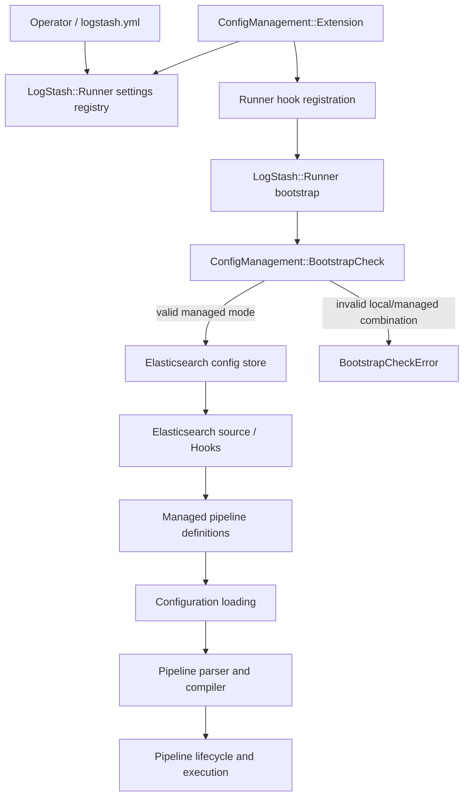
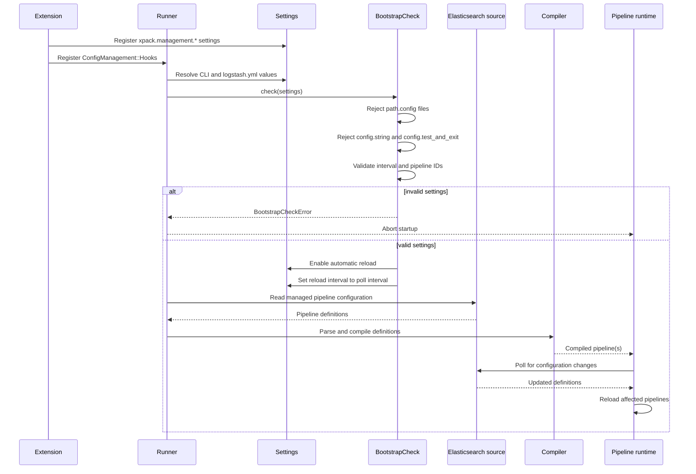
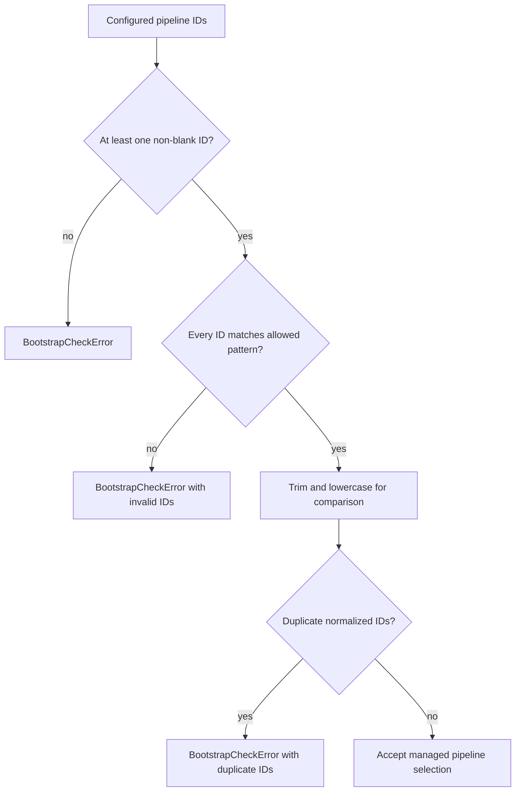
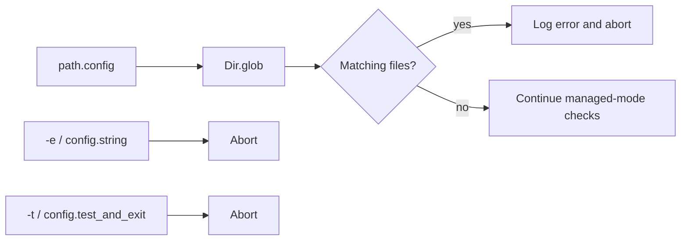
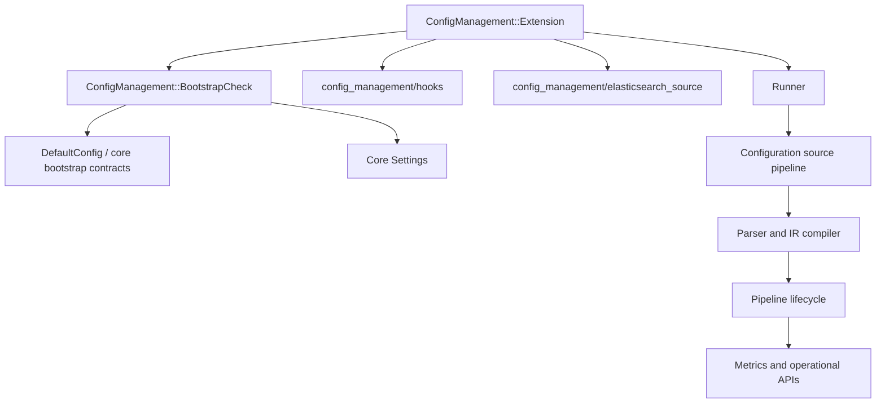
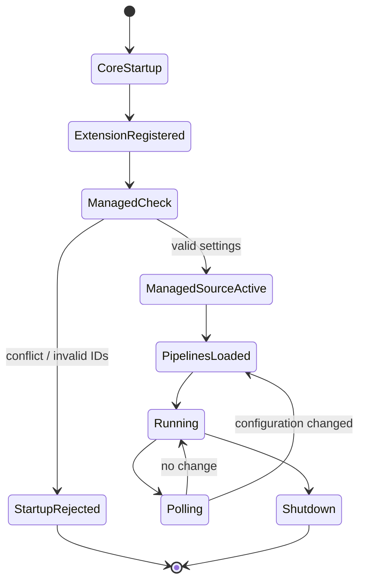

# X-Pack centralized pipeline management

The `xpack_centralized_pipeline_management` module changes Logstash from locally sourced pipeline configuration to Elasticsearch-backed centralized configuration management. It integrates with the runner during bootstrap, registers `xpack.management.*` settings, validates that local configuration mechanisms are not being used at the same time, and configures automatic polling/reload of the managed pipelines.

The module is intentionally thin. Elasticsearch retrieval and runner hook behavior are delegated to the configuration-management support classes loaded by `Extension` (`config_management/hooks` and `config_management/elasticsearch_source`); this module owns the X-Pack integration and policy checks.

## Architecture overview



At process startup, `Extension#additionals_settings` adds the management namespace to the common settings registry. `Extension#register_hooks` attaches `LogStash::ConfigManagement::Hooks` to `LogStash::Runner`, allowing centralized management to participate in the normal runner lifecycle. The bootstrap check then enforces the mode contract before managed pipelines are consumed.

Core runner and setting mechanics are documented in [application_bootstrap_and_settings.md](application_bootstrap_and_settings.md). The resulting pipeline configuration is consumed by [configuration_sources_and_loading.md](configuration_sources_and_loading.md), then compiled and executed by [pipeline_configuration_parser.md](pipeline_configuration_parser.md), [pipeline_ir_and_compilation.md](pipeline_ir_and_compilation.md), and [pipeline_lifecycle_and_execution.md](pipeline_lifecycle_and_execution.md).

## Component responsibilities

### `ConfigManagement::Extension`

`Extension` is the X-Pack plugin entry point and extends `LogStash::UniversalPlugin`.

- `register_hooks(hooks)` loads `LogStash::Runner` and registers a `ConfigManagement::Hooks` instance against it.
- `additionals_settings(settings)` registers all centralized-management settings with defaults and type coercion.
- Registration errors are logged with the exception message and backtrace, then re-raised so startup cannot continue with a partially registered configuration surface.

The extension does not itself retrieve or compile pipeline definitions. Its role is integration: make the settings available and insert configuration-management behavior into runner startup.

### `ConfigManagement::BootstrapCheck`

`BootstrapCheck.check(settings)` is the policy gate for Elasticsearch-backed configuration. It performs the following checks and mutations in order:

1. Rejects local files found through `path.config`.
2. Rejects `config.string` (`-e`), because inline configuration conflicts with the Elasticsearch config store.
3. Rejects `config.test_and_exit` (`-t`), because test-only local startup is not supported in managed mode.
4. Reads `xpack.management.logstash.poll_interval` and forces `config.reload.automatic = true`.
5. Sets `config.reload.interval` to the centralized-management poll interval.
6. Requires at least one non-blank `xpack.management.pipeline.id`.
7. Validates pipeline IDs against the allowed letter/underscore start, alphanumeric/underscore/dash continuation, and `*` wildcard grammar.
8. Rejects duplicate IDs using trimmed, case-insensitive normalization.

If all checks pass, it logs that Elasticsearch is being used as the config store, including the selected pipeline IDs and polling interval.

## Managed-mode bootstrap flow



The check is a startup boundary, not the poller itself. Once it has forced the core reload settings, the hook/source implementation can use the normal runner reload lifecycle. Pipeline state and execution remain the responsibility of the data-plane modules.

## Settings surface

| Setting | Type | Default | Purpose |
|---|---|---:|---|
| `xpack.management.enabled` | Boolean | `false` | Enables centralized pipeline management integration. |
| `xpack.management.logstash.poll_interval` | Time value | `5s` | Poll interval used to check Elasticsearch for changes; also becomes `config.reload.interval`. |
| `xpack.management.pipeline.id` | String array | `["main"]` | Pipeline IDs to retrieve and manage; IDs may contain `*` wildcards. |
| `xpack.management.elasticsearch.username` | Nullable string | `logstash_system` | Username for Elasticsearch authentication. |
| `xpack.management.elasticsearch.password` | Nullable string | unset | Password for username/password authentication. |
| `xpack.management.elasticsearch.hosts` | String array | `["https://localhost:9200"]` | Elasticsearch endpoints. |
| `xpack.management.elasticsearch.cloud_id` | Nullable string | unset | Elastic Cloud connection identifier. |
| `xpack.management.elasticsearch.cloud_auth` | Nullable string | unset | Elastic Cloud authentication value. |
| `xpack.management.elasticsearch.api_key` | Nullable string | unset | API key authentication. |
| `xpack.management.elasticsearch.proxy` | Nullable string | unset | Proxy used for Elasticsearch connections. |
| `xpack.management.elasticsearch.ssl.*` | Nullable strings / arrays | varies | CA, certificate, key, truststore, keystore, cipher, and verification settings. |
| `xpack.management.elasticsearch.ssl.verification_mode` | String enum | `full` | TLS verification mode: `none`, `certificate`, or `full`. |
| `xpack.management.elasticsearch.sniffing` | Boolean | `false` | Enables Elasticsearch node sniffing for the managed connection. |

Settings are registered with the same typed settings infrastructure used by core Logstash. See [application_bootstrap_and_settings_setting_bridge.md](application_bootstrap_and_settings_setting_bridge.md) for coercion and Ruby/Java setting delegation, and [application_bootstrap_and_settings_platform_utilities.md](application_bootstrap_and_settings_platform_utilities.md) for Cloud ID/auth-related utilities.

## Pipeline ID validation

The accepted pattern is equivalent to:

```text
^[a-z_*][a-z_-0-9*]*$
```

Matching is case-insensitive. If every configured entry is empty or whitespace-only, the check reports a missing pipeline selection; blank entries mixed with other values fail the pattern check. Duplicate detection trims and lowercases values before grouping, so `pipeline1` and ` PIPELINE1 ` conflict; the error reports the user-facing spellings and de-duplicates the report.



The wildcard is syntactic only at this layer. Expansion and selection semantics are handled by the Elasticsearch-backed configuration source rather than by `BootstrapCheck`.

## Local configuration exclusion

Centralized mode must have a single authoritative source. `check_path_config` uses `Dir.glob(path.config)` and rejects startup when the configured path resolves to one or more files. This catches both direct local file usage and glob-based local configuration. A path that resolves to no files is allowed by this check; the managed source remains responsible for providing the actual pipelines.



This behavior complements, rather than replaces, local source selection rules documented in [configuration_sources_and_loading_source_loading.md](configuration_sources_and_loading_source_loading.md). In managed mode, local source options are prohibited before normal source loading begins.

## Dependencies and module boundaries



Responsibilities are split across modules:

- Core startup owns settings precedence, process locking, and general bootstrap orchestration: [application_bootstrap_and_settings.md](application_bootstrap_and_settings.md).
- Core local/remote source loading owns `PipelineConfig` construction: [configuration_sources_and_loading.md](configuration_sources_and_loading.md).
- Parsing, IR construction, and graph compilation are documented in [pipeline_configuration_parser.md](pipeline_configuration_parser.md) and [pipeline_ir_and_compilation.md](pipeline_ir_and_compilation.md).
- Pipeline convergence, reload, shutdown, and registry state belong to [pipeline_lifecycle_and_execution.md](pipeline_lifecycle_and_execution.md).
- Elasticsearch credentials and secret material should follow the [secret_store.md](secret_store.md) boundary where applicable.
- Metrics and health exposure belong to [observability_and_operational_control.md](observability_and_operational_control.md), if generated in the documentation set.

## Operational characteristics and failure behavior

- Disabled-by-default setting: `xpack.management.enabled` defaults to `false`; activation and the associated runner hook behavior are controlled by the X-Pack extension lifecycle.
- Fail-fast registration: any settings-registration exception is logged and re-raised.
- Fail-fast bootstrap: conflicting local options, missing IDs, invalid IDs, and duplicate IDs raise `LogStash::BootstrapCheckError`.
- Automatic reload: the check overwrites core reload settings so the managed source is periodically re-evaluated.
- Secure connection configuration: authentication and TLS settings are exposed as nullable values so deployments can select username/password, API key, Cloud, certificate, or truststore-based connection strategies.
- No pipeline compilation in this module: malformed pipeline definitions and compiler errors occur in downstream source/compiler components after the centralized-mode gate has passed.

## Configuration-management process summary



The key invariant is that a managed Logstash process does not silently combine local configuration with Elasticsearch-managed configuration. The extension establishes the integration points, and `BootstrapCheck` makes that invariant explicit before pipeline execution begins.
