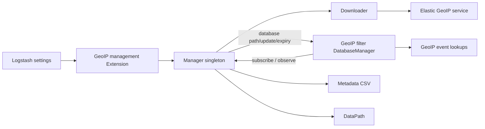
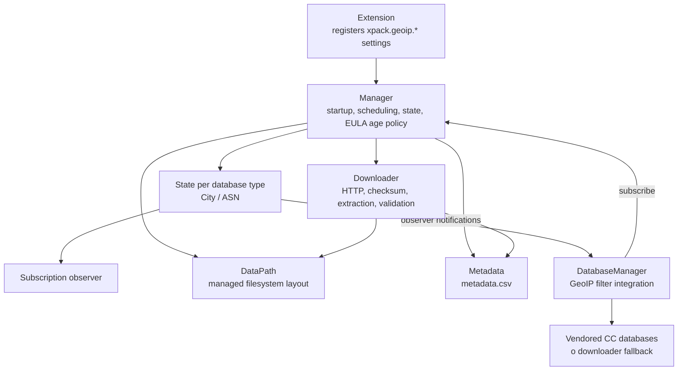
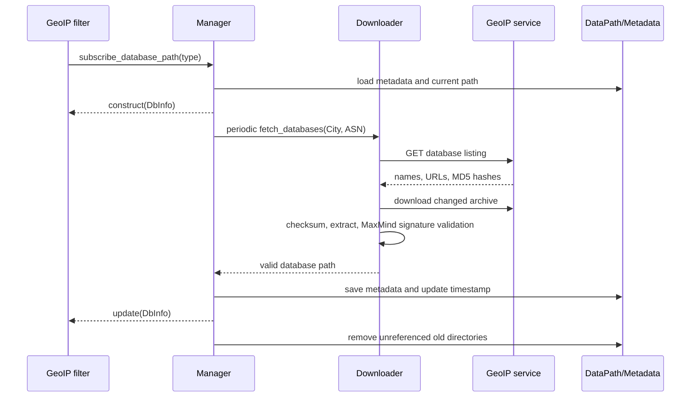

# X-Pack GeoIP Database Management

## Purpose

`xpack_geoip_database_management` manages the MaxMind GeoLite2 City and ASN databases used by the GeoIP filter. It provides a shared, lazy-started service that discovers database versions, downloads and validates updates, persists local metadata, exposes database paths to plugins, and withdraws stale databases to enforce the MaxMind EULA.

The module supports two operating modes:

- **Managed/online mode:** a GeoIP filter without an explicit `database =>` path subscribes to the manager and receives database updates.
- **Self-managed/offline mode:** a filter with an explicit path bypasses this manager. When the downloader is disabled, the filter falls back to the CC-licensed databases vendored by the GeoIP plugin.

## Position in Logstash

The module is an X-Pack extension registered with Logstash settings. The GeoIP filter is the primary consumer; plugin discovery and the event-processing runtime execute the actual lookup, while this module owns acquisition and lifecycle of managed database files.

## Architecture

`Manager` is lazy: construction reads settings, but the periodic task and storage directory are initialized only when the first supported database type is subscribed to. Each database type has an observable state containing the current `DbInfo`; subscriptions receive a construct callback, update callbacks, and an expiry callback.

## Sub-modules

The implementation is documented in the following focused pages:

- [xpack_geoip_database_management_lifecycle_and_policy.md](xpack_geoip_database_management_lifecycle_and_policy.md) — settings, manager startup, subscriptions, state transitions, polling, metrics, and EULA expiry behavior.
- [xpack_geoip_database_management_storage_and_download.md](xpack_geoip_database_management_storage_and_download.md) — filesystem paths, metadata persistence, service interaction, download verification, extraction, and cleanup.
- [xpack_geoip_database_management_filter_integration.md](xpack_geoip_database_management_filter_integration.md) — GeoIP filter registration, managed versus manual paths, vendored fallback, and plugin notifications.

## End-to-end update flow

## Configuration

The extension registers:

| Setting | Default | Effect |
|---|---:|---|
| `xpack.geoip.downloader.endpoint` | `https://geoip.elastic.co/v1/database` | Service endpoint used to list and download databases. |
| `xpack.geoip.downloader.poll.interval` | `24h` | Period between background synchronization attempts. |
| `xpack.geoip.downloader.enabled` | `true` | Enables managed database acquisition. The former `xpack.geoip.download.endpoint` is a deprecated alias for the endpoint setting. |

## Operational guarantees and failure behavior

- Downloads are retried, checked against the service-provided MD5, unpacked, and scanned for a MaxMind database marker before becoming active.
- A failed update leaves the previous valid database in place, while the age check continues to enforce the 25-day warning and 30-day expiry thresholds.
- At expiry, subscribers are notified to stop lookups; the filter tags events with `_geoip_expired_database`.
- Old timestamped directories are deleted unless referenced by current metadata.
- The service uses the Logstash data path, so managed files are local to a Logstash installation and are not part of plugin configuration.

## Related modules

The module relies on the broader [plugin API and registry](plugin_api_and_registry.md) and [event model and JRuby interop](event_model_and_jruby_interop.md) areas for plugin execution and event processing. It does not perform GeoIP lookups itself; it supplies the database resource consumed by the GeoIP filter.
