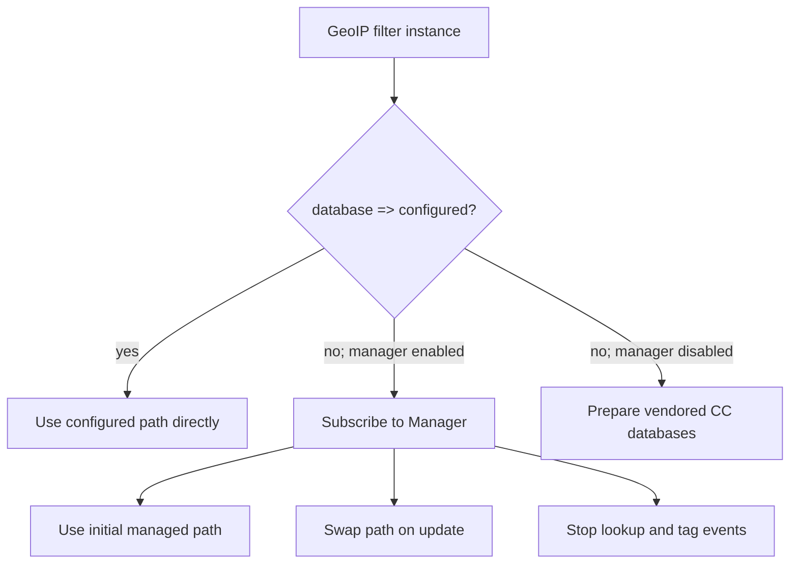
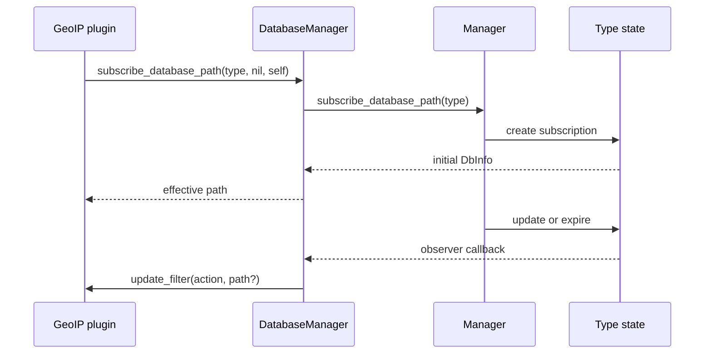

# GeoIP Filter Integration

This sub-module documents `LogStash::Filters::Geoip::DatabaseManager`, the adapter between the generic database manager and GeoIP filter instances.

## Registration paths

`DatabaseManager` is a singleton and maintains a subscription per supported database type. It keeps a concurrent set of filter plugins for each type, so one managed database update can be propagated to all pipelines using that type.

## Managed mode

When a filter omits `database =>` and the manager is enabled, the adapter:

1. starts the manager lazily;
2. records the plugin as an observer for its database type;
3. returns the current database path;
4. handles future `update` and `expire` notifications.

On update, the adapter changes the state path and calls `plugin.update_filter(:update, new_path)` for every subscribed plugin. On expiry, it clears the path and calls `plugin.update_filter(:expire)`. It logs affected pipeline IDs for operational visibility.

## Offline and manual modes

If management is disabled, the adapter copies the GeoLite2 City and ASN files shipped in the `logstash-filter-geoip` gem's `vendor` directory into `<path.data>/plugins/filters/geoip/CC`. These files are used as the fallback database and are marked as non-EULA-managed in `DatabaseState`.

If a path is explicitly configured, the adapter returns it without subscribing or checking for updates. It logs that the operator is responsible for understanding the applicable MaxMind terms.

## Lifecycle and concurrency

The first download trigger is protected by a monitor and is idempotent. Database state changes and plugin set access are synchronized. `unsubscribe_database_path` removes a plugin from its type's concurrent set, preventing future notifications after plugin teardown.

The adapter does not perform database parsing or event lookup; those responsibilities remain with the GeoIP filter and the event-processing/plugin runtime.
