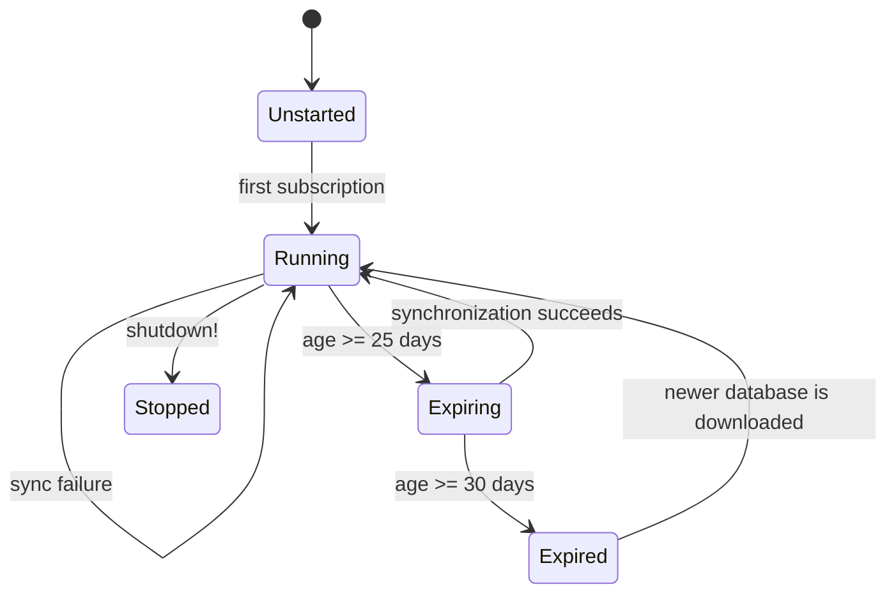
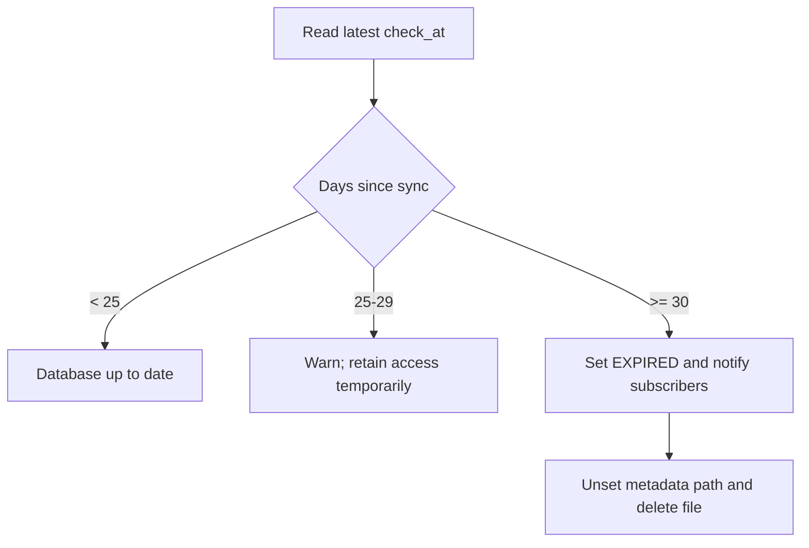

# GeoIP Management Lifecycle and Policy

This sub-module covers `Extension` and `Manager`, plus the manager's per-type observable state. The manager is the coordination layer for managed City and ASN databases.

## Components

### `Extension`

`LogStash::GeoipDatabaseManagement::Extension` is a `LogStash::UniversalPlugin` extension. Its `additionals_settings` method registers the endpoint, polling interval, and enabled flag. Registration requires the runner settings implementation and logs/re-raises registration failures.

### `Manager`

`Manager` is a singleton configured from `LogStash::SETTINGS`. It owns:

- lazy initialization and the periodic `Concurrent::TimerTask`;
- one `State` for every supported database type;
- the `Downloader`, `Metadata`, and `DataPath` collaborators;
- metrics for synchronization and database age;
- cleanup of stale database directories;
- EULA-driven age checks.

`subscribe_database_path` validates the database type, returns immediately when disabled, and otherwise starts the manager on first use. The returned subscription observes the current `DbInfo` and later state changes.

## Synchronization sequence

`ensure_started!` creates the storage and metadata state, performs an immediate synchronization, and then schedules periodic synchronization. Each job:

1. marks download status as updating;
2. asks `Downloader` for changed databases;
3. records the archive checksum and directory in `Metadata`;
4. updates the corresponding `State`, notifying observers;
5. refreshes timestamps for unchanged types;
6. checks age and removes directories not listed as active.

Errors are logged and handled in the job's `ensure` path so age checks, cleanup, and metric finalization still run.

## EULA age policy

Metadata stores the last successful synchronization time. At 25 or more days, the manager logs a warning with the remaining grace period. At 30 or more days, it changes the state to expired, removes the recorded path, notifies subscribers, and deletes the database file. This prevents a stale managed MaxMind database from remaining available indefinitely.

## State and observers

`State` wraps Ruby's `Observable` and serializes subscription, update, expiry, and release operations. `update!` replaces the current `DbInfo`; `expire!` replaces it with `DbInfo::EXPIRED`. Subscribers are responsible for translating these notifications into filter behavior.

## Threading and shutdown

Manager startup is guarded by `@start_lock`; filter integration has its own monitor for plugin registration and state publication. `shutdown!` stops the timer, waits briefly for termination, and removes observers. The synchronization task clears its pipeline logging context because it is not associated with a pipeline.
