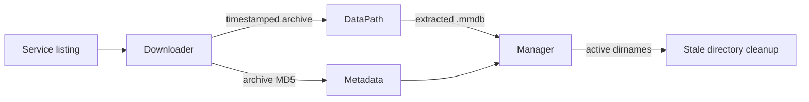
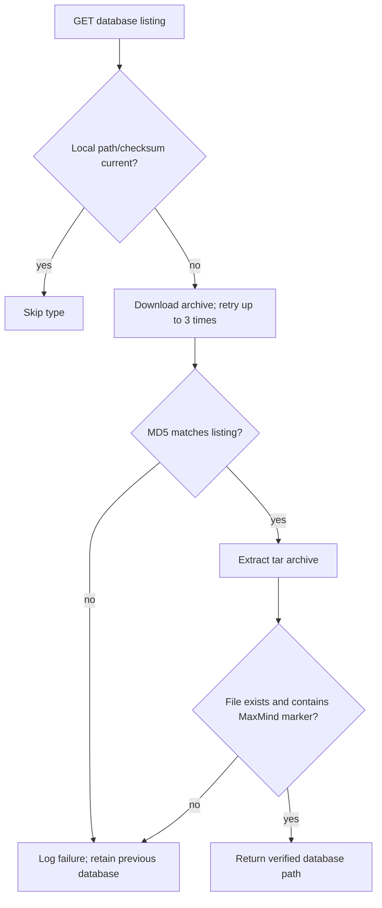

# GeoIP Storage and Download

This sub-module covers `DataPath`, `Metadata`, and `Downloader`. Together they turn a service response into a verified, timestamped database available to the manager.

## Filesystem layout

The manager roots storage at:

```text
<path.data>/geoip_database_management/
├── metadata.csv
├── <unix-timestamp>/
│   ├── GeoLite2-City.mmdb
│   └── GeoLite2-ASN.mmdb
└── ... older timestamp directories ...
```

`DataPath` expands the root and constructs archive and database paths using the constants-defined GeoLite naming convention. `resolve` keeps all generated paths under the configured root.

## Metadata model

`Metadata` stores CSV rows with the columns `database_type`, `check_at`, `gz_md5`, and `dirname`. It can locate the latest existing database, retrieve the last checksum and synchronization timestamp, update timestamps for unchanged databases, clear a database directory reference on expiry, and enumerate active directories for cleanup.



Metadata is rewritten as sorted CSV on every update. A missing metadata file is treated as an empty store; `touch` initializes the file without adding rows.

## Downloader pipeline

`Downloader#fetch_databases` checks the service listing and processes only missing or changed database types. The service URL includes the local Logstash UUID when available and the service terms-of-use acknowledgement. Endpoint query parameters supplied by configuration are intentionally ignored.



HTTP requests use connect and request timeouts and honor `http_proxy`. Non-2xx listing responses become `BadResponseCodeError`; per-database failures are returned as unsuccessful results rather than preventing other database types from being attempted.

## Cleanup and recovery

New downloads use a Unix timestamp directory, allowing the old active directory to remain until metadata points at the new one. After a job, the manager preserves all directory names referenced by metadata and removes other directories. If a download or validation fails, the previous metadata and database remain usable.
