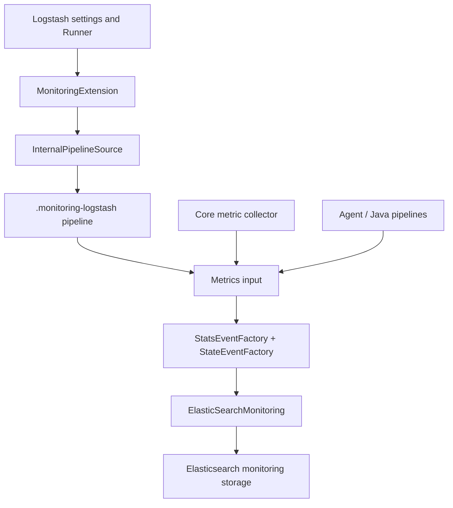
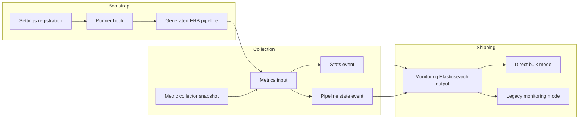
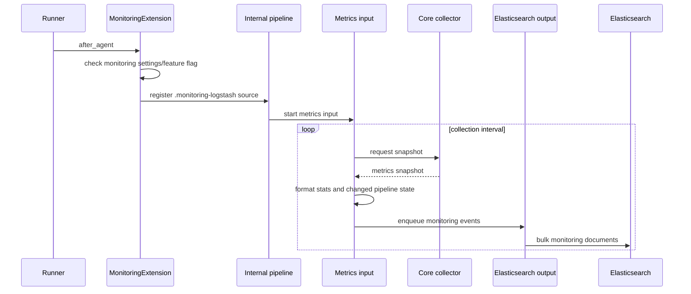

# X-Pack Monitoring

`xpack_monitoring` is Logstash’s legacy internal monitoring extension and its direct-to-Elasticsearch monitoring path. It registers monitoring settings and Runner hooks, creates a hidden `.monitoring-logstash` pipeline when enabled, periodically converts Logstash core snapshots into statistics and pipeline-state events, and ships those events through a monitoring-specific Elasticsearch output.

The module is an integration layer: metric production is owned by Logstash instrumentation, pipeline state comes from the Agent and compiled pipelines, and Elasticsearch delivery is delegated to the standard Elasticsearch output. Legacy internal collection is deprecated and feature-gated; direct shipping is selected by `monitoring.enabled`.

## Position in the system

## Architecture overview

The generated pipeline is system-marked, uses an in-memory queue, disables metric collection for itself, and runs with one worker. The metrics input schedules snapshots and enqueues events. A mode check shared across the extension, factories, and output determines whether events use direct bulk/index fields or the legacy monitoring endpoint/event-type contract.

## Sub-modules

| Sub-module | Responsibility | Documentation |
| --- | --- | --- |
| Metrics collection and event construction | Poll snapshots, track pipeline changes, format stats/state documents, and enqueue events | [xpack_monitoring_metrics_collection.md](xpack_monitoring_metrics_collection.md) |
| Registration and configuration | Register settings, evaluate enablement, render the hidden pipeline, and attach Runner hooks | [xpack_monitoring_registration_and_configuration.md](xpack_monitoring_registration_and_configuration.md) |
| Elasticsearch shipping | Select direct versus legacy output behavior while reusing the standard Elasticsearch output | [xpack_monitoring_elasticsearch_shipping.md](xpack_monitoring_elasticsearch_shipping.md) |

## End-to-end lifecycle

## Data contracts and mode selection

Stats events expose node identity, event counters, process/JVM/OS values, reloads, queue totals, and pipeline information. State events expose pipeline identity, LIR hash, ephemeral ID, worker/batch settings, and serialized LIR representation. In direct mode, each event is additionally associated with one or more Elasticsearch cluster UUIDs discovered from Elasticsearch outputs or configured as `monitoring.cluster_uuid`.

The central predicate is `LogStash::MonitoringExtension.use_direct_shipping?(settings)`, which reads `monitoring.enabled`. Direct mode uses the Elasticsearch bulk endpoint and a date-based `.monitoring-logstash-<API version>-YYYY.MM.dd` index. Legacy mode emits the historical body toward `/_monitoring/bulk` and retains event-type compatibility.

## Related modules

- [metrics_and_instrumentation.md](metrics_and_instrumentation.md) — metric registry, snapshots, and instrumentation API consumed by the metrics input.
- [runtime_resource_monitoring.md](runtime_resource_monitoring.md) — periodic JVM, process, OS, queue, and DLQ pollers that populate runtime metrics.
- [pipeline_lifecycle_and_execution.md](pipeline_lifecycle_and_execution.md) — Agent pipeline lifecycle and state convergence used for pipeline-state events.
- [configuration_sources_and_loading.md](configuration_sources_and_loading.md) — source loading and internal pipeline configuration flow.
- [plugin_api_and_registry.md](plugin_api_and_registry.md) — plugin lifecycle and hook/registry concepts used by the extension and input.
- [event_model_and_jruby_interop.md](event_model_and_jruby_interop.md) — `LogStash::Event` and Ruby/Java event interoperability.

## Operational considerations

- Legacy collection requires `xpack.monitoring.allow_legacy_collection: true` and is explicitly deprecated.
- Collection and timer timeouts are configurable; defaults are 10 seconds and 10 minutes respectively.
- Pipeline state is not emitted for system pipelines.
- Monitoring event construction failures are logged and skipped for that iteration; timer shutdown removes Agent hooks to prevent duplicate callbacks.
- Elasticsearch connection and TLS behavior are inherited from the standard Elasticsearch output rather than reimplemented here.

