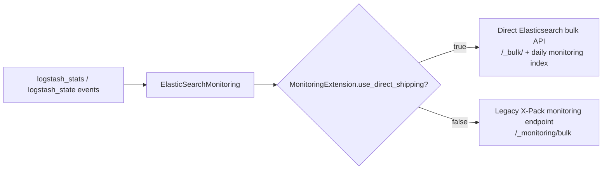

# X-Pack Monitoring: Elasticsearch Shipping

This sub-module adapts the standard Elasticsearch output for monitoring events. `ElasticSearchMonitoring` in `x-pack/lib/monitoring/outputs/elasticsearch_monitoring.rb` sets the `elasticsearch_monitoring` config name, accepts the compatibility `document_type` option, and selects event-type behavior based on the monitoring transport mode.

## Transport relationship

`use_event_type?` returns `false` for direct shipping and `true` for legacy collection. This keeps the inherited Elasticsearch output compatible with the two event schemas without duplicating connection, retry, serialization, or TLS behavior.

## Mode-dependent contract

| Mode | Event body | Endpoint/index selection | Event type behavior |
| --- | --- | --- | --- |
| Direct shipping (`monitoring.enabled`) | Wrapper fields `type`, `logstash_stats` or `logstash_state`, `cluster_uuid`, `interval_ms`, and timestamp | `/_bulk/`; `.monitoring-logstash-<API>-YYYY.MM.dd` | No legacy event type |
| Legacy internal collection | Historical monitoring document body | `/_monitoring/bulk?...`; index is selected by the receiving X-Pack monitoring service | Uses inherited event-type compatibility |

The mode decision is shared with [xpack_monitoring_metrics_collection.md](xpack_monitoring_metrics_collection.md) and [xpack_monitoring_registration_and_configuration.md](xpack_monitoring_registration_and_configuration.md), which construct the corresponding event and template fields.

## Inheritance boundary

The class extends `LogStash::Outputs::ElasticSearch`; it does not implement an Elasticsearch client. Connection settings, authentication, proxies, TLS, sniffing, batching, and delivery errors therefore follow the standard Elasticsearch output implementation and its [plugin API and registry](plugin_api_and_registry.md) integration.

