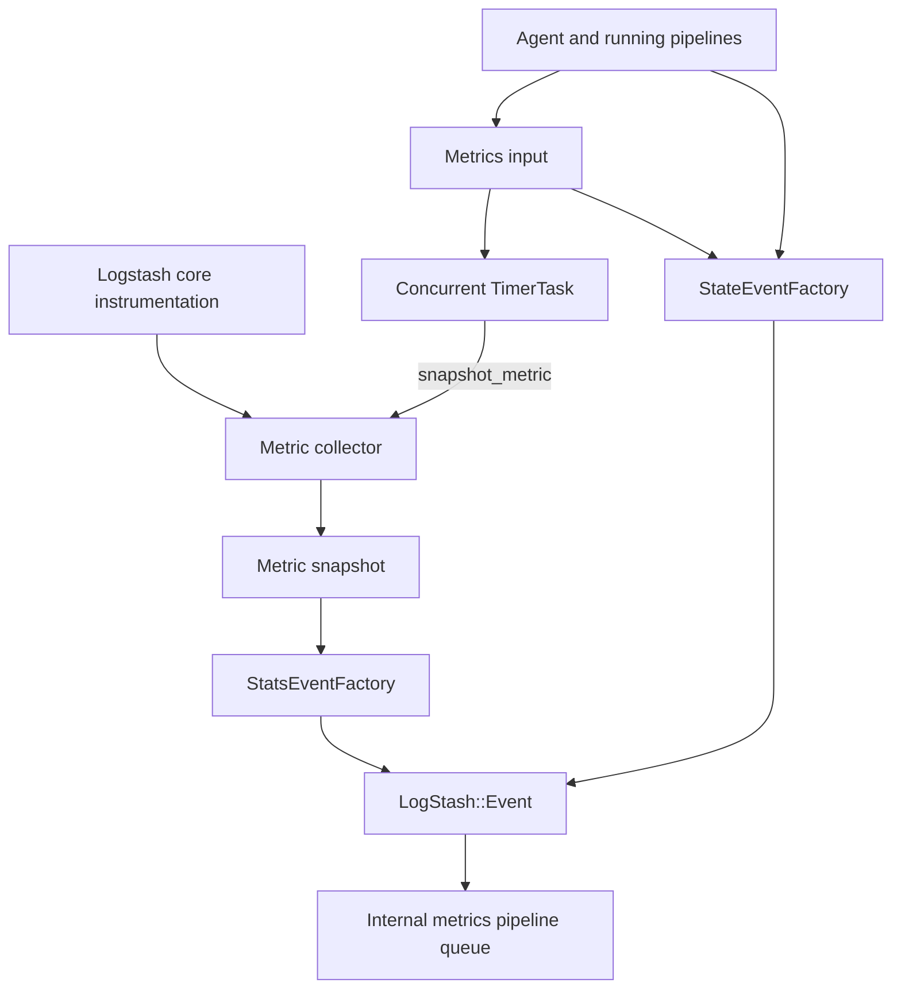
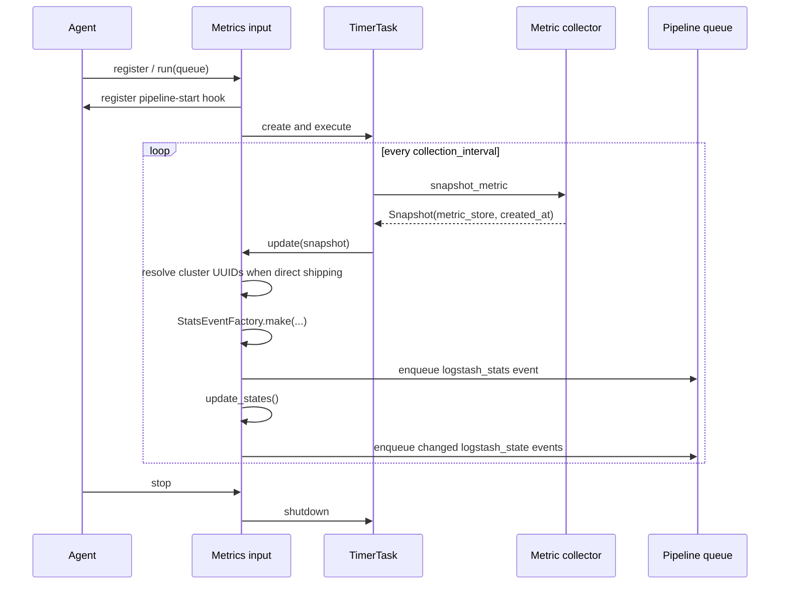

# X-Pack Monitoring: Metrics Collection and Event Construction

This sub-module turns periodic Logstash core metric snapshots and pipeline state into `LogStash::Event` objects. It is implemented by `LogStash::Inputs::Metrics` and its two factories:

- `x-pack/lib/monitoring/inputs/metrics.rb`
- `x-pack/lib/monitoring/inputs/metrics/stats_event_factory.rb`
- `x-pack/lib/monitoring/inputs/metrics/state_event_factory.rb`

The underlying metric registry and snapshot model are documented in [metrics_and_instrumentation.md](metrics_and_instrumentation.md). This code owns the monitoring document schema and emission cadence, not metric production.

## Component relationships



## `Metrics` input lifecycle

`register` captures immutable node metadata, clones settings, and records the execution agent when one is available. `run` stores the plugin queue, creates the timer, registers an Agent hook, starts the first timer execution, and keeps the plugin thread alive until stopped. `stop` removes the hook and shuts down the timer.



The default collection interval is 10 seconds and the default timer timeout is 10 minutes. `extended_performance_collection` controls detailed per-plugin, queue, and component metrics; `config_collection` controls pipeline-state events. Timer failures are observed by `TimerTaskLogger`, and a failed event build is logged without preventing later iterations.

## Statistics document

`StatsEventFactory` combines static node data with the snapshot. The resulting `logstash_stats` document contains:

- `timestamp` from the snapshot;
- node identity and HTTP address under `logstash`;
- global event counts under `events`;
- process, JVM, OS, reload, queue, and pipeline statistics.

OS cgroup data is included only when the snapshot exposes the `os` namespace. Queue totals count events only for non-system pipelines whose queue type is `persisted`; a stopped pipeline is skipped to tolerate registry races.

In direct-shipping mode, the factory wraps the document with `type: logstash_stats`, `logstash_stats`, `cluster_uuid`, `interval_ms`, and a current timestamp. In legacy mode, it emits the historical document body and leaves transport-specific handling to the monitoring output.

## Pipeline-state document

`StateEventFactory` rejects anything that is not a `LogStash::JavaPipeline`, then serializes:

```text
pipeline.id
pipeline.hash              # pipeline.lir.unique_hash
pipeline.ephemeral_id
pipeline.workers
pipeline.batch_size
pipeline.representation    # LIRSerializer output
```

System pipelines are excluded by `Metrics#update_pipeline_state`. State is emitted initially on pipeline start and subsequently when a pipeline hash changes or the ten-minute refresh window expires. Direct shipping wraps it as `type: logstash_state`; legacy mode emits the pipeline document directly. Both factories remove reserved `@timestamp` and `@version` fields where appropriate because monitoring supplies its own timestamp metadata.

## Cluster UUID selection

When direct shipping is active, `Metrics` discovers cluster UUIDs from running Elasticsearch output plugins through `pipeline.resolve_cluster_uuids`. Unique discovered IDs take precedence over the configured `monitoring.cluster_uuid`; if none can be found, the configured value is used, otherwise an empty ID is emitted with a warning. A separate event is produced for each selected cluster UUID.

## Failure and concurrency boundaries

The timer runs independently of the input thread. Events are pushed onto the internal queue, so downstream back pressure can affect the collector listener path. Event construction is local to each factory invocation, while the input tracks the last emitted pipeline hashes and refresh time to limit repeated state documents. The input deliberately unregisters hooks during shutdown to avoid duplicate callbacks from multiple test or runtime instances.
