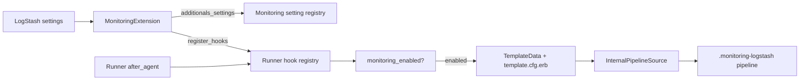
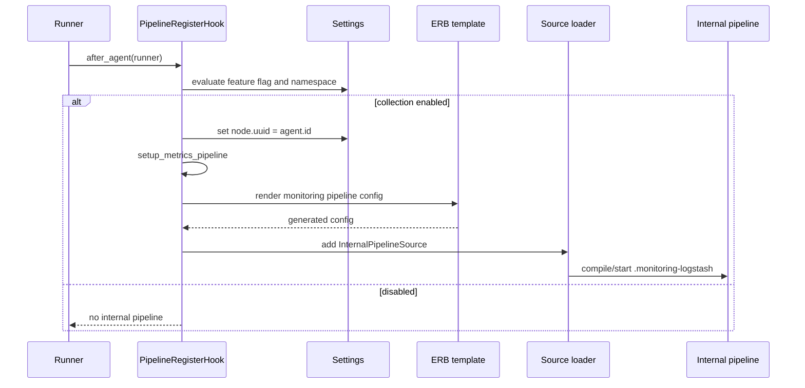

# X-Pack Monitoring: Registration and Configuration

This sub-module activates the monitoring extension, decides whether legacy internal collection is allowed, and synthesizes the hidden `.monitoring-logstash` pipeline. It is implemented by `LogStash::MonitoringExtension` in `x-pack/lib/monitoring/monitoring.rb`.

## Extension integration

`register_hooks` attaches a `PipelineRegisterHook` to `LogStash::Runner`. `additionals_settings` registers both the legacy `xpack.monitoring.*` namespace and the direct-shipping `monitoring.*` namespace, plus `node.uuid`.

## Enablement rules

`PipelineRegisterHook#monitoring_enabled?` first checks `xpack.monitoring.allow_legacy_collection`. If the feature flag is false, legacy internal monitoring is rejected and a warning is logged when legacy settings appear enabled. When allowed:

1. An explicitly set `monitoring.enabled` wins for direct shipping.
2. Otherwise an explicitly set `xpack.monitoring.enabled` controls legacy collection.
3. If neither is set but legacy Elasticsearch hosts or Cloud ID are configured, monitoring is treated as enabled with a warning asking for an explicit setting.
4. Otherwise the registered default for `xpack.monitoring.enabled` is used.

The extension rejects ambiguous configurations where both `xpack.monitoring.enabled` and `monitoring.enabled` are set, or where legacy `xpack.monitoring.*` and direct `monitoring.*` settings are mixed (except the legacy feature flag).

## Hidden pipeline setup

After the agent starts, the hook assigns `node.uuid` from the agent ID and adds an `InternalPipelineSource` containing a generated `PipelineConfig`. The generated pipeline is intentionally constrained:

| Setting | Value | Reason |
| --- | --- | --- |
| `pipeline.id` | `.monitoring-logstash` | Stable internal identity |
| `config.reload.automatic` | `false` | Configuration is generated by the extension |
| `metric.collect` | `false` | Avoid collecting metrics about the metrics pipeline |
| `queue.type` | `memory` | Monitoring should not create a persisted queue |
| `pipeline.workers` | `1` | Low-throughput internal pipeline |
| `pipeline.batch.size` | `2` | Small monitoring batches |
| `pipeline.system` | `true` | Exclude it from user pipeline state/queue totals |

The ERB template receives Elasticsearch connection, authentication, TLS, proxy, collection, and API-version values through `TemplateData`. Time values are converted from nanoseconds to seconds for plugin configuration. `monitoring_endpoint` and `monitoring_index` select the direct bulk endpoint/index or the legacy monitoring endpoint depending on `use_direct_shipping?`.

## Registered settings

The extension registers collection interval and timeout, pipeline-detail and config collection flags, Elasticsearch hosts/credentials, Cloud ID/auth, API key, proxy, TLS trust/key material, verification mode, cipher suites, sniffing, and enablement flags. The legacy namespace also registers `xpack.monitoring.allow_legacy_collection`.

The detailed setting coercion and bootstrap behavior belongs to [application_bootstrap_and_settings.md](application_bootstrap_and_settings.md). Pipeline source loading and LIR representation are covered by [configuration_sources_and_loading.md](configuration_sources_and_loading.md) and [configuration_sources_and_loading_pipeline_representation.md](configuration_sources_and_loading_pipeline_representation.md).

## Deprecation and errors

When legacy collection is enabled, the hook emits a deprecation message directing operators to Elastic Agent monitoring. Errors during generated-pipeline setup are logged with a backtrace and re-raised, preventing a silently partial monitoring installation.

