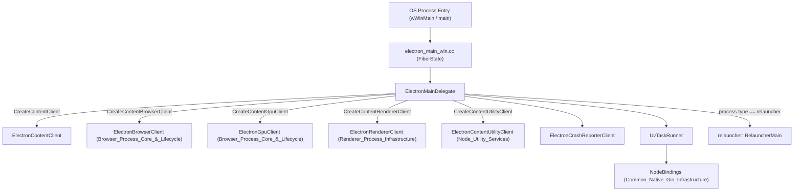
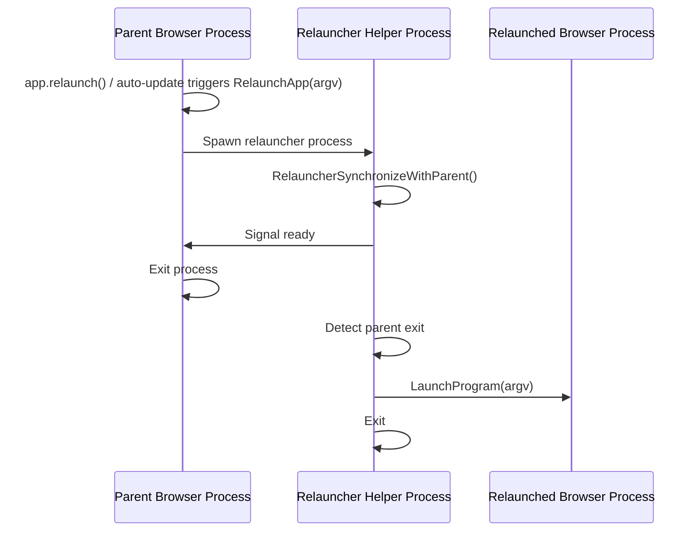
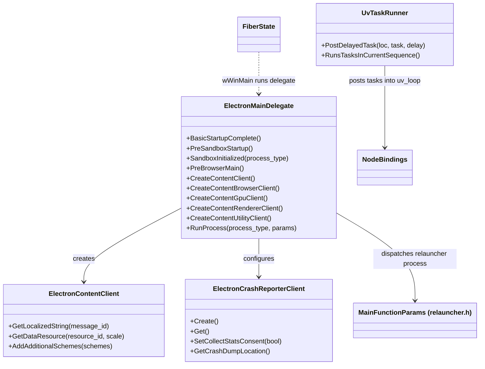

# Application_Bootstrap_&_Process_Entry

## 1. Purpose

The **Application_Bootstrap_&_Process_Entry** module (rooted at `shell/`) is the earliest-executing layer of Electron's native codebase. It is responsible for:

- Providing the OS-level process entry points (e.g. `wWinMain` on Windows) that run before Chromium's `//content` layer is initialized.
- Implementing `ElectronMainDelegate`, the `content::ContentMainDelegate` subclass that Chromium's startup sequence calls into to determine process type (browser, renderer, GPU, utility, relauncher) and construct the corresponding `Content*Client`.
- Supplying minimal, low-dependency infrastructure needed before most subsystems exist: content resource/string provisioning (`ElectronContentClient`), crash reporter bootstrapping (`ElectronCrashReporterClient`), and a libuv-backed `base::SingleThreadTaskRunner` adapter (`UvTaskRunner`) that lets Node.js and Chromium share a single thread's scheduling.
- Implementing the **Relauncher** mechanism — a helper-process-based protocol for safely restarting the application (`app.relaunch()`, auto-update installs) without racing PID reuse or producing duplicate visible app instances.

Because it runs before nearly everything else, this module intentionally has very few dependencies; instead, it *constructs* the objects that later modules (Browser Core, Renderer Infrastructure, Node Utility Services, etc.) depend on.

## 2. Architecture Overview

### 2.1 Process Entry & Delegate Dispatch

### 2.2 Relaunch Flow

### 2.3 Component Relationships

## 3. Sub-modules & Core Components

This module is organized into two cohesive areas:

### 3.1 [`shell_app`](shell_app.md) — Main Delegate, Clients & Task Runner
- **Main Delegate & Process Entry**: `ElectronMainDelegate`, `Client`, `TracingSamplerProfiler`, and the Windows entry point's `FiberState` (32-bit large-stack fiber workaround) in `electron_main_win.cc`.
- **Content & Crash Reporter Clients**: `ElectronContentClient` (localized strings/resources for `//content`) and `ElectronCrashReporterClient` (Crashpad/Breakpad configuration).
- **UV Task Runner**: `UvTaskRunner`, `Location`, `TimeDelta` — the `base::SingleThreadTaskRunner` adapter bridging Chromium task posting onto libuv's loop.

### 3.2 [`Relauncher`](Relauncher.md) — Self-Restart Mechanism
- `MainFunctionParams` (public API surface: `RelaunchApp`, `RelaunchAppWithHelper`, `RelauncherMain`).
- `PROCESS_BASIC_INFORMATION` and supporting helpers in `relauncher_win.cc` (Windows-specific parent-process synchronization and program launching).

## 4. Relationship to Other Modules

| Concern | Delegated To |
|---|---|
| Full browser-process startup sequencing | [Browser_Process_Core_&_Lifecycle](shell_browser_main_parts.md) |
| Browser content client behavior | [Browser_Process_Core_&_Lifecycle](shell_browser_main_parts.md) |
| Renderer-side content client & Node integration | [Renderer_Process_Infrastructure](renderer_client.md) |
| GPU process client | [Browser_Process_Core_&_Lifecycle](shell_browser_main_parts.md) |
| Utility process client | [Node_Utility_Services](utility_content_client.md) |
| Node.js/libuv internals consumed by `UvTaskRunner` | [Common_Native_Gin_Infrastructure](node_bindings.md) |
| App restart triggering (`app.relaunch()`) | [Browser_Process_Core_&_Lifecycle](shell_browser_core.md) → this module's Relauncher |
| Command-line parsing helpers | [Common_Native_Gin_Infrastructure](common_infra.md) |

This module sits at the root of the dependency graph: nearly all other Electron subsystems are constructed, directly or indirectly, as a consequence of code here running first.