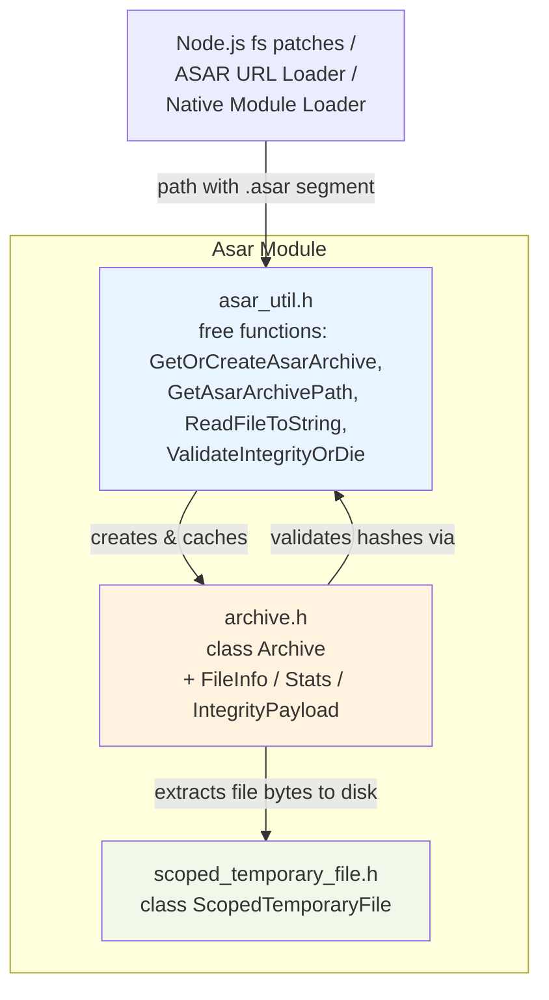
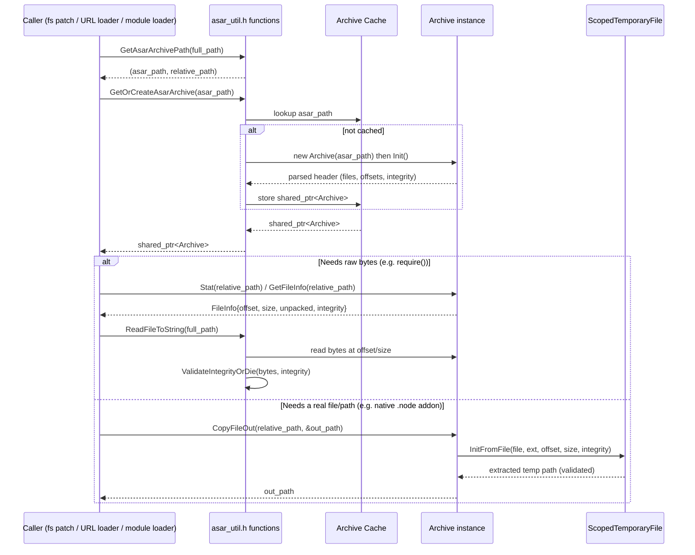

# Asar Module

## 1. Introduction & Purpose

The **Asar** module implements Electron's support for the **ASAR archive format** — a simple tar-like, uncompressed archive format used to package an Electron application's source files (JavaScript, HTML, resources, native `.node` addons, etc.) into a single file (typically `app.asar`). Packaging an app as an ASAR archive speeds up file reads on some platforms, prevents accidental exposure of `node_modules` internals, and provides a single-file distribution unit while still allowing Node.js's `fs` module (patched by Electron) to transparently read files "inside" the archive as though it were a normal directory.

This module lives under the broader **Common Native Gin Infrastructure** area of the codebase (see [Common_API.md](Common_API.md), [Gin_Helper.md](Gin_Helper.md)) and provides the low-level, platform-agnostic C++ primitives that higher layers — most notably the **networking layer's ASAR URL loader** (see [shell_browser_net_asar](shell_browser_net.md)) and Node.js's patched `fs`/`require` machinery — build upon to resolve, read, validate, and extract files from `.asar` packages.

Core responsibilities:
- **Archive parsing**: Read and parse the JSON header embedded at the start of an `.asar` file describing the virtual file tree (files, directories, symlinks, offsets, sizes).
- **Path resolution**: Given an absolute file path that traverses into an `.asar` file (e.g. `/app/resources/app.asar/index.js`), split it into the archive path and the relative in-archive path, and resolve stat/readdir/realpath-like queries against the virtual tree.
- **File extraction**: Support copying a file out of the archive into a real temporary file on disk (necessary for native code, like `.node` addons, that requires a genuine file descriptor/path), while also supporting "unpacked" files that are stored outside the header-managed offset.
- **Integrity verification**: Validate the SHA-256 hashes (whole-file and block-level) embedded in the archive header against extracted content to detect tampering (Electron's `integrityCheck` / `fuses` fusible protections).
- **Archive caching**: Cache parsed `Archive` instances per path so repeated lookups don't reparse the header.

## 2. Architecture Overview

The module is small and cohesive — three headers that together model an ASAR archive and its lifecycle from "path on disk" to "validated bytes in memory or on a temp file."

### Component Relationships

- **`asar_util.h`** is the primary *entry point* used by the rest of Electron. It exposes free functions rather than requiring callers to manage `Archive` objects directly:
  - `GetOrCreateAsarArchive()` — returns a cached `std::shared_ptr<Archive>` for a given `.asar` file path, creating and initializing (`Archive::Init()`) it on first access.
  - `GetAsarArchivePath()` — inspects an arbitrary filesystem path and determines whether it points inside an `.asar` file, splitting it into `(asar_path, relative_path)`.
  - `ReadFileToString()` — a drop-in, ASAR-aware replacement for `base::ReadFileToString`.
  - `ValidateIntegrityOrDie()` — enforces integrity (hash) checks, terminating the process on mismatch (used to enforce Electron's `onlyLoadAppFromAsar` / integrity fuses).

- **`archive.h`** defines the **`Archive`** class, the core representation of a parsed `.asar` file:
  - Parses the archive's JSON header (a `base::Value::Dict` tree) describing every file/directory/symlink, its `offset`, `size`, `unpacked` flag, `executable` flag, and optional `IntegrityPayload`.
  - Provides filesystem-like query methods mirroring Node's `fs` primitives: `GetFileInfo`, `Stat`, `Readdir`, `Realpath`.
  - `CopyFileOut()` extracts a specific file's bytes into a real temporary file (via `ScopedTemporaryFile`) for consumers that require an actual path/fd (e.g., loading native addons or handing a file to OS APIs). Results are cached in `external_files_` so repeated extraction of the same in-archive file is avoided.
  - `GetUnsafeFD()` exposes the raw archive file descriptor for advanced/streaming use cases (bypassing integrity checks — callers are responsible for validation).
  - Thread-safety: once `Init()` succeeds, the class is safe for concurrent read access (guarded internally by `external_files_lock_` for the extraction cache).

- **`scoped_temporary_file.h`** defines **`ScopedTemporaryFile`**, an RAII helper representing a file extracted from an archive:
  - `Init()` creates an empty temp file with a given extension.
  - `InitFromFile()` copies a byte range `[offset, offset+size)` from an open `base::File` (the archive) into the temp file, optionally validating the copied bytes against an `IntegrityPayload` via `asar_util`'s validation routine.
  - The temp file is deleted when the object is destroyed, tying its lifetime to whatever holds the `Archive`'s `external_files_` cache entry (or a local variable in short-lived call sites).

## 3. Data Flow

A typical "read a file from inside an ASAR package" flow:

Key points illustrated above:
- **Unpacked files** (marked `unpacked = true` in the header, controlled by the `asarUnpack` packaging option) bypass offset-based extraction entirely — `Realpath`/`CopyFileOut` resolve directly to their real path alongside the `.asar` file.
- **Integrity validation** occurs both for in-memory reads (`ReadFileToString` → `ValidateIntegrityOrDie`) and for on-disk extraction (`ScopedTemporaryFile::InitFromFile` given an `IntegrityPayload`), ensuring tampered archives are rejected regardless of the access path.
- **Header integrity** (`Archive::HeaderIntegrity()`) additionally allows verifying that the header itself (the file listing) has not been tampered with, independent of individual file hashes.

## 4. Key Data Structures

| Structure | Description |
|---|---|
| `IntegrityPayload` | Holds a hash algorithm (`kSHA256` or `kNone`), a whole-file `hash`, and a list of per-block hashes (`blocks`) with a fixed `block_size`, enabling streaming/incremental integrity validation. |
| `Archive::FileInfo` | Per-entry metadata parsed from the header: `unpacked`, `executable`, `size`, `offset`, and optional `IntegrityPayload`. |
| `Archive::Stats` | Extends `FileInfo` with a `FileType` (`kFile`, `kDirectory`, `kLink`), mirroring `uv_dirent_type_t`, to support `fs.stat`-like semantics. |
| `Archive::FileType` | Enum aliasing libuv's dirent types for directory entry classification during `Readdir`. |

## 5. Integration with the Rest of the System

- **Networking Layer**: The [shell_browser_net_asar sub-module](shell_browser_net.md) (`AsarFileValidator`, `AsarURLLoader`, `AsarURLLoaderFactory`) is the primary browser-process consumer, serving `file://` and custom-protocol requests whose paths resolve inside an `.asar` archive, streaming validated bytes back to renderer/network clients.
- **Common Native Gin Infrastructure**: As a sibling of [Common_API.md](Common_API.md), [Common_Infra.md](Common_Infra.md), and [Gin_Helper.md](Gin_Helper.md), Asar provides a foundational, dependency-light service used by higher-level bindings (e.g., `electron.app`, module loading) without introducing a dependency on V8/Gin itself — it is pure `base::`/`uv` C++.
- **Node Integration**: Electron's patched Node.js `fs` bindings and the internal module resolution/`require()` machinery call into `asar_util` functions (`GetAsarArchivePath`, `ReadFileToString`, `GetOrCreateAsarArchive`) so that scripts and native modules packaged inside `app.asar` load transparently, without application code needing ASAR-awareness.
- **Security**: Integrity validation (`ValidateIntegrityOrDie`) underpins Electron's "fuses" security feature (`onlyLoadAppFromAsar`, embedded integrity fuse) that prevents loading of tampered or unauthorized application code.

## 6. Summary

The Asar module is a compact but critical piece of Electron's packaging and security story. It cleanly separates:
1. **Path/archive resolution & caching** (`asar_util.h`),
2. **Archive parsing & querying** (`archive.h`), and
3. **Safe extraction to disk** (`scoped_temporary_file.h`),

allowing the rest of the codebase — from the network stack to the Node.js runtime — to treat `.asar` files as if they were ordinary, integrity-checked directories.
