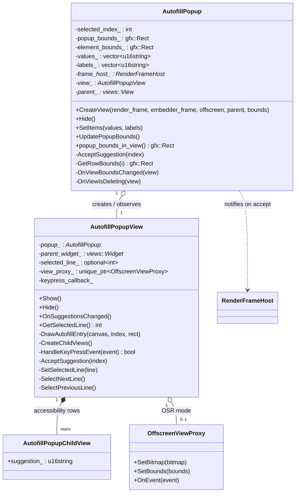
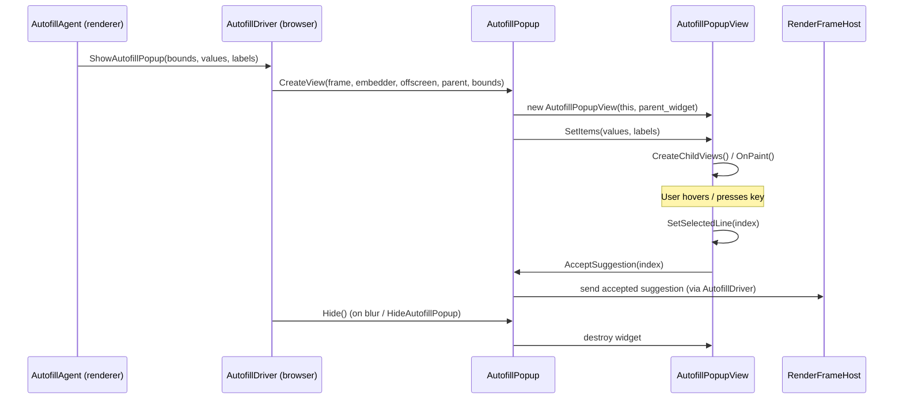
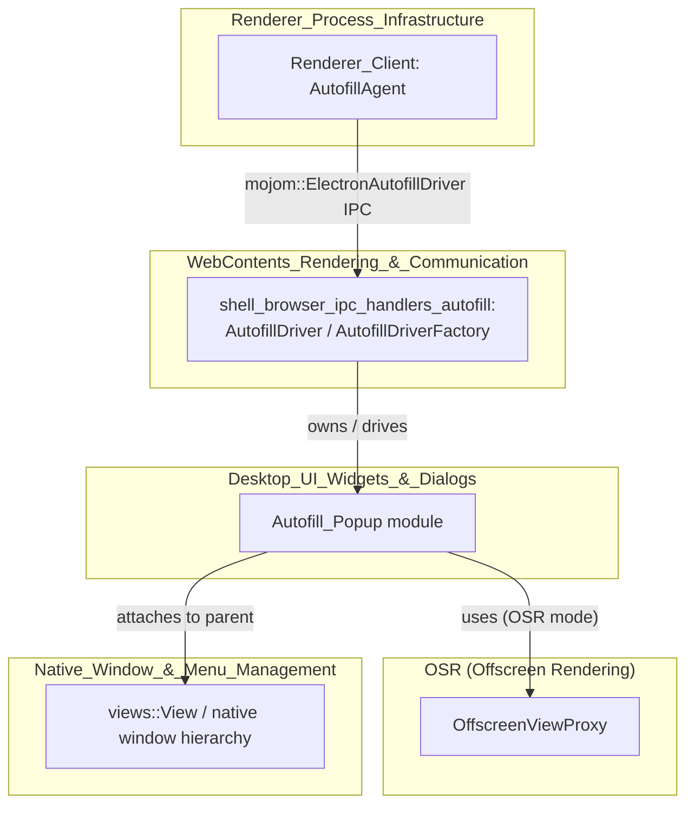

# Autofill Popup

## 1. Purpose

The **Autofill Popup** module implements Electron's native, cross-platform suggestion
dropdown that appears when a user interacts with an `<input>` element that has
associated autocomplete/datalist suggestions (Electron does not use Chromium's
full Autofill feature; it re-implements a lightweight "datalist" style popup).

It is a small but self-contained UI component living under
`shell/browser/ui/` that:

- Owns the **business logic / state** of the popup (which suggestions to show,
  where to position it, which row is selected, etc.).
- Owns the **Views-based rendering** of the popup (drawing rows, handling
  mouse/keyboard/gesture input, accessibility node data, drag operations).

The popup is driven by IPC messages that originate in the renderer process
(see [`shell_browser_ipc_handlers_autofill`](shell_browser_ipc_handlers_autofill.md)
and the renderer's [`Renderer_Client`](Renderer_Client.md) `AutofillAgent`), and
it renders on top of a `content::RenderFrameHost`'s native window, including
support for Electron's offscreen-rendering (OSR) mode.

This module is a child of the broader
[Desktop_UI_Widgets_&_Dialogs](Desktop_UI_Widgets_&_Dialogs.md) module, which
groups together all native, platform-facing UI widgets (dialogs, tray icons,
menus, frame views, DevTools UI, etc.).

## 2. Core Components

| Component | File | Responsibility |
|---|---|---|
| `AutofillPopup` | `shell/browser/ui/autofill_popup.h` | Controller/model class. Owns suggestion data, computes popup geometry, and creates/destroys the view. |
| `AutofillPopupView` | `shell/browser/ui/views/autofill_popup_view.h` | `views::WidgetDelegateView` responsible for actually painting the popup, handling mouse/keyboard/gesture events, and managing row selection. |
| `AutofillPopupChildView` | `shell/browser/ui/views/autofill_popup_view.h` | A lightweight, invisible child `views::View` per suggestion row, used purely to expose per-row accessibility (`AXNodeData`) information. |

### Key supporting types (defined elsewhere, referenced here)

- `content::RenderFrameHost` — the frame that requested the popup and that
  will receive the "accepted suggestion" callback.
- `gfx::RectF` / `gfx::Rect` — geometry types used to place the popup relative
  to the target `<input>` element.
- `electron::OffscreenViewProxy` (from
  [OSR (Offscreen Rendering)](OSR_(Offscreen_Rendering).md)) — used when the
  hosting `BrowserWindow` runs in offscreen-rendering mode, so the popup's
  bitmap/bounds can be forwarded to the OSR compositing pipeline instead of a
  native OS window.
- `input::NativeWebKeyboardEvent` — keyboard events forwarded from the
  `RenderWidgetHost` so the popup can intercept arrow keys/Enter/Escape while
  the underlying page still has focus.

## 3. Architecture Overview

`AutofillPopup` acts as the **controller**: it stores the list of suggestion
strings (`values_`/`labels_`), tracks the target element's bounds
(`element_bounds_`), and computes the popup's desired size/position. It does
**not** derive from `views::View` itself — instead it creates and owns an
`AutofillPopupView*` (`view_`), whose lifetime is actually managed by the
Views `Widget` (hence `raw_ptr` and the `views::ViewObserver` interface used
to detect when the view is deleted out from under the controller).

`AutofillPopupView` is the **view**: a `WidgetDelegateView` that draws each
suggestion row (`DrawAutofillEntry`), reacts to mouse/gesture/keyboard input to
move the selection, and calls back into `AutofillPopup::AcceptSuggestion()`
when a row is committed. It also builds one `AutofillPopupChildView` per row
purely so screen readers get correct per-item accessibility nodes
(`ax::mojom::Role::kMenuItem`).

### Lifecycle / Interaction Flow

1. The renderer-side `AutofillAgent` (see
   [Renderer_Client](Renderer_Client.md)) detects focus/edit on a form field
   with datalist options and calls the `mojom::ElectronAutofillDriver` Mojo
   interface (`ShowAutofillPopup`).
2. In the browser process, `AutofillDriver` (owned per-frame by
   `AutofillDriverFactory`, see
   [`shell_browser_ipc_handlers_autofill`](shell_browser_ipc_handlers_autofill.md))
   receives the call and owns an `AutofillPopup` instance (`#if
   defined(TOOLKIT_VIEWS)`).
3. `AutofillDriver::ShowAutofillPopup()` calls
   `AutofillPopup::CreateView()`, passing the target/embedder
   `RenderFrameHost`s, an `offscreen` flag, the parent `views::View`, and the
   element bounds.
4. `AutofillPopup` creates an `AutofillPopupView`, attaches it as a child
   `Widget` of the host window, and calls `SetItems()` to push suggestion
   strings into the view, which triggers `OnSuggestionsChanged()` →
   `CreateChildViews()` + repaint.
5. User interaction (mouse hover/click, arrow keys, gestures) updates
   `selected_line_` in `AutofillPopupView` and ultimately calls
   `AutofillPopup::AcceptSuggestion(index)`, which forwards the chosen
   suggestion back to the renderer through `frame_host_`.
6. `AutofillDriver::HideAutofillPopup()` or focus loss calls
   `AutofillPopup::Hide()`, which tears down the `AutofillPopupView`/`Widget`.

## 4. Offscreen Rendering (OSR) Support

When Electron's `BrowserWindow` is created with `offscreen: true`,
`AutofillPopup::CreateView()` receives `offscreen = true`. In that mode,
`AutofillPopupView` allocates an `OffscreenViewProxy`
(defined in [OSR (Offscreen Rendering)](OSR_(Offscreen_Rendering).md)) that
bridges the popup's paint output and input events into the OSR compositing
pipeline instead of relying on a native platform `Widget` being visible on
screen. This lets the popup be captured correctly by
`OffScreenRenderWidgetHostView`/`OffScreenWebContentsView` for consumers that
render the whole window into a bitmap (e.g. CEF-style embedding).

## 5. Relationship to Other Modules

- **[`shell_browser_ipc_handlers_autofill`](shell_browser_ipc_handlers_autofill.md)**
  (part of [WebContents_Rendering_&_Communication](WebContents_Rendering_&_Communication.md)):
  hosts `AutofillDriver` and `AutofillDriverFactory`, the Mojo-facing classes
  that own and control an `AutofillPopup` instance per frame.
- **[Renderer_Client](Renderer_Client.md)**
  (part of [Renderer_Process_Infrastructure](Renderer_Process_Infrastructure.md)):
  hosts the renderer-side `AutofillAgent`, which detects form-field focus and
  datalist changes, and requests the popup to be shown/hidden via Mojo.
  It also handles `AcceptDataListSuggestion` once the user picks an item.
- **[OSR (Offscreen Rendering)](OSR_(Offscreen_Rendering).md)**: supplies
  `OffscreenViewProxy`, used by `AutofillPopupView` to support popups inside
  offscreen-rendered `BrowserWindow`s.
- **[Desktop_UI_Widgets_&_Dialogs](Desktop_UI_Widgets_&_Dialogs.md)**: the
  parent module; sibling widgets include tray icons, dialogs, menus, and
  frame views, all following a similar "controller + Views-based
  view" pattern.
- **[Native_Window_&_Menu_Management](Native_Window_&_Menu_Management.md)**:
  provides the `views::View` parent hierarchy and native window plumbing that
  the popup's `Widget` attaches to.

## 6. Notes for Maintainers

- The popup is only compiled/used on platforms using the Views toolkit
  (guarded by `#if defined(TOOLKIT_VIEWS)` at the call site in
  `AutofillDriver`), i.e. Windows and Linux. macOS uses different native UI
  affordances for this equivalent Electron feature elsewhere in the UI layer.
- `AutofillPopup` never directly owns the `views::Widget` — Views' ownership
  model means the `Widget` owns the `AutofillPopupView`, so `AutofillPopup`
  must observe view deletion (`OnViewIsDeleting`) to avoid dangling pointers.
- Row geometry, fonts, and colors (`kRowHeight`, `kNamePadding`,
  `smaller_font_list_`, `bold_font_list_`, `GetBackgroundColorIDForRow`) are
  intentionally simple/fixed since this is a minimal datalist-style popup, not
  a full Chromium Autofill UI.
