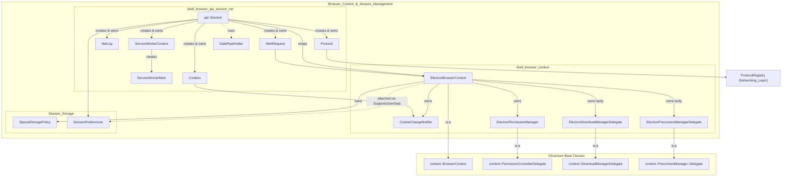
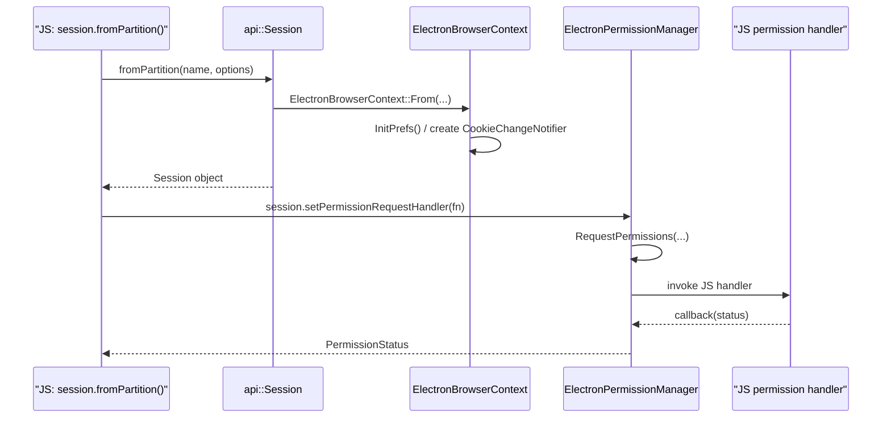

# Browser_Context_&_Session_Management

## Introduction

The **Browser_Context_&_Session_Management** module is the foundation of Electron's per-session state model. It implements **`ElectronBrowserContext`**, Electron's specialization of Chromium's `content::BrowserContext`, and everything built directly on top of it to expose a fully-featured, JavaScript-programmable `session` API.

Every Electron `Session` object (`session.defaultSession`, `session.fromPartition(...)`, etc.) is backed by exactly one `ElectronBrowserContext` instance. This context owns or lazily creates all per-session subsystems required by Chromium's content layer — cookies, permissions, downloads, network preconnection, storage policy, protocol handling, request interception, service workers, and preferences — and exposes JS-facing wrappers for each.

This module sits at the intersection of Chromium's content-layer extension points and Electron's gin/V8 binding layer, making it one of the most heavily depended-upon modules in the codebase.

## Purpose & Responsibilities

- **Session identity & lifecycle** — creating, caching (by partition name or path), and destroying `ElectronBrowserContext` instances.
- **Preferences** — per-session `PrefService` backed by `JsonPrefStore` + in-memory override store.
- **Cookies** — bridging Chromium's mojo cookie-change notifications to JS-observable events.
- **Permissions** — implementing `content::PermissionControllerDelegate` with JS-settable request/check handlers and device-permission bookkeeping.
- **Downloads** — implementing `content::DownloadManagerDelegate`, wiring native save dialogs.
- **Network preconnection** — minimal delegate for Chromium's `PreconnectManager`.
- **Storage policy & preload scripts** — lightweight per-context helpers (`SpecialStoragePolicy`, `SessionPreferences`).
- **JS-facing Session & Networking API** — `Session`, `Cookies`, `Protocol`, `NetLog`, `WebRequest`, `ServiceWorkerContext`/`ServiceWorkerMain`, and `DataPipeHolder`.

## Architecture Overview

### Session creation & permission flow

## Core Components

The module is organized into three closely related sub-modules:

### [shell_browser_context](shell_browser_context.md)
Implements `ElectronBrowserContext` itself along with its tightly-coupled delegate classes:
- `ElectronBrowserContext` — context identity/caching, preferences, device-permission bookkeeping, display-media selection, and all `content::BrowserContext` virtual overrides.
- `CookieChangeNotifier` — mojo `CookieChangeListener` adapter exposing a simple callback API.
- `ElectronPermissionManager` — `content::PermissionControllerDelegate` implementation with JS-pluggable request/check/device handlers.
- `ElectronDownloadManagerDelegate` — `content::DownloadManagerDelegate` implementation driving native save dialogs.
- `ElectronPreconnectManagerDelegate` — minimal `content::PreconnectManager::Delegate`.

### [Session_Storage](Session_Storage.md)
Small, single-responsibility helper classes owned/attached by `ElectronBrowserContext`:
- `SessionPreferences` — per-session preload script registration, attached via `base::SupportsUserData`.
- `SpecialStoragePolicy` — Chromium's `storage::SpecialStoragePolicy` implementation controlling per-origin storage protection/quota/durability/isolation.

### [shell_browser_api_session_net](shell_browser_api_session_net.md)
The JS-facing gin bindings built on top of `ElectronBrowserContext`, split into further sub-areas:
- **Session Core** — the `Session` class itself (storage/cache management, proxy/SSL config, preload scripts, network emulation).
- **Cookies & Data Pipe** — `Cookies` and `DataPipeHolder`.
- **Protocol & NetLog** — `Protocol` (custom scheme registration/interception) and `NetLog`.
- **WebRequest** — request/response interception (`WebRequest`, `RequestFilter`).
- **Service Workers** — `ServiceWorkerContext` and `ServiceWorkerMain`.

## Relationship to Other Modules

- **[Browser_Process_Core_&_Lifecycle](shell_browser_main_parts.md)** — `ElectronBrowserMainParts`/`ElectronBrowserClient` create and consult the default `ElectronBrowserContext` during startup and content-layer callbacks.
- **[Networking_Layer](shell_browser_net.md)** — `ResolveProxyHelper`, `ProtocolRegistry`, and proxying URL loader factories are owned/used by `ElectronBrowserContext` and the `Session`/`Protocol` APIs.
- **[Device_&_Peripheral_Access](shell_browser_file_system_access.md)** — File System Access and HID/USB/Serial permission contexts are looked up per-`ElectronBrowserContext`; device grants are recorded in this module.
- **[Native_Window_&_Menu_Management](shell_browser_native_window.md)** — `WebViewManager` (guest views) is created lazily via `GetGuestManager()`.
- **[WebContents_Rendering_&_Communication](web_contents.md)** — `ZoomLevelDelegate` is created per storage partition; `WebContents` is the origin of many `WebRequest`/permission events.
- **[Extensions_Subsystem](shell_browser_extensions_core.md)** — `ElectronExtensionSystem` is bootstrapped from `ElectronBrowserContext` when extensions are enabled.
- **[Preload_Script_Infrastructure](Preload_Script.md)** — defines the `PreloadScript` data type stored by `SessionPreferences`.