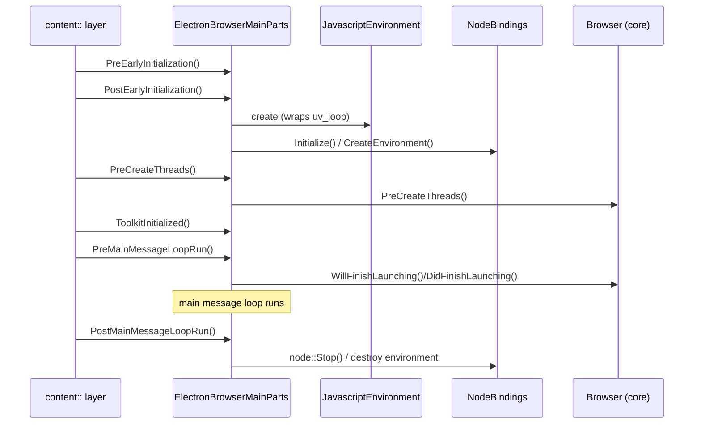

# Browser Process Core & Lifecycle

## 1. Purpose

The `Browser_Process_Core_&_Lifecycle` module (rooted at `shell/browser`) is the **foundation of Electron's browser (main) process**. It provides:

- The single application-wide `Browser` object that tracks app readiness, quitting/shutdown state, and mediates cross-platform OS behaviors (dock, jump lists, login items, recent documents, protocol handlers, etc.).
- `BrowserProcessImpl`, Electron's implementation of Chromium's `BrowserProcess` interface — a global service locator that lazily vends shared services (`PrefService`, `PrintJobManager`, `ResolveProxyHelper`, `SystemNetworkContextManager`, etc.) to the rest of the codebase.
- `ElectronBrowserClient` and `ElectronBrowserMainParts`, the two primary embedder hooks into Chromium's `//content` layer, responsible for answering embedder queries (device delegates, navigation throttles, notification services, etc.) and driving the ordered startup/shutdown sequence of the browser process (initializing V8/Node.js, the platform UI toolkit, and Electron's core singletons).
- Supporting infrastructure: the V8/Node `JavascriptEnvironment` and `MicrotasksRunner` used by the embedded main-process runtime, small content-layer glue classes (GPU client, navigation throttle, speech recognition delegate, WebUI factory, plugin-info host), auto-update lifecycle management (`AutoUpdater`), certificate management (`CertificateManagerModel`), and utilities for font defaults, NSS crypto prompts, and PDF viewer wiring.

Because this module sits at the root of Electron's object graph, virtually every other subsystem — window/menu management, WebContents rendering, extensions, device access, networking, and desktop UI — is either instantiated by, or communicates through, the components defined here.

## 2. Architecture Overview

```mermaid
flowchart TB
    subgraph BrowserProcessCoreLifecycle["Browser_Process_Core_&_Lifecycle"]
        direction TB

        subgraph Core["shell_browser_core"]
            Browser["Browser\n(app-wide singleton)"]
            BrowserObserver["BrowserObserver\n(lifecycle events)"]
            BrowserProcessImpl["BrowserProcessImpl\n(global service locator)"]
            AutoUpdater["AutoUpdater\n(update lifecycle)"]
            CertManagerModel["CertificateManagerModel\n(NSS cert store)"]
        end

        subgraph MainParts["shell_browser_main_parts"]
            EBC["ElectronBrowserClient\n(content::ContentBrowserClient)"]
            EBMP["ElectronBrowserMainParts\n(content::BrowserMainParts)"]
            JSENV["JavascriptEnvironment /\nMicrotasksRunner"]
            ContentDelegates["Content-Layer Delegates\n(GPU, NavThrottle, Speech,\nWebUI factory, Plugin info)"]
            SupportUtils["Support Utilities\n(font defaults, NSS delegate,\nPDF helper client)"]
        end

        EBMP -->|owns/creates| Browser
        EBMP -->|owns/creates| BrowserProcessImpl
        EBMP -->|owns| JSENV
        EBC -->|creates| EBMP
        EBC -->|delegates to| ContentDelegates
        EBMP -->|uses| SupportUtils
        Browser -- notifies --> BrowserObserver
        BrowserProcessImpl -- vends --> AutoUpdater
        BrowserProcessImpl -- vends --> CertManagerModel
    end

    AppEntry["Application_Bootstrap_&_Process_Entry"] --> EBMP
    EBC -.implements.-> ContentCBC["content::ContentBrowserClient"]
    EBMP -.implements.-> ContentBMP["content::BrowserMainParts"]

    BrowserProcessImpl --> NativeWindow["Native_Window_&_Menu_Management"]
    BrowserProcessImpl --> Net["Networking_Layer"]
    Browser --> WindowList["Window_List"]
    EBMP --> DeviceAccess["Device_&_Peripheral_Access"]
    EBMP --> Extensions["Extensions_Subsystem"]
    EBMP --> DesktopUI["Desktop_UI_Widgets_&_Dialogs"]
    EBMP --> NodeInfra["Common_Native_Gin_Infrastructure"]
    EBMP --> BrowserContext["Browser_Context_&_Session_Management"]
```

## 3. Startup Sequence (High Level)

## 4. Sub-modules

| Sub-module | Description | Key Components |
|---|---|---|
| **shell_browser_core** | The application-wide `Browser` singleton and lifecycle observer, plus process-scoped services (`BrowserProcessImpl`, `AutoUpdater`, `CertificateManagerModel`). Split further into: **lifecycle** (`Browser`, `BrowserObserver`, platform-specific behaviors) and **services** (`BrowserProcessImpl`, `AutoUpdater`, `CertificateManagerModel`). | `Browser`, `BrowserObserver`, `BrowserProcessImpl`, `AutoUpdater`, `CertificateManagerModel` |
| **shell_browser_main_parts** | Electron's embedder implementations of Chromium's `ContentBrowserClient`/`BrowserMainParts`, driving process startup/shutdown and content-layer integration. Split into: **client & main parts core**, **JS/V8 environment**, **content-layer delegates**, and **support utilities**. | `ElectronBrowserClient`, `ElectronBrowserMainParts`, `JavascriptEnvironment`, `MicrotasksRunner`, `ElectronGpuClient`, `ElectronNavigationThrottle`, `ElectronSpeechRecognitionManagerDelegate`, `ElectronWebUIControllerFactory`, `ElectronPluginInfoHostImpl`, `SetFontDefaults`, `ElectronNSSCryptoModuleDelegate`, `ElectronPDFDocumentHelperClient` |

## 5. Core Components Documentation

### shell_browser_core
- **Purpose**: App-wide singleton (`Browser`) and process-scoped service locator (`BrowserProcessImpl`), plus update and certificate-management helpers.
- **Sub-modules**:
  - `shell_browser_core_lifecycle` — `Browser`, `BrowserObserver`, `LoginItemSettings`, `LaunchItem`, `UserTask`, platform-specific lifecycle behavior.
  - `shell_browser_core_services` — `BrowserProcessImpl`, `BackgroundModeManager`, `PrefService`, `PrintJobManager`, `ResolveProxyHelper`, `AutoUpdater`, `CertificateManagerModel`.
- Full documentation: `shell_browser_core.md`, `shell_browser_core_lifecycle.md`, `shell_browser_core_services.md`

### shell_browser_main_parts
- **Purpose**: Central integration points between Chromium's `//content` layer and Electron's runtime — `ElectronBrowserClient` (embedder query answering) and `ElectronBrowserMainParts` (ordered startup/shutdown driver).
- **Sub-modules**:
  - `shell_browser_main_parts_client_core` — `ElectronBrowserClient`, `ElectronBrowserMainParts`, and their nested delegate/bootstrap types.
  - `shell_browser_main_parts_js_environment` — `JavascriptEnvironment`, `MicrotasksRunner`.
  - `shell_browser_main_parts_content_delegates` — `ElectronGpuClient`, `ElectronNavigationThrottle`, `ElectronSpeechRecognitionManagerDelegate`, `ElectronWebUIControllerFactory`, `ElectronPluginInfoHostImpl`.
  - `shell_browser_main_parts_support_utils` — font defaults, `ElectronNSSCryptoModuleDelegate`, `ElectronPDFDocumentHelperClient`.
- Full documentation: `shell_browser_main_parts.md`, `shell_browser_main_parts_client_core.md`, `shell_browser_main_parts_js_environment.md`, `shell_browser_main_parts_content_delegates.md`, `shell_browser_main_parts_support_utils.md`

## 6. Related Modules

- **Application_Bootstrap_&_Process_Entry** — invokes `ElectronMainDelegate`, which constructs `ElectronBrowserClient`/`ElectronBrowserMainParts` at process entry.
- **Browser_Context_&_Session_Management** — per-session `ElectronBrowserContext` instances managed alongside `BrowserProcessImpl` services and torn down in `ElectronBrowserMainParts::PostMainMessageLoopRun()`.
- **Native_Window_&_Menu_Management** — `Window_List`, `NativeWindow` observed by `Browser` for app-quit detection.
- **Device_&_Peripheral_Access** — Bluetooth/HID/Serial/USB/WebAuthn delegates exposed through `ElectronBrowserClient`.
- **Networking_Layer** — `ResolveProxyHelper`, `SystemNetworkContextManager` vended by `BrowserProcessImpl`.
- **Extensions_Subsystem** — `ElectronExtensionsClient`/`ElectronExtensionsBrowserClient` constructed by `ElectronBrowserMainParts`.
- **Common_Native_Gin_Infrastructure** — `NodeBindings`/`ElectronBindings` created by `ElectronBrowserMainParts` to bootstrap V8/Node.js.
- **Desktop_UI_Widgets_&_Dialogs** — `ViewsDelegate`/`ViewsDelegateMac`/`DarkModeManagerLinux` constructed during `ElectronBrowserMainParts::ToolkitInitialized()`.
- **Platform-Specific_Integration** — `PlatformNotificationService` returned via `ElectronBrowserClient::GetPlatformNotificationService()`.
- **Relauncher** — process relaunch support invoked during `Browser` quit/relaunch flows.