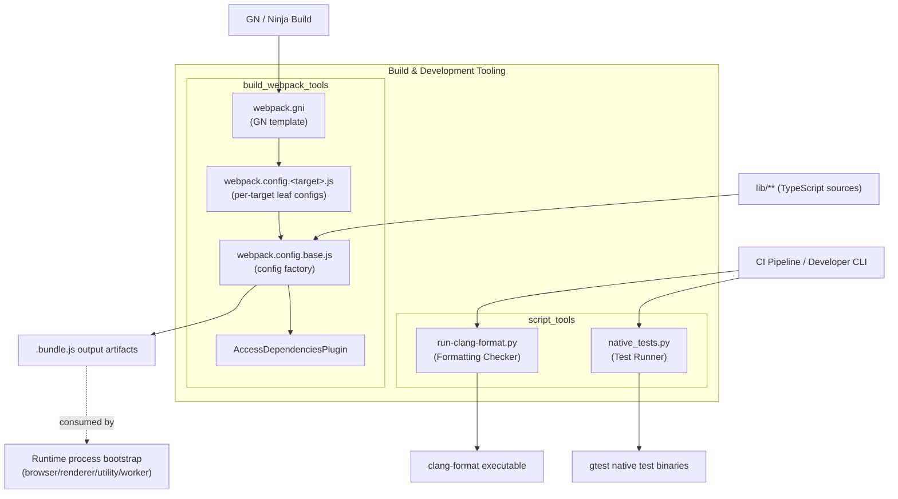
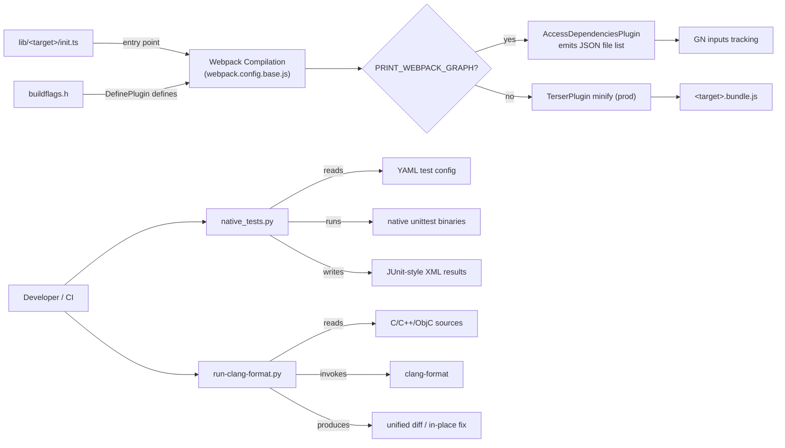

# Build & Development Tooling

## Introduction

The **Build & Development Tooling** module is the collection of engineering-facing infrastructure that supports building, bundling, and validating Electron's own source code. Unlike the rest of the codebase — which implements Electron's runtime behavior (browser process, renderer process, native windowing, IPC, etc.) — this module contains no runtime logic shipped to end users. Instead, it provides the **tools that produce and validate** that runtime code:

- A **Webpack-based build pipeline** (`build/webpack/*`) that compiles and bundles Electron's internal TypeScript/JavaScript sources (`lib/**`) into the `.bundle.js` files embedded in the Electron binary, bridging the JS build with the native GN/Ninja build system.
- **Python developer scripts** (`script/*`) used by CI and local development workflows to run native C++ test suites and enforce C/C++ code formatting via `clang-format`.

This module sits alongside — but is architecturally independent from — the runtime modules such as [Application Bootstrap & Process Entry](Application_Bootstrap_&_Process_Entry.md), [Browser Process Core & Lifecycle](Browser_Process_Core_&_Lifecycle.md), and [Public JS API Bindings](Public_JS_API_Bindings.md). Its relationship to those modules is purely input/output: it consumes their source files (e.g., `lib/browser/api`, `lib/renderer`) as build inputs and produces artifacts (bundles, test/format reports) that gate what ships or merges.

## Architecture Overview

The module is organized into two independent children, each addressing a distinct concern within the build/dev tooling domain:

Both children are largely self-contained: `build_webpack_tools` handles JS/TS bundling concerns, while `script_tools` handles native test execution and formatting concerns. They share no code, but both plug into the same CI/build lifecycle that gates changes to the rest of the Electron codebase.

## Data & Control Flow

## Core Components

### `build_webpack_tools`

Contains the Webpack build configuration infrastructure that bundles Electron's `lib/**` TypeScript sources into per-process JavaScript bundles (browser, renderer, sandboxed/isolated renderer, preload realm, utility, worker, node).

- **`AccessDependenciesPlugin`** (`build/webpack/webpack.config.base.js`) — A Webpack compiler plugin that hooks `compilation.finishModules` to enumerate every resolved source module and print their repo-relative paths as JSON. Activated only when `env.PRINT_WEBPACK_GRAPH` is set, enabling the GN build to introspect exact bundle dependency graphs without a full compile.
- The module implements a **factory-of-factories** configuration pattern: `webpack.config.base.js` exports a parameterized factory consumed by thin per-target leaf configs (`webpack.config.<target>.js`), each supplying flags like `alwaysHasNode`, `targetDeletesNodeGlobals`, `wrapInitWithProfilingTimeout`, `wrapInitWithTryCatch`, and `loadElectronFromAlternateTarget`.
- `webpack.gni` bridges this JS tooling into GN/Ninja, invoking Webpack per target and wiring buildflag injection, minification mode, and dependency tracking.

See full details: [Build & Webpack Tooling](build_webpack_tools.md)

### `script_tools`

A set of independent Python CLI utilities supporting native test execution and code-style enforcement:

- **`DisabledTestsPolicy`, `Platform`, `TestBinary`, `TestsList`, `Verbosity`** (`script/lib/native_tests.py`) — A config-driven native test runner that discovers, filters (by platform and disabled-test policy), executes, and reports on `gtest`-based C++ test binaries.
- **`ExitStatus`** (`script/run-clang-format.py`) — Drives a parallelized `clang-format` checker/fixer across C/C++/Objective-C sources, producing unified diffs or in-place fixes with CI-friendly exit codes.

See full details: [Script Tools](script_tools.md)

## Relationship to the Rest of the System

This module has no direct runtime dependency on Electron's native or JS execution layers, but its outputs gate and enable them:

| Build Target / Tool | Downstream Consumer |
|---|---|
| `browser` bundle | [Browser Process Core & Lifecycle](Browser_Process_Core_&_Lifecycle.md), [Public JS API Bindings](Public_JS_API_Bindings.md) (`lib_browser_api`) |
| `renderer` / `sandboxed_renderer` / `isolated_renderer` bundles | [Renderer Process Infrastructure](Renderer_Process_Infrastructure.md), `lib_renderer_ipc` |
| `preload_realm` bundle | [Preload Script Infrastructure](Preload_Script_Infrastructure.md) |
| `utility` bundle | [Node Utility Services](Node_Utility_Services.md) |
| `native_tests.py` | Validates native C++ code across [Browser Process Core & Lifecycle](Browser_Process_Core_&_Lifecycle.md), [Common Native Gin Infrastructure](Common_Native_Gin_Infrastructure.md), and other native modules |
| `run-clang-format.py` | Enforces style across the entire native C++ codebase prior to merge |

## Related Documentation

- [Build & Webpack Tooling](build_webpack_tools.md) — detailed docs for the Webpack configuration factory, `AccessDependenciesPlugin`, and GN integration.
- [Script Tools](script_tools.md) — detailed docs for `native_tests.py` and `run-clang-format.py`.
- [Public JS API Bindings](Public_JS_API_Bindings.md) — source consumed by the `browser`/`renderer` bundle targets.
- [Preload Script Infrastructure](Preload_Script_Infrastructure.md) — runtime consumer of the `preload_realm` bundle.
- [Common Native Gin Infrastructure](Common_Native_Gin_Infrastructure.md) — native code validated by the clang-format and native test tooling.