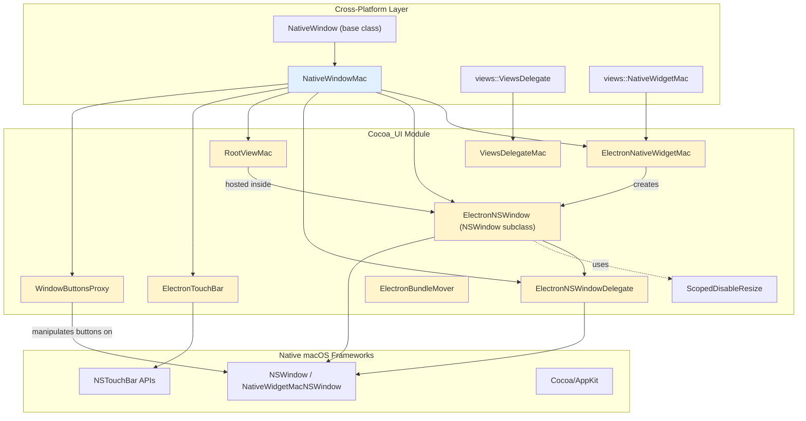
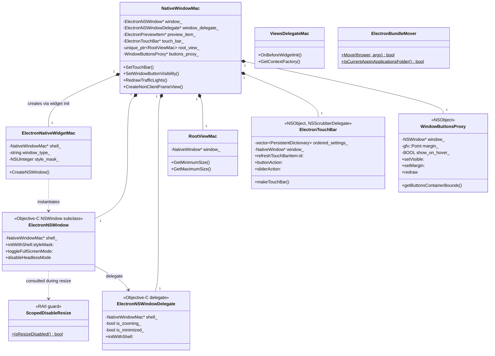
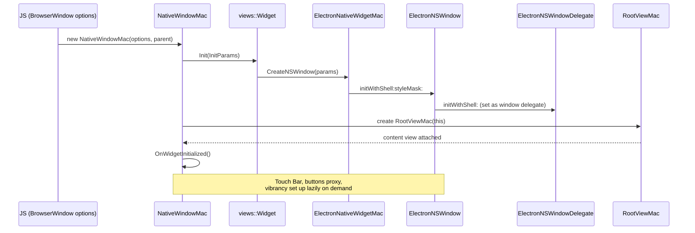
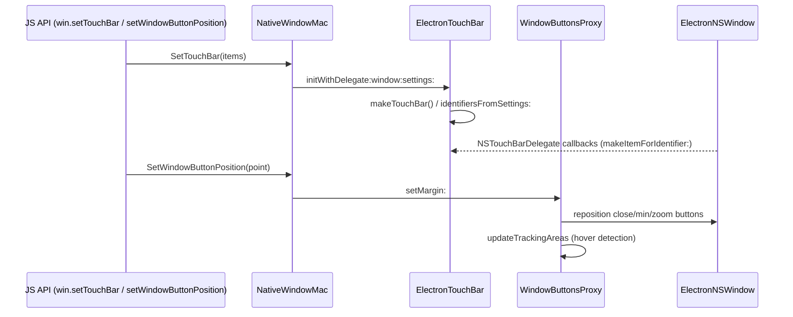

# Cocoa_UI Module

## Introduction

The **Cocoa_UI** module contains the macOS (AppKit/Cocoa) glue layer that Electron's cross-platform `NativeWindowMac` uses to implement native window behavior on macOS. It bridges the Chromium `views::Widget` framework with native `NSWindow`/`NSView`/`NSObject` objects, providing custom window classes, delegates, view-hosting, the macOS Touch Bar implementation, window control (traffic-light) button management, and utilities for moving the app bundle into `/Applications`.

This module is purely macOS-specific (Objective-C++ headers, `.h` files declaring both C++ classes and Objective-C interfaces) and is one of several platform backends feeding into the broader native window and UI subsystem. It has no direct Windows/Linux equivalent logic bundled in it — those live in their own sibling modules (see [Native_Window_&_Menu_Management](Native_Window_&_Menu_Management.md), `Frame_Views`, and `Windows_UI_(Desktop_Widgets)`).

## Purpose & Scope

Cocoa_UI is responsible for:

- **Native widget creation**: Supplying a custom `views::NativeWidgetMac` subclass (`ElectronNativeWidgetMac`) so Electron can control how the underlying `NSWindow` is created.
- **Custom NSWindow/NSWindowDelegate**: Extending Chromium's `NativeWidgetMacNSWindow`/`ViewsNSWindowDelegate` with Electron-specific behavior (`ElectronNSWindow`, `ElectronNSWindowDelegate`), including resize suppression, fullscreen transition tracking, accessibility, and Quick Look preview support.
- **Root content view hosting**: Providing the `views::View` (`RootViewMac`) that anchors Electron's cross-platform view tree inside the native Cocoa content view.
- **Touch Bar support**: Implementing the full NSTouchBar item lifecycle (`ElectronTouchBar`) — buttons, labels, sliders, color pickers, popovers, and groups — driven by JS-configured settings dictionaries.
- **Window button (traffic light) control**: `WindowButtonsProxy` repositions/hides/shows the native close/minimize/zoom buttons and supports hover-to-reveal behavior for frameless windows.
- **Views framework integration**: `ViewsDelegateMac` supplies macOS-specific hooks required by the `views::ViewsDelegate` interface (widget init parameters, context factory).
- **App bundle relocation**: `ElectronBundleMover` implements the "Move to Applications Folder" prompt/logic exposed to JS via `app.moveToApplicationsFolder()`.

## Architecture Overview

### Component Relationship Diagram

## Core Components

| Component | File | Responsibility |
|---|---|---|
| `ElectronNativeWidgetMac` | `electron_native_widget_mac.h` | Subclass of `views::NativeWidgetMac`; overrides `CreateNSWindow()` to produce an `ElectronNSWindow` configured with the correct style mask and window type. |
| `ElectronNSWindow` (+ `ScopedDisableResize`) | `electron_ns_window.h` | Objective-C `NSWindow` subclass adding Electron-specific properties (`acceptsFirstMouse`, `enableLargerThanScreen`, vibrancy view, corner mask) and behaviors (fullscreen toggling, headless mode). `ScopedDisableResize` is a static RAII counter used to suppress resize handling during sensitive operations. |
| `ElectronNSWindowDelegate` | `electron_ns_window_delegate.h` | Extends `ViewsNSWindowDelegate`; implements `NSTouchBarDelegate` and `QLPreviewPanelDataSource`; tracks zoom/minimize/resize state to work around macOS window-management quirks. |
| `RootViewMac` | `root_view_mac.h` | A `views::View` that acts as the root content view bridging Chromium Views into the native Cocoa window; supplies min/max size constraints back to the parent `NativeWindow`. |
| `ElectronTouchBar` | `electron_touch_bar.h` | Implements the entire Touch Bar item model (buttons, labels, color pickers, sliders, popovers, groups, "escape" item) driven from JS-supplied `PersistentDictionary` settings; handles item creation, refresh, and user-interaction callbacks. |
| `WindowButtonsProxy` (+ `ButtonsAreaHoverView`) | `window_buttons_proxy.h` | Repositions/hides the native traffic-light buttons, supports custom margins/heights for frameless & custom-titlebar windows, and implements hover-to-reveal via a tracking `NSView`. |
| `ViewsDelegateMac` | `views_delegate_mac.h` | macOS implementation of `views::ViewsDelegate`, providing `OnBeforeWidgetInit` and `GetContextFactory` hooks required by the Views framework during widget initialization. |
| `ElectronBundleMover` | `electron_bundle_mover.h` | Static utility implementing the "move app to /Applications" flow, including conflict detection (`kExists`, `kExistsAndRunning`) and user confirmation via `gin_helper::ErrorThrower`/`gin::Arguments`. |

## Data / Control Flow: Window Creation

## Interaction with Touch Bar & Window Buttons

## Relationship to Other Modules

- **[Native_Window_&_Menu_Management](Native_Window_&_Menu_Management.md)**: `NativeWindowMac` (the primary consumer of every class in this module) is declared in `shell/browser/native_window_mac.h`, part of `shell_browser_native_window_mac`. Cocoa_UI supplies the concrete Cocoa-level building blocks (`ElectronNSWindow`, `RootViewMac`, `ElectronTouchBar`, `WindowButtonsProxy`) that `NativeWindowMac` owns and orchestrates.
- **Browser_Process_Core_&_Lifecycle** (`shell_browser_main_parts_client_core_bootstrap`): `ElectronBrowserMainParts` references `ViewsDelegateMac` as the platform's `views::ViewsDelegate` implementation, wiring it into the Views framework during browser startup.
- **Menu_(Model_&_Views)**: `ElectronMenuController` (Cocoa menu controller, in the sibling "Menu" module) works alongside `ElectronTouchBar`'s Touch Bar item model and shares the `ElectronMenuModel` data source used across platforms.
- **Common_Native_Gin_Infrastructure**: `ElectronTouchBar` and `ElectronBundleMover` consume `gin_helper::PersistentDictionary`, `gin::Arguments`, and `gin_helper::ErrorThrower` from the shared Gin binding utilities (see `Gin_Helper` sub-module) to marshal JS-configured settings and report errors back to JavaScript.
- **Desktop_UI_Widgets_&_Dialogs** (parent module): Cocoa_UI is one of several platform-specific children alongside `Frame_Views` (Linux/Win frame chrome), `Windows_UI_(Desktop_Widgets)`, and `GTK_UI`, each providing the OS-native rendering backend for the shared `Autofill_Popup`, `UI_Dialogs`, `Tray_Icon`, and `Menu_(Model_&_Views)` abstractions.

## Key Design Notes

1. **Weak/raw pointer ownership**: Most C++ wrapper classes (`ElectronNativeWidgetMac`, `RootViewMac`) hold a `raw_ptr` back-reference to their owning `NativeWindowMac`, while the Objective-C objects (`ElectronNSWindow`, `ElectronNSWindowDelegate`, `ElectronTouchBar`, `WindowButtonsProxy`) hold plain/weak references to `shell_`/`window_` — the `NativeWindowMac` instance is the source of truth and owns the Cocoa objects' lifetimes via strong Objective-C properties (`__strong`).
2. **Resize suppression pattern**: `ScopedDisableResize` is a simple static-counter RAII guard consulted by `ElectronNSWindow` to avoid recursive/unwanted resize events during programmatic window operations (e.g., during fullscreen transitions or content view swaps).
3. **Fullscreen transition safety**: Both `ElectronNSWindow` (`toggleFullScreenMode:`) and its delegate track zooming/resizing state explicitly because macOS's fullscreen APIs are asynchronous and prone to lock-ups if a `close` is issued mid-transition (`has_deferred_window_close_` in `NativeWindowMac`).
4. **Settings-driven UI**: Touch Bar items are entirely data-driven via `gin_helper::PersistentDictionary`, allowing the JS layer to declaratively describe buttons/sliders/popovers without the native code needing per-feature JS bindings.
