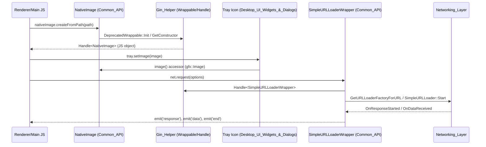

# Common_API Module

## 1. Introduction & Purpose

The **Common_API** module is a small, focused collection of native (C++) bindings that are shared across Electron's **main** and **utility** processes. It exposes a handful of low-level, cross-cutting JavaScript-facing APIs that do not belong to a single higher-level subsystem (such as windowing, sessions, or extensions) but are instead consumed *by* many of those subsystems.

Concretely, this module provides:

- **`Clipboard`** — native clipboard read/write access (text, HTML, RTF, images, bookmarks, raw buffers).
- **`NativeImage`** — the cross-platform image wrapper type (`nativeImage` in the public JS API) used throughout Electron for icons, tray images, drag images, screenshots, etc.
- **`SimpleURLLoaderWrapper`** — a Gin-wrapped adapter around Chromium's `network::SimpleURLLoader`, powering Electron's `net.request`-style URL loading API directly from native code.
- **`ElectronBindings`** — the bridge that exposes low-level Node.js/V8 process introspection primitives (heap snapshots, memory info, CPU usage, crash/hang testing hooks, `process._linkedBinding`) into the Node environment.

Architecturally, `Common_API` sits at the base of the dependency graph within `shell/common/`: it depends on the [Gin_Helper](Gin_Helper.md) wrapping/handle infrastructure and the [Gin_Converters](Gin_Converters.md) type-conversion layer, and it is in turn depended upon by many higher-level modules such as [System_&_App-Level_Services_API](System_&_App-Level_Services_API.md), [Networking_Layer](Networking_Layer.md), and [Desktop_UI_Widgets_&_Dialogs](Desktop_UI_Widgets_&_Dialogs.md).

## 2. Architecture Overview

Common_API is a leaf/foundation module: it has no children sub-modules (all four components live directly under `shell/common/api/`), but it has deep integration points with the rest of the `Common_Native_Gin_Infrastructure` family and beyond.

```mermaid
graph TD
    subgraph Common_API["Common_API (this module)"]
        Clipboard["Clipboard\n(electron_api_clipboard.h)"]
        NativeImage["NativeImage\n(electron_api_native_image.h)"]
        URLLoader["SimpleURLLoaderWrapper\n(electron_api_url_loader.h)"]
        Bindings["ElectronBindings\n(electron_bindings.h)"]
    end

    subgraph Infra["Gin/V8/Node Infrastructure"]
        GinHelper["Gin_Helper\n(Wrappable, Handle, Arguments, Promise)"]
        GinConv["Gin_Converters\n(image, net, gfx converters)"]
        NodeBind["Node_Bindings\n(NodeBindings, Environment)"]
        V8Utils["V8_Node_Common_Utils\n(v8_util, heap_snapshot)"]
    end

    Clipboard --> GinHelper
    Clipboard --> GinConv
    NativeImage --> GinHelper
    NativeImage --> GinConv
    URLLoader --> GinHelper
    URLLoader -->|BrowserContext| BrowserCtx["Browser_Context_&_Session_Management"]
    URLLoader -->|network stack| NetLayer["Networking_Layer"]
    Bindings --> NodeBind
    Bindings --> V8Utils
    Bindings --> GinHelper

    subgraph Consumers["Representative Consumers"]
        SysAPI["System_&_App-Level_Services_API"]
        UI["Desktop_UI_Widgets_&_Dialogs"]
        Session["Browser_Context_&_Session_Management"]
        AppBoot["Application_Bootstrap_&_Process_Entry"]
    end

    NativeImage --> SysAPI
    NativeImage --> UI
    Clipboard --> SysAPI
    URLLoader --> Session
    Bindings --> AppBoot
```

### Key relationships

- **Wrapping pattern**: `NativeImage` and `SimpleURLLoaderWrapper` extend `gin_helper::DeprecatedWrappable<T>` (see [Gin_Helper](Gin_Helper.md)), which provides the V8 object-template/constructor machinery (`Wrappable::Init`, `GetConstructor`) needed to expose a C++ object as a JS-visible instance. Instances are returned to JS via `gin_helper::Handle<T>`, a lightweight non-owning smart pointer pairing the V8 wrapper with the native object pointer.
- **Static utility pattern**: `Clipboard` and most of `ElectronBindings` instead expose purely **static methods**, called directly from generated Gin function templates — no per-instance JS wrapper object is required for these.
- **Event emission**: `SimpleURLLoaderWrapper` additionally mixes in `gin_helper::EventEmitterMixin`, letting it emit Node-style events (`'data'`, `'complete'`, `'redirect'`, etc.) back into JavaScript as the underlying network request progresses.
- **Lifecycle safety**: `SimpleURLLoaderWrapper` also implements `gin_helper::CleanedUpAtExit`, ensuring in-flight loaders are torn down cleanly during process shutdown.

## 3. Sub-components

Since this module consists of exactly four self-contained header/source pairs with no further natural sub-groupings in the module tree, each is documented in detail below rather than split into separate files.

### 3.1 Clipboard (`electron_api_clipboard.h`)

`electron::api::Clipboard` is a **stateless, static-only utility class** (non-instantiable — copy is explicitly deleted and no public constructor exists) that wraps `ui::base::Clipboard`. It provides the native implementation backing Electron's public `clipboard` module.

Responsibilities:
- Determine the active `ui::ClipboardBuffer` (standard vs. selection buffer) via `GetClipboardBuffer(gin_helper::Arguments*)`.
- Query/clear clipboard state: `AvailableFormats`, `Has`, `Clear`.
- Read/write plain text, RTF, HTML, bookmarks, raw format strings, and arbitrary buffers.
- Read/write images via `gfx::Image`, delegating to [Gin_Converters](Gin_Converters.md)'s `image_converter.h` for JS ⇄ `gfx::Image` conversion.
- Manage the platform "find" pasteboard (`ReadFindText`/`WriteFindText`, primarily macOS).
- `WriteFilesForTesting` — a test-only hook for writing file lists to the clipboard.

All methods accept an optional `gin_helper::Arguments*` to allow callers to pass an extra options object (e.g., `{ type: 'selection' }` on Linux) without a fixed C++ signature — a common idiom across the [Gin_Helper](Gin_Helper.md) layer.

### 3.2 NativeImage (`electron_api_native_image.h`)

`electron::api::NativeImage` is the native backer of Electron's public `nativeImage` API and one of the most widely reused types across the codebase (used by tray icons, window icons, drag-and-drop, notifications, screen capture, etc. — see [Desktop_UI_Widgets_&_Dialogs](Desktop_UI_Widgets_&_Dialogs.md) and [System_&_App-Level_Services_API](System_&_App-Level_Services_API.md)).

Key design points:
- Inherits `gin_helper::DeprecatedWrappable<NativeImage>`, so instances are created and returned as `gin_helper::Handle<NativeImage>` — never constructed directly from JS.
- Wraps a `gfx::Image` (`image_`) as its core data, with Windows-only support for lazy `HICON` generation and caching per pixel size (`hicons_` map, populated from `hicon_path_` when needed).
- Rich set of **static factory functions** mirroring the JS API surface: `CreateEmpty`, `Create`, `CreateFromPNG`, `CreateFromJPEG`, `CreateFromPath`, `CreateFromBitmap`, `CreateFromBuffer`, `CreateFromDataURL`, `CreateFromNamedImage`, and (non-Linux) `CreateThumbnailFromPath` (returns a `v8::Promise`).
- `TryConvertNativeImage` is the key interop helper used by other modules/converters to coerce an arbitrary `v8::Local<v8::Value>` into a `NativeImage*`, with configurable throw-vs-warn error behavior (`OnConvertError`).
- Instance methods (private, exposed via `GetObjectTemplateBuilder`) implement the full nativeImage prototype: `ToPNG`, `ToJPEG`, `ToBitmap`, `ToDataURL`, `Resize`, `Crop`, `GetSize`, `GetAspectRatio`, `AddRepresentation`, template-image flagging (`SetTemplateImage`/`IsTemplateImage`, macOS-oriented), and emptiness checks (`IsEmpty`).
- Tracks V8 external memory usage (`UpdateExternalAllocatedMemoryUsage`, `memory_usage_`) so the image's native memory footprint is visible to V8's GC heuristics.

### 3.3 SimpleURLLoaderWrapper (`electron_api_url_loader.h`)

`electron::api::SimpleURLLoaderWrapper` bridges Chromium's `network::SimpleURLLoader` networking primitive into a JS-consumable, event-emitting object — the native engine behind Electron's low-level `net` request API (complementary to the higher-level session/protocol machinery in [Networking_Layer](Networking_Layer.md) and [Browser_Context_&_Session_Management](Browser_Context_&_Session_Management.md)).

Inheritance/composition:
- `gin_helper::DeprecatedWrappable<SimpleURLLoaderWrapper>` — standard JS-wrappable object pattern.
- `gin_helper::EventEmitterMixin<SimpleURLLoaderWrapper>` — enables `.emit()` of Node-style events back to JS listeners.
- `gin_helper::CleanedUpAtExit` — guarantees graceful shutdown via `WillBeDestroyed()`.
- `network::SimpleURLLoaderStreamConsumer` (private) — receives streamed response bodies (`OnDataReceived`, `OnComplete`, `OnRetry`).
- `network::mojom::URLLoaderNetworkServiceObserver` (private) — receives network-service-level callbacks: auth challenges (`OnAuthRequired`), TLS errors (`OnSSLCertificateError`), redirect/loading-state updates, shared-storage and private-network events, etc.

Lifecycle:
1. `Create(gin::Arguments*)` constructs the wrapper from a JS-supplied request descriptor, resolving the appropriate `ElectronBrowserContext` and building a `network::ResourceRequest`.
2. `Start()` kicks off the underlying `SimpleURLLoader`, obtaining a `SharedURLLoaderFactory` for the target URL via `GetURLLoaderFactoryForURL`.
3. As the request progresses, private callback handlers (`OnResponseStarted`, `OnRedirect`, `OnUploadProgress`, `OnDownloadProgress`) translate native network events into emitted JS events.
4. `Pin()`/`PinBodyGetter()` keep V8 references alive (`pinned_wrapper_`, `pinned_chunk_pipe_getter_`) for the duration of the request to prevent premature GC.
5. `Cancel()` allows JS-initiated abort of an in-flight request.

A `base::WeakPtrFactory` and `SEQUENCE_CHECKER` guard against use-after-free and cross-sequence access, consistent with Chromium's threading conventions.

### 3.4 ElectronBindings (`electron_bindings.h`)

`electron::ElectronBindings` is not a JS-wrappable object but a **process-level bridge** installed once per Node `Environment`. It underlies low-level `process`-object extensions and diagnostic tooling exposed by Electron's main/utility processes, tying together [Node_Bindings](Node_Bindings.md) and [V8_Node_Common_Utils](V8_Node_Common_Utils.md).

Responsibilities:
- **`BindTo(isolate, process)`** — installs `process._linkedBinding`, Electron's alternative to Node's internal `process.binding`, allowing native Electron modules to be loaded by name from JS.
- **`EnvironmentDestroyed(node::Environment*)`** — cleanup hook invoked when a Node environment tears down (removes it from `pending_next_ticks_`).
- **`BindProcess(isolate, dictionary, metrics)`** — populates a `gin_helper::Dictionary` (typically the global `process` object) with diagnostic accessors: heap statistics (`GetHeapStatistics`), process creation time (`GetCreationTime`), system memory info (`GetSystemMemoryInfo`), process memory info as a `v8::Promise` (`GetProcessMemoryInfo`), Blink memory info, and CPU usage (`GetCPUUsage`, backed by a `base::ProcessMetrics` instance owned as `metrics_`).
- **`Crash()` / `Hang()`** — intentional-fault static methods used for crash-reporter and hang-detector testing (see [Application_Bootstrap_&_Process_Entry](Application_Bootstrap_&_Process_Entry.md) for how crash reporting is wired at startup).
- **`TakeHeapSnapshot(isolate, file_path)`** — writes a `.heapsnapshot` file, delegating to `shell/common/heap_snapshot.h` (part of [V8_Node_Common_Utils](V8_Node_Common_Utils.md)).
- **`DidReceiveMemoryDump(...)`** — static callback that resolves a `gin_helper::Promise<Dictionary>` once Chromium's `memory_instrumentation::GlobalMemoryDump` service returns results for a given `target_pid`.
- **`ActivateUVLoop(isolate)` / `OnCallNextTick(uv_async_t*)`** — integrates libuv's event loop with pending Node `process.nextTick` callbacks queued across environments (`call_next_tick_async_`, `pending_next_ticks_`), ensuring Node's microtask/next-tick semantics function correctly inside Electron's embedder loop.

## 4. Data & Control Flow Example

The following sequence illustrates a typical cross-module flow: a renderer calls `nativeImage.createFromPath()` and then uses the result to set a tray icon, followed by a `net`-style request being issued.

## 5. How This Module Fits into the Overall System

| Related Module | Relationship |
|---|---|
| [Gin_Helper](Gin_Helper.md) | Supplies `Wrappable`, `Handle<T>`, `Arguments`, `Promise`, `EventEmitterMixin`, `CleanedUpAtExit` — the foundational patterns all four Common_API components build on. |
| [Gin_Converters](Gin_Converters.md) | Supplies JS ⇄ native type conversion (images, net types, gfx types) used by `Clipboard` and `NativeImage`. |
| [Node_Bindings](Node_Bindings.md) | `ElectronBindings` operates on `node::Environment` instances managed by this module. |
| [V8_Node_Common_Utils](V8_Node_Common_Utils.md) | Provides `heap_snapshot`, `v8_util`, and related low-level V8 helpers used by `ElectronBindings`. |
| [Networking_Layer](Networking_Layer.md) | `SimpleURLLoaderWrapper` is a JS-facing companion to the native URL-loader factories and proxying infrastructure documented there. |
| [Browser_Context_&_Session_Management](Browser_Context_&_Session_Management.md) | Supplies `ElectronBrowserContext`, used by `SimpleURLLoaderWrapper` to resolve the correct network context/partition. |
| [System_&_App-Level_Services_API](System_&_App-Level_Services_API.md) | Consumes `NativeImage` extensively (tray, notifications, desktop capturer sources, app icons). |
| [Desktop_UI_Widgets_&_Dialogs](Desktop_UI_Widgets_&_Dialogs.md) | Consumes `NativeImage` and `Clipboard`-style image handling for tray icons, drag images, and menu icons. |
| [Application_Bootstrap_&_Process_Entry](Application_Bootstrap_&_Process_Entry.md) | Wires up crash-reporter clients that interact with `ElectronBindings::Crash()`/`Hang()` diagnostics. |
| [Asar](Asar.md) | Sibling module under `Common_Native_Gin_Infrastructure`; not directly dependent, but shares the same `shell/common/` layer. |

## 6. Summary

Common_API is intentionally narrow in scope: it is the thinnest possible native layer exposing clipboard access, image manipulation, low-level URL loading, and Node/V8 process introspection to JavaScript. Its components rely almost entirely on the [Gin_Helper](Gin_Helper.md) wrapping infrastructure for their JS interop, and its outputs (`NativeImage`, network events, process diagnostics) are consumed pervasively across nearly every other functional module in the system.
