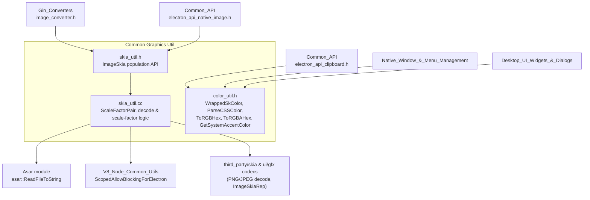
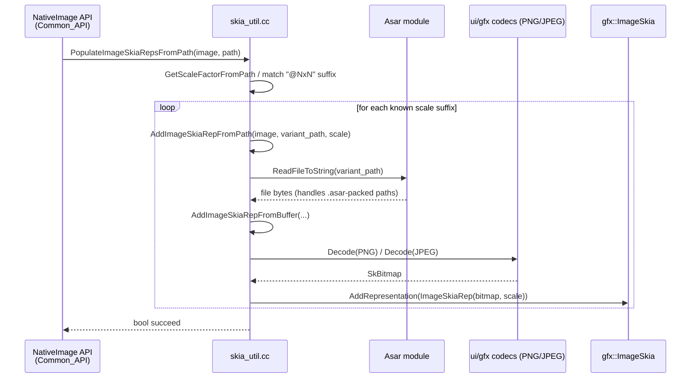

# Common Graphics Util

## Introduction & Purpose

The **Common Graphics Util** module is a small but foundational utility layer within Electron's shared (`shell/common`) code. It provides low-level, platform-agnostic helper functions for two closely related concerns:

1. **Color parsing and formatting** (`color_util.h`) — converting between CSS-style color strings and Skia's native `SkColor` representation, plus OS-level accent color retrieval on Windows.
2. **Raster image (Skia) manipulation** (`skia_util.h` / `skia_util.cc`) — populating `gfx::ImageSkia` objects with bitmap representations decoded from PNG/JPEG data, raw buffers, files on disk (including ASAR-packed files), and Windows `HICON` handles.

These utilities have no UI or business logic of their own; instead they are consumed throughout the codebase wherever colors or images need to be parsed, decoded, or converted between native and JavaScript-exposed representations. Because of this, Common Graphics Util acts as a shared dependency for the [Gin Converters](Gin_Converters.md) module (which exposes `gfx::ImageSkia` and `SkColor` to JavaScript), the [Common API](Common_API.md) module (`electron_api_native_image`, `electron_api_clipboard`), and higher-level UI and window-management modules such as [Native_Window_&_Menu_Management](Native_Window_%26_Menu_Management.md) and [Desktop_UI_Widgets_%26_Dialogs](Desktop_UI_Widgets_%26_Dialogs.md).

## Scope

This module is part of the broader **Common Native Gin Infrastructure** family of utility modules living under `shell/common/`. It sits alongside, and is used by, sibling utility modules:

- [Common_API](Common_API.md) — Gin-exposed APIs (`NativeImage`, `Clipboard`) that depend on image decoding routines from this module.
- [Asar](Asar.md) — provides the archive-aware file reading (`asar::ReadFileToString`) used when loading image files that may reside inside `.asar` packages.
- [V8_Node_Common_Utils](V8_Node_Common_Utils.md) — provides `ScopedAllowBlockingForElectron`, used here to permit blocking file I/O during image loading.
- [Gin_Converters](Gin_Converters.md) — the `image_converter.h` gin converter marshals `gfx::ImageSkia`/`gfx::Image` values to/from JavaScript, relying indirectly on the bitmap population helpers documented here.

## Architecture Overview



## Core Components

### `WrappedSkColor` (color_util.h)

`SkColor` is a plain `uint32_t` typedef in Skia, which makes it ambiguous for gin's type-conversion templates (they need a distinct C++ type to specialize on). `WrappedSkColor` is a minimal tag struct that wraps an `SkColor` value and provides an implicit conversion back to `SkColor`, allowing gin converters to unambiguously recognize "this value should be treated as a color" when marshaling between C++ and JavaScript.

```cpp
struct WrappedSkColor {
  WrappedSkColor() = default;
  WrappedSkColor(SkColor c) : value(c) {}
  SkColor value;
  operator SkColor() const { return value; }
};
```

Alongside this type, `color_util.h` declares free functions (implemented elsewhere in `shell/common/color_util.cc`, not part of this module's core components but part of the same header contract):

| Function | Purpose |
|---|---|
| `ParseCSSColor(const std::string&)` | Parses hex, `rgb()`, `rgba()`, `hsl()`, `hsla()`, or named CSS colors into an `SkColor`. |
| `ToRGBHex(SkColor)` | Formats a color as `"#RRGGBB"`. |
| `ToRGBAHex(SkColor, bool include_hash)` | Formats a color as `"#RRGGBBAA"` (or without the leading `#`). |
| `GetSystemAccentColor()` *(Windows only)* | Retrieves the OS accent color from the Windows registry/theme API. |

These are consumed by JS-facing APIs (e.g. `nativeTheme`, `systemPreferences`) and by native UI code that needs to render using the user's theme color.

### `ScaleFactorPair` (skia_util.cc)

An internal (anonymous-namespace) helper struct pairing a filename suffix (e.g. `"@2x"`) with its corresponding scale factor (e.g. `2.0f`). It powers Electron's macOS/Chromium-style **resolution-suffix convention** for image assets, used by `PopulateImageSkiaRepsFromPath` to automatically discover and load `@1x`, `@2x`, `@3x`, etc. variants of an image file so the correct resolution can be selected at render time.

```cpp
struct ScaleFactorPair {
  const char* name;
  float scale;
};
```

### Image population API (skia_util.h)

The public header declares a small set of free functions used to build up a `gfx::ImageSkia` (Chromium's multi-resolution image container) from various sources:

| Function | Purpose |
|---|---|
| `PopulateImageSkiaRepsFromPath(image, path)` | Loads all resolution variants of an image found next to `path` (honoring the `@NxN` suffix convention) and adds them as `ImageSkiaRep`s. |
| `AddImageSkiaRepFromBuffer(image, data, width, height, scale_factor)` | Adds a representation from a raw pixel or encoded (PNG/JPEG) buffer, falling back to raw `N32` pixel interpretation if decoding fails. |
| `AddImageSkiaRepFromJPEG(image, data, scale_factor)` | Decodes JPEG bytes and adds the resulting bitmap as a representation (also fixes an alpha-type bug in the JPEG decoder). |
| `AddImageSkiaRepFromPNG(image, data, scale_factor)` | Decodes PNG bytes and adds the resulting bitmap as a representation. |
| `ReadImageSkiaFromICO(image, HICON)` *(Windows only)* | Converts a native Windows icon handle into an `ImageSkia` representation. |

Internally, `AddImageSkiaRepFromPath` (private to the `.cc` file) uses `electron::ScopedAllowBlockingForElectron` (from [V8_Node_Common_Utils](V8_Node_Common_Utils.md)) to permit synchronous file I/O, and `asar::ReadFileToString` (from [Asar](Asar.md)) so that image assets bundled inside `.asar` archives are transparently readable just like normal files on disk.

## Data Flow: Loading a Multi-Resolution Image



## How This Module Fits Into the Overall System

- **JavaScript-exposed APIs**: `NativeImage` and `Clipboard` (in [Common_API](Common_API.md)) call into `skia_util` to decode image buffers/files supplied from JS (e.g., `nativeImage.createFromPath()`), and into `color_util`'s `WrappedSkColor` for color-related clipboard/native-theme operations.
- **Gin marshaling**: [Gin_Converters](Gin_Converters.md)'s `image_converter.h` and any color-related converters rely on the types and helper functions in this module to convert between native Skia/gfx types and V8 values.
- **UI & Windowing**: Modules such as [Native_Window_&_Menu_Management](Native_Window_%26_Menu_Management.md) and [Desktop_UI_Widgets_%26_Dialogs](Desktop_UI_Widgets_%26_Dialogs.md) use `color_util` (e.g., for theming, `nativeTheme`, tray icons) and `skia_util` (e.g., loading tray/dock/window icons) indirectly through the higher-level APIs.
- **Packaging transparency**: Through its dependency on [Asar](Asar.md), this module allows image assets to be loaded identically whether they live on the plain filesystem or inside a packaged `.asar` archive — a detail invisible to all downstream callers.

## Summary

Common Graphics Util is a compact, dependency-light utility module that centralizes two cross-cutting concerns — color parsing/formatting and Skia image decoding — so that the numerous higher-level modules in Electron (native UI, gin bindings, and JS-facing APIs) don't need to duplicate this logic. Its small size and stable, narrowly-scoped API surface make it a foundational leaf dependency in the overall module graph.
