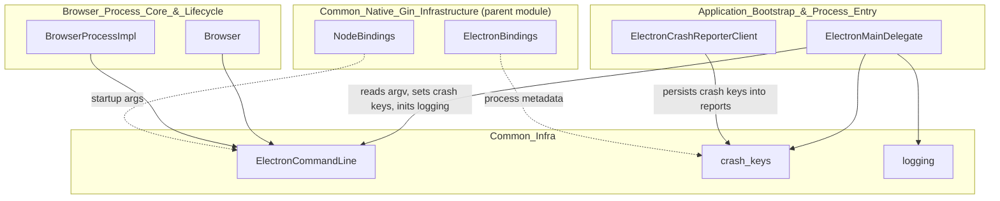
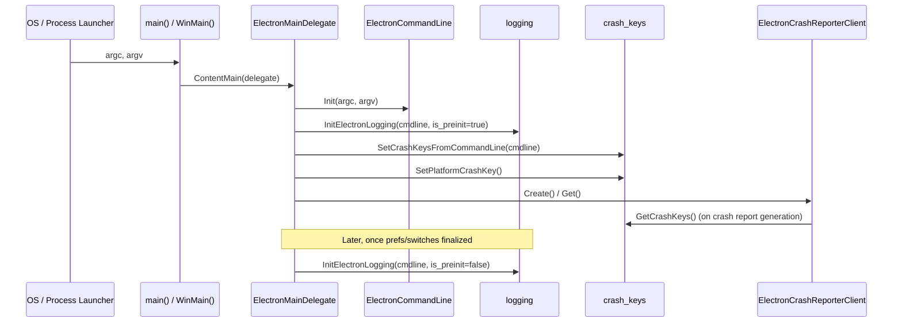

# Common_Infra

## Purpose

`Common_Infra` provides a small set of foundational, process-wide utilities that are used
throughout Electron's native (C++) codebase before almost any other subsystem is initialized.
It is intentionally minimal and dependency-light so that it can be safely used from the very
first lines of `main()`, from crash-handling code, and from any process type (browser, renderer,
GPU, utility, zygote, etc.).

The module is composed of exactly three headers, each addressing a distinct, orthogonal concern:

| Concern | Component | Responsibility |
|---|---|---|
| Command-line capture | `ElectronCommandLine` (`shell/common/electron_command_line.h`) | Stores the original `argc`/`argv` the process was launched with, exposing it as a stable singleton for the rest of the app. |
| Crash diagnostics | `crash_keys` namespace (`shell/common/crash_keys.h`) | Manages a global table of key/value "crash keys" that are attached to crash reports for post-mortem debugging. |
| Logging bootstrap | `logging` namespace (`shell/common/logging.h`) | Initializes Chromium/Electron's logging system and determines the log file location. |

Because these utilities have no heavy dependencies (no V8, no content layer, no UI), they sit at
the very bottom of Electron's native dependency graph and are consumed by almost every other
native module.

## Architecture Overview

`Common_Infra` has **no outbound dependencies** on other Electron modules — it only depends on
Chromium's `base` library (`base::CommandLine`, `base::FilePath`). All arrows above are *inbound*:
other modules call into `Common_Infra`, never the reverse.

## Component Details

### 1. `ElectronCommandLine`
*File: `shell/common/electron_command_line.h`*

A non-instantiable singleton (all members are `static`, constructor deleted) that captures the
process's original command-line arguments exactly as passed to `main()`.

- **`Init(argc, argv)`** — Called once, extremely early in [`ElectronMainDelegate`](Application_Bootstrap_&_Process_Entry.md)'s
  startup sequence (`BasicStartupComplete`), before `base::CommandLine::Init()` may have fully
  normalized the arguments on all platforms.
- **`argv()`** — Returns the raw `base::CommandLine::StringVector` for platform-specific code that
  needs the untouched argument list.
- **`AsUtf8()`** — Provides a UTF-8-normalized view of the arguments, useful for cross-platform
  code (important on Windows where native argv is UTF-16).
- **`InitializeFromCommandLine()`** *(Linux only)* — Because Linux uses the zygote process model,
  the arguments must instead be re-derived from `base::CommandLine::ForCurrentProcess()` after
  fork, rather than from the original `argc`/`argv`.

**Why it exists**: Chromium's own `base::CommandLine` is reinitialized/mutated at various points
across different process types and platforms. Electron needs one authoritative, unmodified record
of the arguments the app was launched with (e.g., for `app.commandLine` JS APIs, single-instance
locking, and relaunching).

### 2. `crash_keys` namespace
*File: `shell/common/crash_keys.h`*

A free-function API (not a class) for managing global crash-reporting metadata:

- `SetCrashKey` / `ClearCrashKey` / `GetCrashKeys` — basic CRUD over an internal
  `std::map<std::string, std::string>` of arbitrary diagnostic key/value pairs.
- `SetCrashKeysFromCommandLine(command_line)` — Extracts relevant switches/flags from a
  `base::CommandLine` and registers them as crash keys, so crash reports can be correlated with
  how the process was launched.
- `SetPlatformCrashKey()` — Registers platform identification (OS/arch/version) as a crash key.

**Consumers**: [`ElectronCrashReporterClient`](Application_Bootstrap_&_Process_Entry.md) (in the
`Application_Bootstrap_&_Process_Entry` module) reads/aggregates these keys via
`GetProcessSimpleAnnotations()` when assembling a crash report to upload. `ElectronMainDelegate`
populates keys early during `PreSandboxStartup()`.

### 3. `logging` namespace
*File: `shell/common/logging.h`*

Two free functions that bootstrap Electron's logging subsystem on top of Chromium's `logging`
library:

- `InitElectronLogging(command_line, is_preinit)` — Configures log level, log destinations
  (stderr/file), and Electron-specific flags (e.g. `--enable-logging`, `--log-file`). The
  `is_preinit` flag distinguishes the very first (pre-sandbox) initialization from a later,
  fully-configured re-initialization once user preferences/switches are available.
- `GetLogFileName(command_line)` — Computes the `base::FilePath` where log output should be
  written, honoring the `--log-file` switch or falling back to a platform default location.

**Consumers**: Called from `ElectronMainDelegate::PreSandboxStartup()` /
`BasicStartupComplete()` (see `Application_Bootstrap_&_Process_Entry`) so that logging is available
as early as possible in every process type.

## Data Flow: Process Startup Sequence

The three components are typically exercised together, in this order, at the very start of every
Electron process:

This ordering guarantees that:
1. The original arguments are captured before any platform code mutates `base::CommandLine`.
2. Logging is available for diagnostics as early as possible (even before sandbox initialization).
3. Crash keys reflect the actual launch configuration in case the process crashes during startup.

## Relationship to Other Modules

`Common_Infra` is one of several leaf utility groups inside the broader
[**Common_Native_Gin_Infrastructure**](Common_Native_Gin_Infrastructure.md) module, which also
includes:

- [**Common_API**](Common_API.md) — higher-level native API bindings (clipboard, native image, URL
  loader) that may log via this module.
- [**Gin_Helper**](Gin_Helper.md) / [**Gin_Converters**](Gin_Converters.md) — V8/Gin binding
  infrastructure, unrelated to but co-located with `Common_Infra` at the "common" layer.
- [**Node_Bindings**](Node_Bindings.md) — Node.js integration, whose startup also flows through
  process-level logging/command-line state.
- [**Asar**](Asar.md) and [**Common_Graphics_Util**](Common_Graphics_Util.md) — other
  self-contained common utilities.

Primary external consumers outside the parent module:

- [**Application_Bootstrap_&_Process_Entry**](Application_Bootstrap_&_Process_Entry.md) — the
  `ElectronMainDelegate` and `ElectronCrashReporterClient` classes are the main drivers of
  `Common_Infra`'s APIs during process startup and crash reporting.
- [**Browser_Process_Core_&_Lifecycle**](Browser_Process_Core_&_Lifecycle.md) — `Browser` and
  `BrowserProcessImpl` read command-line state (e.g., for relaunch behavior, `app.commandLine`
  JS API) originally captured by `ElectronCommandLine`.

## Design Notes

- **No class instances**: All three components expose only static/free functions — there is no
  object lifecycle to manage, which makes them trivially safe to call from any process, thread, or
  initialization phase.
- **Platform conditionals**: Both `ElectronCommandLine` (Linux zygote handling) and `logging`
  (implicitly, via `base::FilePath`/`base::CommandLine` platform differences) contain
  platform-specific branches, but the public API surface remains uniform across OSes.
- **Minimal dependencies**: Only `base::CommandLine` and `base::FilePath` are required, keeping
  `Common_Infra` includable from extremely early startup code paths where most of Chromium/Electron
  is not yet initialized.
