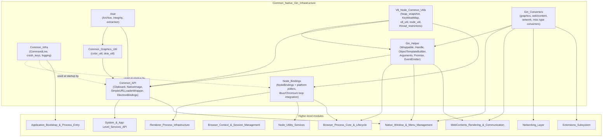
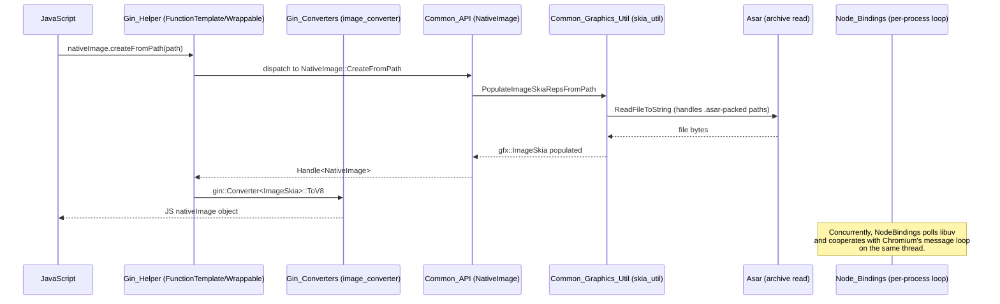

# Common_Native_Gin_Infrastructure

## 1. Introduction & Purpose

**Common_Native_Gin_Infrastructure** (rooted at `shell/common/`) is the foundational native (C++) layer that underlies almost every JavaScript-facing feature in Electron. It provides the shared plumbing required to:

- **Bind C++ objects/functions to JavaScript** via V8 and Chromium's `gin` library (object wrapping, function templates, promises, events).
- **Convert native C++ types to/from V8 values** (geometry, images, network types, web/content types, app-specific types).
- **Embed and drive the Node.js runtime** (libuv + V8) cooperatively alongside Chromium's own message loop, across every process type.
- **Provide small, cross-cutting utilities** used everywhere: command-line capture, crash-key management, logging bootstrap, ASAR archive reading, color/image utilities, and low-level V8/Node helpers (heap snapshots, weak maps, structured cloning, thread-restriction overrides).
- **Expose narrowly-scoped native APIs** (`clipboard`, `nativeImage`, low-level `net` URL loading, process introspection) that are consumed pervasively by higher-level modules.

Because it has no dependency on higher-level subsystems (windowing, sessions, extensions, etc.), this module sits at the *bottom* of Electron's native dependency graph. Virtually every other module described elsewhere in this documentation set — from [Native_Window_&_Menu_Management](Native_Window_&_Menu_Management.md) to [Browser_Context_&_Session_Management](Browser_Context_&_Session_Management.md) to [Extensions_Subsystem](Extensions_Subsystem.md) — depends, directly or transitively, on the building blocks defined here.

## 2. Architecture Overview

The module is organized into eight cohesive sub-modules, each addressing a distinct concern, layered roughly from "raw utilities" up to "JS-facing APIs" and "Node runtime embedding."

### Layering summary

1. **Common_Infra**, **Asar**, and **Common_Graphics_Util** are dependency-light "leaf" utilities (command-line/logging/crash-keys, archive reading, color/image decoding).
2. **V8_Node_Common_Utils** wraps raw V8/Node/libuv primitives (heap snapshots, weak object maps, structured-clone serialization, blocking-thread overrides, Node environment helpers).
3. **Gin_Converters** teaches `gin::Converter<T>` how to translate specific C++ types (geometry, images, web/content types, network types, misc app types) to/from V8 values.
4. **Gin_Helper** builds the object/class-level scaffolding (`Wrappable`, `Handle<T>`, `ObjectTemplateBuilder`, `Arguments`, `Promise`, `EventEmitter`) that every native JS-exposed class uses, consuming `Gin_Converters` for value marshalling.
5. **Node_Bindings** embeds the Node.js runtime (libuv + V8 isolate/environment) into every process type, cooperatively scheduling it alongside Chromium's message loop.
6. **Common_API** is the topmost sub-module here: a small set of concrete JS-facing native APIs (`clipboard`, `nativeImage`, low-level `net` loader, process/heap introspection) built directly on top of `Gin_Helper`, `Gin_Converters`, `Asar`, and `V8_Node_Common_Utils`.

## 3. Data Flow Example

A representative flow — calling a native method from JavaScript that returns an image and involves Node environment machinery:

## 4. Core Components / Sub-modules

| Sub-module | Responsibility | Documentation |
|---|---|---|
| **Common_API** | JS-facing native APIs: `Clipboard`, `NativeImage`, `SimpleURLLoaderWrapper` (low-level `net` loading), `ElectronBindings` (process/heap/Node diagnostics). | [Common_API.md](Common_API.md) |
| **Asar** | Parsing, resolving, extracting, and integrity-validating `.asar` archive files used to package application source. | [Asar.md](Asar.md) |
| **Common_Graphics_Util** | Color parsing/formatting (`WrappedSkColor`, CSS color parsing) and Skia bitmap population for `gfx::ImageSkia` from files/buffers/PNG/JPEG/ICO. | [Common_Graphics_Util.md](Common_Graphics_Util.md) |
| **Common_Infra** | Process-wide bootstrap utilities: `ElectronCommandLine` (argv capture), `crash_keys` (crash diagnostics), `logging` (log init). | [Common_Infra.md](Common_Infra.md) |
| **Gin_Converters** | `gin::Converter<T>` specializations grouped into graphics/input, web/content/blink, networking, and misc app types. | [Gin_Converters.md](Gin_Converters.md) |
| **Gin_Helper** | Core binding scaffolding: argument/callback dispatch, object wrapping/lifecycle (`Wrappable`, `Handle<T>`, `TrackableObject`), `ObjectTemplateBuilder`, events (`EventEmitter`) and promises (`Promise<T>`, `ReplyChannel`). | [Gin_Helper.md](Gin_Helper.md) |
| **V8_Node_Common_Utils** | Heap snapshots, `KeyWeakMap` (weak native-key-to-JS-object maps), `ScopedAllowBlockingForElectron`, V8 value serialization (`v8_util`), Node environment/microtask helpers (`node_util`). | [V8_Node_Common_Utils.md](V8_Node_Common_Utils.md) |
| **Node_Bindings** | Abstract `NodeBindings` base plus platform implementations (`NodeBindingsLinux`, `NodeBindingsMac`, `NodeBindingsWin`) that embed and cooperatively schedule the Node.js/libuv event loop across all process types. | [Node_Bindings.md](Node_Bindings.md) |

## 5. Relationship to the Rest of the System

- **[Gin_Helper](Gin_Helper.md)** and **[Gin_Converters](Gin_Converters.md)** are the direct foundation for nearly every native API class documented under [Native_Window_&_Menu_Management](Native_Window_&_Menu_Management.md), [WebContents_Rendering_&_Communication](WebContents_Rendering_&_Communication.md), [Browser_Context_&_Session_Management](Browser_Context_&_Session_Management.md), [System_&_App-Level_Services_API](System_&_App-Level_Services_API.md), and [Extensions_Subsystem](Extensions_Subsystem.md).
- **[Node_Bindings](Node_Bindings.md)** is consumed by [Browser_Process_Core_&_Lifecycle](Browser_Process_Core_&_Lifecycle.md) (main process), [Renderer_Process_Infrastructure](Renderer_Process_Infrastructure.md) (renderer/worker processes), and [Node_Utility_Services](Node_Utility_Services.md) (utility process `NodeService`).
- **[Common_Infra](Common_Infra.md)** underpins [Application_Bootstrap_&_Process_Entry](Application_Bootstrap_&_Process_Entry.md) (command-line capture, logging, crash keys wired into `ElectronMainDelegate`/`ElectronCrashReporterClient`).
- **[Asar](Asar.md)** underpins Electron's packaged-app file resolution, consumed by the ASAR URL loader in [Networking_Layer](Networking_Layer.md) and by Node's patched `fs`/module-loading machinery.
- **[Common_API](Common_API.md)**'s `NativeImage` and `Clipboard` are reused extensively by [Desktop_UI_Widgets_&_Dialogs](Desktop_UI_Widgets_&_Dialogs.md) and [System_&_App-Level_Services_API](System_&_App-Level_Services_API.md) (tray icons, notifications, drag images, screen capture sources).
- **[V8_Node_Common_Utils](V8_Node_Common_Utils.md)** supports structured-clone messaging used by [Public_JS_API_Bindings](Public_JS_API_Bindings.md) (IPC/MessageChannel) and diagnostic hooks exposed by [Common_API](Common_API.md).

## 6. Summary

Common_Native_Gin_Infrastructure is the load-bearing native substrate of Electron: it defines *how* C++ objects and values are exposed to JavaScript, *how* the Node.js runtime is embedded and scheduled across process types, and supplies the small but essential utilities (archives, colors/images, logging, crash diagnostics) that the rest of the native codebase depends on. Understanding its sub-modules — especially `Gin_Helper`, `Gin_Converters`, and `Node_Bindings` — is a prerequisite for understanding almost any other native module in the system.