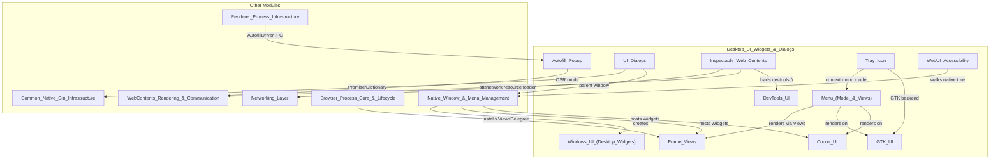
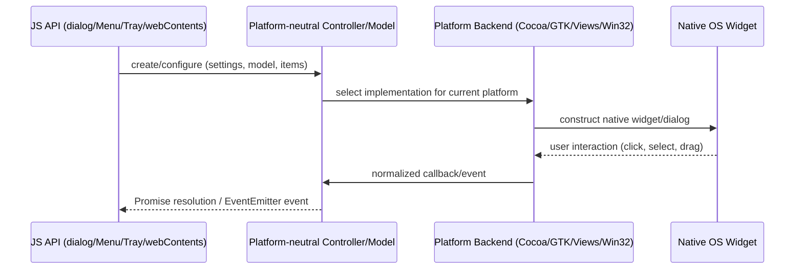

# Desktop_UI_Widgets_&_Dialogs

## 1. Purpose

The **Desktop_UI_Widgets_&_Dialogs** module (`shell/browser/ui`) is Electron's collection of **native, platform-facing UI building blocks** — the widgets and dialogs that live outside the web-rendered page content but are essential to making an Electron app feel like a native desktop application.

It provides:

- **Interactive overlays on web content**: the Autofill/datalist suggestion popup rendered above `<input>` elements.
- **Native OS dialogs**: message boxes, open/save file pickers, and certificate-trust prompts, plus drag-and-drop helpers.
- **Chromium DevTools integration**: the `devtools://` WebUI plumbing and the `InspectableWebContents` host that docks/undocks the DevTools front-end.
- **Menus**: the cross-platform `ElectronMenuModel` and its per-platform renderers (Cocoa `NSMenu`, Views-based in-window menu bar, and the Linux X11/D-Bus global menu bar).
- **System tray icons**: `TrayIcon` and its macOS/Linux/Windows backends.
- **Window frame chrome**: custom title bars, caption buttons, and resize borders for frameless/custom-titlebar windows on Windows and Linux.
- **Platform-specific desktop shell widgets**: Windows Jump Lists, taskbar thumbnail toolbars/progress, and the Aura↔Win32 widget-hosting glue.
- **Toolkit backends**: GTK-specific menu/tray rendering, Cocoa-specific window/touch-bar/traffic-light management.
- **Internal diagnostic WebUI**: the `chrome://accessibility` page.

Together these components implement everything a `NativeWindow` (see [Native_Window_&_Menu_Management](Native_Window_&_Menu_Management.md)) or `WebContents` (see [WebContents_Rendering_&_Communication](WebContents_Rendering_&_Communication.md)) needs to present native chrome, dialogs, and auxiliary desktop-shell affordances, while hiding OS differences behind shared, platform-neutral headers.

## 2. Architecture

The module follows a consistent pattern: a **platform-neutral controller/model** (declared once) paired with **one or more platform-specific renderer/backends** (Cocoa, GTK/X11, Views, Win32). Sub-modules are largely independent but share a few cross-cutting dependencies: `NativeWindow`/`NativeWindowViews` (hosting), `ElectronMenuModel` (menu data), and `gin_helper::Promise`/`Dictionary` (JS interop).

### Interaction Flow (typical widget/dialog lifecycle)

## 3. Sub-Modules

| Sub-module | Responsibility |
|---|---|
| [Autofill_Popup](Autofill_Popup.md) | Native datalist/autofill suggestion popup rendered over form fields; supports offscreen rendering (OSR). |
| [UI_Dialogs](UI_Dialogs.md) | Message boxes, file open/save dialogs (incl. Linux XDG Portal), certificate-trust prompts, and drag-and-drop utilities. |
| [Cocoa_UI](Cocoa_UI.md) | macOS `NSWindow`/`NSView` glue: custom widget/window classes, delegates, Touch Bar, traffic-light button control, bundle relocation. |
| [DevTools_UI](DevTools_UI.md) | `devtools://` WebUI bootstrap (bundled resources, theme CSS) and the `DevToolsManagerDelegate` (remote debugging, `Browser.close`). |
| [Inspectable_Web_Contents](Inspectable_Web_Contents.md) | Hosts/docks the DevTools front-end `WebContents`, dispatches CDP/embedder protocol messages, persists DevTools UI state. |
| [GTK_UI](GTK_UI.md) | Linux GTK backend for context menus (`MenuGtk`) and the legacy `GtkStatusIcon` tray implementation. |
| [Tray_Icon](Tray_Icon.md) | Cross-platform `TrayIcon` abstraction with Cocoa, Linux (GTK/D-Bus), and Windows (`NotifyIcon`) backends. |
| [Menu_(Model_&_Views)](Menu_(Model_&_Views).md) | `ElectronMenuModel` plus Cocoa `NSMenu`, Views in-window menu bar, and Linux X11/Unity global menu backends. |
| [Frame_Views](Frame_Views.md) | Custom window chrome (title bar, caption buttons, resize borders) for frameless/CSD windows on Windows and Linux. |
| [Windows_UI_(Desktop_Widgets)](Windows_UI_(Desktop_Widgets).md) | Aura↔Win32 widget hosting, background dialog thread, Jump Lists, and taskbar (`ITaskbarList3`) integration. |
| [WebUI_Accessibility](WebUI_Accessibility.md) | Internal `chrome://accessibility` diagnostic WebUI for inspecting native and web accessibility trees. |

## 4. Key Relationships to Other Modules

- **[Native_Window_&_Menu_Management](Native_Window_&_Menu_Management.md)** — the primary consumer/host; `NativeWindow`/`NativeWindowViews`/`NativeWindowMac` own and orchestrate the frame views, Cocoa window glue, menus, and tray icons defined here.
- **[WebContents_Rendering_&_Communication](WebContents_Rendering_&_Communication.md)** — drives the Autofill popup (via `AutofillDriver`) and owns `InspectableWebContents` to implement `webContents.openDevTools()`.
- **[Common_Native_Gin_Infrastructure](Common_Native_Gin_Infrastructure.md)** — supplies `gin_helper::Promise`/`Dictionary`/`Handle` used by dialogs, certificate trust, and Touch Bar settings to bridge native results back to JavaScript.
- **[Browser_Process_Core_&_Lifecycle](Browser_Process_Core_&_Lifecycle.md)** — installs the process-wide `ViewsDelegate`/`ViewsDelegateMac` singletons at startup and provides the `Browser` app-name fallback used by message boxes.
- **[Networking_Layer](Networking_Layer.md)** — `InspectableWebContents`' `NetworkResourceLoader` uses `AsarURLLoaderFactory`/`ElectronURLLoaderFactory`/`ProtocolRegistry` to fetch DevTools source maps across custom schemes.
- **[Renderer_Process_Infrastructure](Renderer_Process_Infrastructure.md)** — the renderer-side `AutofillAgent` initiates popup show/hide requests consumed by `Autofill_Popup`.