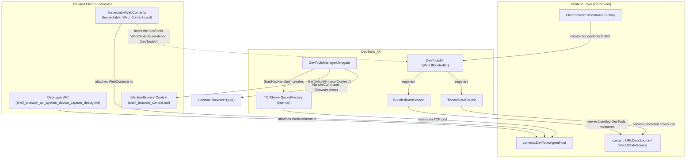
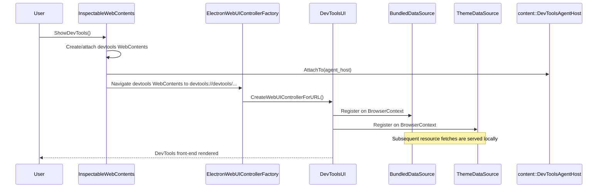
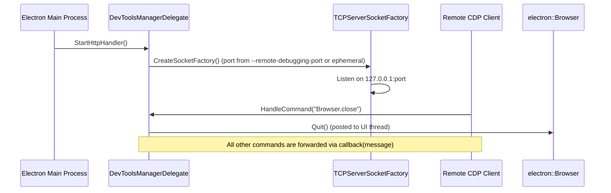

# DevTools_UI Module

## Introduction

The **DevTools_UI** module implements Electron's integration of the Chromium
**DevTools** (Developer Tools) front-end into the Electron browser process.
It is responsible for:

- Bootstrapping the `chrome-devtools://` (internally `devtools://`) WebUI that
  hosts the DevTools front-end inside a `content::WebContents`.
- Serving the bundled DevTools HTML/JS/CSS resources and dynamically-generated
  theme CSS to that WebUI via custom `content::URLDataSource` implementations.
- Providing the `content::DevToolsManagerDelegate` implementation that
  Electron uses to control remote debugging behavior — including opening the
  remote-debugging TCP socket (`--remote-debugging-port`), handling the
  `Browser.close` protocol command, and supplying the discovery page HTML.

This module sits at the intersection of Electron's **Desktop UI Widgets &
Dialogs** family and the browser's content/networking layers. It does **not**
implement the DevTools front-end itself (that ships as bundled Chromium
resources) nor the low-level window that hosts the DevTools contents (that is
[Inspectable_Web_Contents.md](Inspectable_Web_Contents.md)) nor the
JS-facing `Debugger` protocol API (that is part of
[shell_browser_api_system_device_capture_debug.md](shell_browser_api_system_device_capture_debug.md)).
Instead, DevTools_UI provides the **glue** that makes the `devtools://` origin
resolvable, themeable, and remotely controllable.

## Architecture Overview

### Key Responsibilities

| Component | Responsibility |
|---|---|
| `DevToolsManagerDelegate` | Implements `content::DevToolsManagerDelegate`. Starts the remote-debugging HTTP/TCP handler, intercepts the `Browser.close` CDP command, supplies the discovery page HTML, and resolves the default `BrowserContext` used for `devtools://` targets. |
| `TCPServerSocketFactory` (internal, `.cc`-local) | A `content::DevToolsSocketFactory` implementation that creates a `net::TCPServerSocket` bound to `127.0.0.1` and either a user-specified port (`--remote-debugging-port`) or an ephemeral port. |
| `DevToolsUI` | A `content::WebUIController` subclass instantiated for the `devtools://devtools/` WebUI. Registers the `BundledDataSource` and `ThemeDataSource` on construction so that the front-end and its theme can be fetched. |
| `BundledDataSource` | A `content::URLDataSource` that serves the bundled DevTools front-end files (HTML, JS, CSS, images) in response to `devtools://devtools/bundled/...` requests. |
| `ThemeDataSource` | A `content::URLDataSource` that dynamically generates `colors.css` (and related theme resources) for `devtools://theme/...` requests, reflecting the native/dark-mode theme. |

## How DevTools_UI Fits Into the Overall System

1. When a `WebContents` navigates to a `devtools://devtools/` URL — typically
   because `InspectableWebContents` created/attached a DevTools front-end
   WebContents (see [Inspectable_Web_Contents.md](Inspectable_Web_Contents.md))
   — Electron's `ElectronWebUIControllerFactory` (see
   [shell_browser_main_parts_content_delegates.md](shell_browser_main_parts_content_delegates.md))
   instantiates a `DevToolsUI` controller for that WebContents.
2. `DevToolsUI` registers `BundledDataSource` and `ThemeDataSource` with the
   `BrowserContext`'s `URLDataSource` machinery so subsequent resource
   requests from the DevTools front-end (bundled JS/CSS/HTML, and theme CSS)
   are served locally rather than over the network.
3. Independently, `DevToolsManagerDelegate` is installed as the process-wide
   `content::DevToolsManagerDelegate`. It is responsible for:
   - Starting the optional remote-debugging HTTP server
     (`DevToolsManagerDelegate::StartHttpHandler`), used for tools like
     Chrome DevTools Protocol clients connecting over `--remote-debugging-port`.
   - Intercepting low-level CDP commands sent to the browser target — in
     particular short-circuiting `Browser.close` to invoke
     `electron::Browser::Quit()` directly (see
     [shell_browser_core_lifecycle.md](shell_browser_core_lifecycle.md)).
   - Supplying `GetDefaultBrowserContext()`, which resolves to
     `ElectronBrowserContext::GetDefaultBrowserContext()` (see
     [shell_browser_context.md](shell_browser_context.md)), used when DevTools
     needs a default context (e.g. for the discovery page or new targets).
4. The actual per-tab "attach debugger" JS API (`webContents.debugger`) is a
   separate component (`Debugger`, part of the System & App-Level Services
   API module) that also talks to `content::DevToolsAgentHost`, but through
   its own `DevToolsAgentHostClient` implementation rather than through this
   module.

## Process Flow: Opening DevTools for a WebContents

## Process Flow: Remote Debugging Startup & Browser.close Handling

## Related Modules

- [Inspectable_Web_Contents.md](Inspectable_Web_Contents.md) — Hosts and
  manages the DevTools front-end `WebContents`/`WebContentsView`, dispatches
  embedder messages, and is the primary consumer of `DevToolsUI`.
- [shell_browser_api_system_device_capture_debug.md](shell_browser_api_system_device_capture_debug.md) —
  Implements the `webContents.debugger` JS API (`Debugger` class) which is a
  separate `content::DevToolsAgentHostClient` used for programmatic CDP
  access, distinct from the DevTools front-end UI.
- [shell_browser_context.md](shell_browser_context.md) — Provides
  `ElectronBrowserContext`, including `GetDefaultBrowserContext()` consumed by
  `DevToolsManagerDelegate`.
- [shell_browser_core_lifecycle.md](shell_browser_core_lifecycle.md) —
  Provides the `Browser` singleton whose `Quit()` method is invoked when the
  `Browser.close` CDP command is received.
- [shell_browser_main_parts_content_delegates.md](shell_browser_main_parts_content_delegates.md) —
  Provides `ElectronWebUIControllerFactory`, which maps `devtools://` URLs to
  the `DevToolsUI` controller.
- [GTK_UI.md](GTK_UI.md), [Tray_Icon.md](Tray_Icon.md),
  [UI_Dialogs.md](UI_Dialogs.md), [Frame_Views.md](Frame_Views.md) — sibling
  modules under the parent "Desktop UI Widgets & Dialogs" family that
  together make up Electron's native desktop chrome.

## Notes on Scope

This module is intentionally small and focused: it contains no window
management, no rendering pipeline, and no protocol implementation of its own.
Its classes (`DevToolsManagerDelegate`, `TCPServerSocketFactory`, `DevToolsUI`,
`BundledDataSource`, `ThemeDataSource`) are always used together as the
minimal set of classes Chromium's `content` layer requires to expose a working
`devtools://` WebUI and an optional remote debugging endpoint in an Electron
application. Given its small size and tight cohesion, this module is
documented as a single page without further sub-module decomposition.
