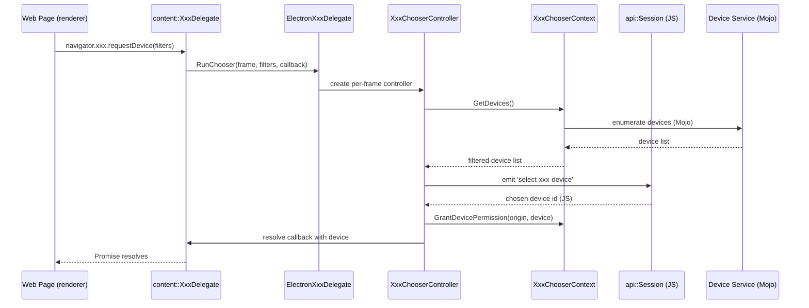

# Device & Peripheral Access

## Purpose

The **Device & Peripheral Access** module implements Electron's browser-process support for the web platform's hardware access APIs, bridging Chromium's `content::` delegate interfaces with Electron's `Session`/`BrowserContext` model and JavaScript-facing event surface. It is the security and orchestration layer that sits between web content (`navigator.bluetooth`, `navigator.hid`, `navigator.serial`, `navigator.usb`, `navigator.credentials` for WebAuthn, `showOpenFilePicker`, and `getUserMedia`/`getDisplayMedia`) and the underlying OS device services.

Its core responsibilities are:

- **Delegate implementation** — providing concrete implementations of Chromium's `content::BluetoothDelegate`, `content::HidDelegate`, `content::SerialDelegate`, `content::UsbDelegate`, and `content::WebAuthenticationDelegate` interfaces, all owned by `ElectronBrowserClient`.
- **Permission management** — tracking, granting, checking, revoking, and persisting per-origin device/resource access grants, scoped to each `ElectronBrowserContext` (session) via the `KeyedService` + `BrowserContextKeyedServiceFactory` pattern.
- **Device chooser orchestration** — driving per-request "select a device" flows that surface candidate devices, filter/exclude per web-page criteria, and resolve the user's (or app's JS-level) choice back to the content layer.
- **JS-level extensibility** — exposing chooser and permission events (e.g. `select-bluetooth-device`, `select-hid-device`, `select-usb-device`, `select-serial-port`) through `Session`/`WebContents`, letting Electron applications implement custom native or JS UI instead of relying on built-in chooser dialogs.
- **Platform security surfaces** — file system access permissioning (File System Access API), media device ID salting for privacy-preserving `enumerateDevices()`, and native OS integration helpers (Bluetooth chooser UI, Linux power/sleep inhibition).

This module is a direct dependency of [Browser_Process_Core_&_Lifecycle](Browser_Process_Core_&_Lifecycle.md) (which owns and exposes these delegates via `ElectronBrowserClient`) and [Browser_Context_&_Session_Management](Browser_Context_&_Session_Management.md) (which supplies the `ElectronBrowserContext`/`Session` scoping these permission grants are keyed to).

## Architecture

### Sub-modules

| Sub-module | Path | Responsibility |
|---|---|---|
| `shell_browser_bluetooth` | `shell/browser/bluetooth` | Web Bluetooth delegate: device chooser, GATT service permission, pairing prompts |
| `shell_browser_hid` | `shell/browser/hid` | WebHID delegate: device enumeration, FIDO/service-worker gating, permission context |
| `Serial` | `shell/browser/serial` | Web Serial delegate: port chooser, Bluetooth-backed serial port discovery |
| `USB` | `shell/browser/usb` | WebUSB delegate: device chooser, hotplug notifications, permission context |
| `WebAuthn` | `shell/browser/webauthn` | WebAuthn/FIDO2 policy hook (resident-key support) |
| `shell_browser_lib` | `shell/browser/lib` | Supporting utilities: `BluetoothChooser` UI state machine, Linux `PowerObserverLinux` |
| `shell_browser_file_system_access` | `shell/browser/file_system_access` | File System Access API permission context and navigation-driven grant cleanup |
| `shell_browser_media` | `shell/browser/media` | Media capture observer and per-context device-ID salt generation |

### High-Level Component Diagram

```mermaid
graph TD
    subgraph Content["content:: Layer (Chromium)"]
        CBD["content::BluetoothDelegate"]
        CHD["content::HidDelegate"]
        CSD["content::SerialDelegate"]
        CUD["content::UsbDelegate"]
        CWD["content::WebAuthenticationDelegate"]
        MO["content::MediaObserver"]
        FSAC["content::FileSystemAccessPermissionContext"]
    end

    subgraph EBC_Mod["ElectronBrowserClient (Browser_Process_Core_&_Lifecycle)"]
        EBC["ElectronBrowserClient"]
    end

    subgraph DPA["Device & Peripheral Access"]
        ElectronBluetoothDelegate
        ElectronHidDelegate
        ElectronSerialDelegate
        ElectronUsbDelegate
        ElectronWebAuthenticationDelegate
        BluetoothChooser
        HidChooserContext["HidChooserContext / Factory"]
        SerialChooserContext["SerialChooserContext / Factory"]
        UsbChooserContext["UsbChooserContext / Factory"]
        FileSystemAccessPermissionContext
        MediaCaptureDevicesDispatcher
        MediaDeviceIDSalt
        PowerObserverLinux
    end

    subgraph BrowserContext["Browser_Context_&_Session_Management"]
        EBCtx["ElectronBrowserContext"]
        Session["api::Session"]
    end

    EBC -->|owns| ElectronBluetoothDelegate
    EBC -->|owns| ElectronHidDelegate
    EBC -->|owns| ElectronSerialDelegate
    EBC -->|owns| ElectronUsbDelegate
    EBC -->|owns| ElectronWebAuthenticationDelegate
    EBC -->|GetMediaObserver| MediaCaptureDevicesDispatcher

    ElectronBluetoothDelegate -.implements.-> CBD
    ElectronHidDelegate -.implements.-> CHD
    ElectronSerialDelegate -.implements.-> CSD
    ElectronUsbDelegate -.implements.-> CUD
    ElectronWebAuthenticationDelegate -.implements.-> CWD
    MediaCaptureDevicesDispatcher -.implements.-> MO
    FileSystemAccessPermissionContext -.implements.-> FSAC

    ElectronBluetoothDelegate --> BluetoothChooser
    ElectronHidDelegate --> HidChooserContext
    ElectronSerialDelegate --> SerialChooserContext
    ElectronUsbDelegate --> UsbChooserContext

    HidChooserContext -->|keyed to| EBCtx
    SerialChooserContext -->|keyed to| EBCtx
    UsbChooserContext -->|keyed to| EBCtx
    FileSystemAccessPermissionContext -->|keyed to| EBCtx
    MediaDeviceIDSalt -->|owned by| EBCtx

    BluetoothChooser -->|emits JS events| Session
    HidChooserContext -->|select-hid-device| Session
    SerialChooserContext -->|select-serial-port| Session
    UsbChooserContext -->|select-usb-device| Session

    MediaDeviceIDSalt -.linux only.-> PowerObserverLinux
```

### Common Delegate → Context → Controller Pattern

Bluetooth, HID, Serial, and USB each follow the same three-tier architecture, differing mainly in how permission state is stored (Bluetooth relies more on Chromium's built-in `BluetoothAllowedDevicesMap`, while HID/Serial/USB maintain explicit `KeyedService` contexts):

### Cross-Cutting Concerns

- **File System Access** attaches a `FileSystemAccessWebContentsHelper` to each `WebContents` to detect cross-origin navigation and revoke stale grants, following the same `KeyedService`-per-`BrowserContext` pattern as the device delegates.
- **Media** does not use a chooser controller; instead `MediaCaptureDevicesDispatcher` satisfies Chromium's `MediaObserver`/`MediaStreamDeviceEnumeratorImpl` contracts (mostly as pass-through no-ops), while `MediaDeviceIDSalt` generates and persists per-context salts used to produce privacy-preserving `deviceId` values.
- **`shell_browser_lib`** supplies reusable platform glue: `BluetoothChooser` (the concrete `content::BluetoothChooser` UI-state implementation used by the Bluetooth delegate) and `PowerObserverLinux` (D-Bus/`systemd-logind` integration for sleep/shutdown inhibition, consumed by the System & App-Level Services `PowerMonitor`).
- **WebAuthn** is the simplest component: a stateless policy adapter overriding only `SupportsResidentKeys`, deferring actual FIDO2/CTAP2 enforcement to the OS platform authenticator or security key.

## Core Components Reference

| Component | Documentation |
|---|---|
| Bluetooth delegate & chooser | [shell_browser_bluetooth](shell_browser_bluetooth.md) |
| WebHID delegate & chooser context | [shell_browser_hid](shell_browser_hid.md) |
| Web Serial delegate & chooser context | [Serial](Serial.md) |
| WebUSB delegate & chooser context | [USB](USB.md) |
| WebAuthn delegate | [WebAuthn](WebAuthn.md) |
| Bluetooth chooser UI & Linux power observer | [shell_browser_lib](shell_browser_lib.md) |
| File System Access permission context | [shell_browser_file_system_access](shell_browser_file_system_access.md) |
| Media capture dispatcher & device ID salt | [shell_browser_media](shell_browser_media.md) |

### Related Modules

- [Browser_Process_Core_&_Lifecycle](Browser_Process_Core_&_Lifecycle.md) — owns `ElectronBrowserClient`, which instantiates and exposes all device delegates in this module.
- [Browser_Context_&_Session_Management](Browser_Context_&_Session_Management.md) — provides `ElectronBrowserContext` and `api::Session`, the scoping and JS-event surface used by every chooser context/controller.
- [WebContents_Rendering_&_Communication](WebContents_Rendering_&_Communication.md) — `WebContents`/`RenderFrameHost` are the request origin and event-emission targets for chooser flows.
- [Desktop_UI_Widgets_&_Dialogs](Desktop_UI_Widgets_&_Dialogs.md) — supplies native file dialog UI consumed by File System Access picker flows.