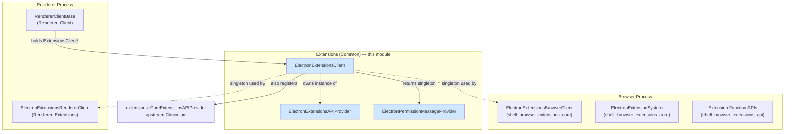
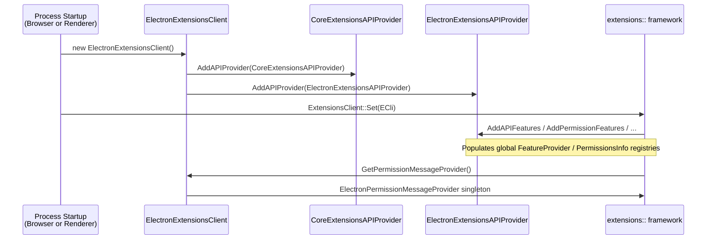

# Extensions (Common)

## Purpose

The **Extensions (Common)** module provides the shared, process-agnostic glue code that wires Electron's Chromium extensions system into the `extensions::ExtensionsClient` contract. It lives under `shell/common/extensions/` and is compiled into **both** the browser process and the renderer process, unlike the browser-only (`shell/browser/extensions/...`) and renderer-only (`shell/renderer/extensions/...`) extension code.

Concretely, this module answers two questions that the upstream `extensions` component library asks of every embedder:

1. **"What extension APIs, permissions, and manifest features does this embedder support?"** — answered by `ElectronExtensionsAPIProvider`.
2. **"Give me an `ExtensionsClient` singleton that knows the product name, webstore URLs, scripting allow-list, and permission-message provider for this embedder."** — answered by `ElectronExtensionsClient` (and its internal helper `ElectronPermissionMessageProvider`).

Because this code is shared across processes, it intentionally contains **no browser-process-only dependencies** (no `content::BrowserContext`, no UI code) and **no renderer-only dependencies** (no `blink::WebLocalFrame`). It is the thin, symmetric foundation that both sides of the extensions subsystem build upon.

## Architecture Overview

### How it fits into the wider Extensions subsystem

The Electron "extensions" feature is split into three tiers, mirroring Chromium's own layering:

| Tier | Location | Documentation |
|------|----------|---------------|
| Browser-process core & manager | `shell/browser/extensions/` | [Extensions_Subsystem's browser core](shell_browser_extensions_core.md) |
| Browser-process API implementations (chrome.* functions) | `shell/browser/extensions/api/` | [shell_browser_extensions_api](shell_browser_extensions_api.md) |
| **Common (this module)** | `shell/common/extensions/` | *this document* |
| Renderer-process client & dispatcher wiring | `shell/renderer/extensions/` | [Renderer_Extensions](Renderer_Extensions.md) |

`ElectronExtensionsClient` is the object that both the browser-side `ElectronExtensionsBrowserClient` (documented in [shell_browser_extensions_core](shell_browser_extensions_core.md)) and the renderer-side `ElectronExtensionsRendererClient` (documented in [Renderer_Extensions](Renderer_Extensions.md)) rely on to answer generic, process-independent questions about the extension (webstore URLs, product name, permission messages, scripting allow-list). Feature/permission/manifest registration performed by `ElectronExtensionsAPIProvider` determines which `chrome.*` APIs are visible at all — the actual C++ implementations of those APIs live one layer up, in [shell_browser_extensions_api](shell_browser_extensions_api.md).

## Core Components

### `ElectronExtensionsClient` (`electron_extensions_client.h/.cc`)

The Electron implementation of `extensions::ExtensionsClient`. It is typically instantiated once per process (browser and renderer each get their own instance, both behaving identically since this class has no process-specific state) and installed via `extensions::ExtensionsClient::Set()`.

Responsibilities:
- **API provider registration**: in its constructor, it registers the upstream `extensions::CoreExtensionsAPIProvider` (which supplies the standard Chromium extension APIs/features) followed by Electron's own `ElectronExtensionsAPIProvider`.
- **Webstore URLs**: exposes `GetWebstoreBaseURL()`, `GetNewWebstoreBaseURL()`, and `GetWebstoreUpdateURL()`, initialized from `extension_urls::kChromeWebstore*` constants.
- **Product identity**: `GetProductName()` returns `"app_shell"` (a TODO marks this as a placeholder that should reflect Electron branding).
- **Scripting allow-list**: `SetScriptingAllowlist()` / `GetScriptingAllowlist()` manage the list of extension IDs allowed to use privileged scripting APIs.
- **Permission plumbing**: `GetPermissionMessageProvider()` returns a lazily-constructed `ElectronPermissionMessageProvider` singleton (via `base::NoDestructor`).
- **URL scriptability & host permission filtering**: `IsScriptableURL()` (currently unrestricted — always returns `true`), `FilterHostPermissions()`, and `GetPermittedChromeSchemeHosts()` are largely stubbed out (`NOTIMPLEMENTED()`), reflecting Electron's simpler, embedder-controlled permission model compared to full Chrome.

### `ElectronPermissionMessageProvider` (internal, `electron_extensions_client.cc`)

A minimal, mostly-stub implementation of `extensions::PermissionMessageProvider`. Electron does not need to show Chrome-style "this extension can read your browsing history" install-time permission dialogs, so:
- `GetPermissionMessages()` always returns an empty list.
- `GetAllPermissionIDs()` always returns an empty set.
- `IsPrivilegeIncrease()` is unimplemented (`NOTREACHED()`), since Electron does not currently perform update-time privilege-escalation checks.

This class is accessed only through `ElectronExtensionsClient::GetPermissionMessageProvider()` and has no independent lifecycle.

### `ElectronExtensionsAPIProvider` (`electron_extensions_api_provider.h`)

Implements `extensions::ExtensionsAPIProvider`, the interface Chromium's extensions system uses to discover which API schemas, manifest keys, permissions, and behavior features an embedder supports. Electron registers exactly one instance of this class (alongside the upstream `CoreExtensionsAPIProvider`) inside `ElectronExtensionsClient`'s constructor.

Key overridden hooks:
- `AddAPIFeatures` / `AddManifestFeatures` / `AddPermissionFeatures` / `AddBehaviorFeatures` — populate `extensions::FeatureProvider` registries so the extensions system knows about Electron-specific (or Electron-enabled subset of Chrome) features.
- `AddAPIJSONSources` — supplies the JSON schema definitions describing available `chrome.*` API surface for extensions running under Electron.
- `IsAPISchemaGenerated` / `GetAPISchema` — used when API schemas are compiled/generated rather than hand-written JSON.
- `RegisterPermissions` — registers the permission strings (e.g., `"tabs"`, `"storage"`) that manifest files may request.
- `RegisterManifestHandlers` — registers parsers for manifest.json keys relevant to the supported API surface.

This class effectively defines the **allow-list of extension functionality** that Electron exposes — it is consulted by both `ElectronExtensionsClient` (common) and the browser-side `ElectronExtensionsBrowserClient` (see [shell_browser_extensions_core](shell_browser_extensions_core.md)) when resolving what an extension is permitted to call.

## Data Flow / Initialization Sequence

## Relationship to Other Modules

- **[shell_browser_extensions_core](shell_browser_extensions_core.md)** — Browser-process extension system (`ElectronExtensionSystem`, `ElectronExtensionsBrowserClient`, delegates). Depends on this module's `ElectronExtensionsClient` for shared metadata and on `ElectronExtensionsAPIProvider` for feature/permission registration.
- **[shell_browser_extensions_api](shell_browser_extensions_api.md)** — Concrete `chrome.*` extension function implementations (tabs, scripting, action, management, etc.) that are only reachable if `ElectronExtensionsAPIProvider` has registered the corresponding API/permission features.
- **[Renderer_Extensions](Renderer_Extensions.md)** — Renderer-process counterpart (`ElectronExtensionsRendererClient`, `ElectronExtensionsRendererAPIProvider`) that consumes the same `ElectronExtensionsClient` singleton to keep renderer-side behavior consistent with the browser process.
- **[Renderer_Client](Renderer_Client.md)** — `RendererClientBase` holds a reference to the `ExtensionsClient` interface (implemented here) when extensions support is compiled in.

## Design Notes

- **Symmetry across processes**: Because `ElectronExtensionsClient` and `ElectronExtensionsAPIProvider` contain no process-specific dependencies, the exact same objects/behavior are usable in both the browser and renderer, minimizing duplicated logic and the risk of browser/renderer behavior drift.
- **Deliberately minimal permission UX**: Several methods (`FilterHostPermissions`, `GetPermittedChromeSchemeHosts`, `IsPrivilegeIncrease`) are intentionally unimplemented/stubbed, reflecting that Electron apps embed extensions under developer control rather than exposing a Chrome-Web-Store-style install flow with end-user permission prompts.
- **Extensibility point**: Adding a new extension API surface to Electron generally means extending `ElectronExtensionsAPIProvider` (schemas/features/permissions) and implementing the corresponding function classes in [shell_browser_extensions_api](shell_browser_extensions_api.md).
