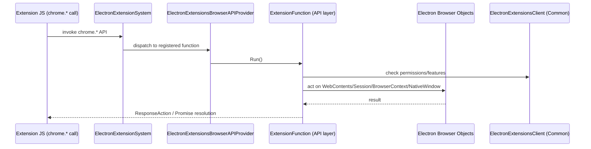

# Extensions Subsystem

## Purpose

The **Extensions Subsystem** implements Electron's support for Chrome-extension-compatible functionality by integrating Chromium's `extensions` component library into Electron's Electron-style browser/renderer process architecture. It provides:

- **Browser-process extension API implementations** (`chrome.action`, `chrome.tabs`, `chrome.scripting`, `chrome.management`, `chrome.runtime`, and private APIs used by Electron's built-in PDF viewer and MIME handler view).
- **Browser-process runtime plumbing** — the extension system, loader, browser client, messaging/guest-view delegates, kiosk/process-manager policy hooks — that hosts, loads, and dispatches calls into the API layer above.
- **Process-agnostic (common) glue code** — the `ExtensionsClient` and `ExtensionsAPIProvider` implementations shared by both the browser and renderer processes, defining supported API surface, permissions, and manifest features.

Together these three tiers let Electron load unpacked/packed Chrome extensions, expose a compatible `chrome.*` JavaScript API surface to extension scripts, and route extension behavior (actions, tabs, scripting, messaging) through Electron's own native `Session`, `BrowserContext`, `WebContents`, and `NativeWindow` abstractions.

## Architecture

The module is organized into three cooperating sub-modules, mirroring Chromium's own extensions layering:

```mermaid
graph TB
    subgraph "Extensions_Subsystem"
        subgraph "shell_browser_extensions_api"
            ACT["Extension Action API<br/>(chrome.action/browserAction/pageAction)"]
            MGMT["Management API<br/>(chrome.management)"]
            RUNTIME["Runtime API Delegate<br/>(chrome.runtime)"]
            SCRIPT["Scripting API<br/>(chrome.scripting)"]
            TABS["Tabs API<br/>(chrome.tabs)"]
            PRIV["Content Viewer / Private APIs<br/>(pdfViewerPrivate, resourcesPrivate, streamsPrivate)"]
        end

        subgraph "shell_browser_extensions_core"
            SYS["Extension System & Loading<br/>(ElectronExtensionSystem, ElectronExtensionLoader)"]
            BC["Browser Client & Resource Manager<br/>(ElectronExtensionsBrowserClient)"]
            API["API Client & WebContents Integration<br/>(ElectronExtensionsAPIClient, Messaging, GuestViews)"]
            DEL["Policy Delegates<br/>(ProcessManager, Kiosk, NavigationUIData)"]
        end

        subgraph "Extensions_(Common)"
            ECLIENT["ElectronExtensionsClient"]
            EPROVIDER["ElectronExtensionsAPIProvider"]
            PMP["ElectronPermissionMessageProvider"]
        end
    end

    BC -->|registers functions from| ACT
    BC -->|registers functions from| MGMT
    BC -->|registers functions from| RUNTIME
    BC -->|registers functions from| SCRIPT
    BC -->|registers functions from| TABS
    BC -->|registers functions from| PRIV
    BC --> DEL
    BC --> API
    SYS -->|owned per| BCTX["ElectronBrowserContext"]
    ECLIENT -->|used by| BC
    ECLIENT -->|used by| RENDERER["ElectronExtensionsRendererClient (renderer)"]
    EPROVIDER -->|feature/permission registry| ECLIENT

    style ACT fill:#cfe8ff
    style MGMT fill:#cfe8ff
    style RUNTIME fill:#cfe8ff
    style SCRIPT fill:#cfe8ff
    style TABS fill:#cfe8ff
    style PRIV fill:#cfe8ff
    style SYS fill:#d8f5d0
    style BC fill:#d8f5d0
    style API fill:#d8f5d0
    style DEL fill:#d8f5d0
    style ECLIENT fill:#ffe8b3
    style EPROVIDER fill:#ffe8b3
    style PMP fill:#ffe8b3
```

### Control flow

### Design characteristics

- **`ExtensionFunction` pattern**: Each JS-callable API method is a class overriding `Run()`; alias/subclass hierarchies share implementation across related namespaces (e.g., `action.*`, `browserAction.*`, `pageAction.*`).
- **Delegate pattern**: Chromium extensions subsystems (`management`, `runtime`, `kiosk`, `process manager`, `messaging`, `guest views`) are integrated via small delegate classes implementing Chromium-defined interfaces.
- **Per-context scoping**: `ElectronExtensionSystem` and its loader are created and owned per `ElectronBrowserContext`, following Chromium's `KeyedService` pattern.
- **Process symmetry**: The common tier (`ElectronExtensionsClient`, `ElectronExtensionsAPIProvider`) has no process-specific dependencies and is shared verbatim between browser and renderer processes.
- **Minimal permission UX**: Several Chrome-style install-time permission/privilege-escalation checks are intentionally stubbed, reflecting Electron's simpler, embedder-controlled extension model.

## Sub-modules & Core Components

| Sub-module | Description | Reference |
|---|---|---|
| **shell_browser_extensions_api** | Browser-process `ExtensionFunction` implementations backing `chrome.action`/`browserAction`/`pageAction`, `chrome.management`, `chrome.runtime` delegate, `chrome.scripting`, `chrome.tabs`, and PDF/stream/resource private APIs. Key components: `ExtensionActionAPI`, `ElectronManagementAPIDelegate`, `ElectronRuntimeAPIDelegate`, `ScriptingExecuteScriptFunction`, `TabsQueryFunction`/`TabsUpdateFunction`, `StreamsPrivateAPI`. | See detailed docs embedded in repo structure (`shell_browser_extensions_api`) |
| **shell_browser_extensions_core** | Browser-process runtime plumbing: `ElectronExtensionSystem`/`ElectronExtensionSystemFactory`/`ElectronExtensionLoader` (system & loading), `ElectronExtensionsBrowserClient`/`ElectronComponentExtensionResourceManager` (browser client & resources), `ElectronExtensionsAPIClient`/`ElectronMessagingDelegate`/`ElectronExtensionWebContentsObserver` (API client & WebContents integration), `ElectronProcessManagerDelegate`/`ElectronKioskDelegate`/`ElectronNavigationUIData` (policy delegates). | See detailed docs embedded in repo structure (`shell_browser_extensions_core`) |
| **Extensions_(Common)** | Process-agnostic `extensions::ExtensionsClient`/`ExtensionsAPIProvider` implementations: `ElectronExtensionsClient`, `ElectronExtensionsAPIProvider`, `ElectronPermissionMessageProvider`. Defines supported API schemas, permissions, manifest features, and webstore metadata shared by both browser and renderer. | See detailed docs embedded in repo structure (`Extensions_(Common)`) |

## Relationship to Other Modules

- **[Browser_Process_Core_&_Lifecycle](../Browser_Process_Core_%26_Lifecycle)** — `ElectronBrowserMainParts` instantiates `ElectronExtensionsBrowserClient` and `ElectronExtensionsClient` during process bootstrap.
- **[Browser_Context_&_Session_Management](../Browser_Context_%26_Session_Management)** — Each `ElectronExtensionSystem` is scoped to an `ElectronBrowserContext`; extension API functions act on `Session`/`BrowserContext` objects defined there.
- **[WebContents_Rendering_&_Communication](../WebContents_Rendering_%26_Communication)** — Guest views, mime-handler views, and extension host delegates operate on `electron::api::WebContents`; the Tabs API manipulates `WebContentsZoomController`.
- **[Renderer_Process_Infrastructure](../Renderer_Process_Infrastructure)** — The `Renderer_Extensions` sub-module (`ElectronExtensionsRendererClient`, `ElectronExtensionsRendererAPIProvider`) mirrors this subsystem on the renderer side and shares the common `ElectronExtensionsClient` singleton.
- **[System_&_App-Level_Services_API](../System_%26_App-Level_Services_API)** — `electron_api_extensions.h::Extensions` exposes a JS-facing wrapper around the extension system for the main process `app`/`session` APIs.