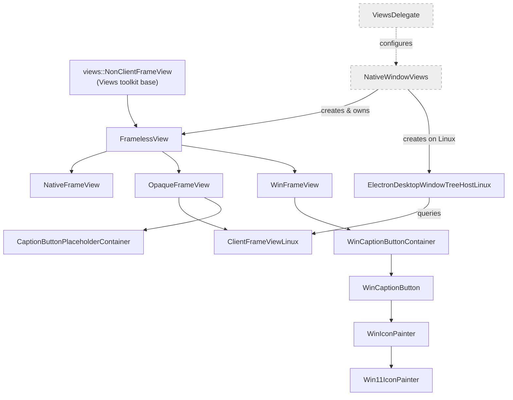
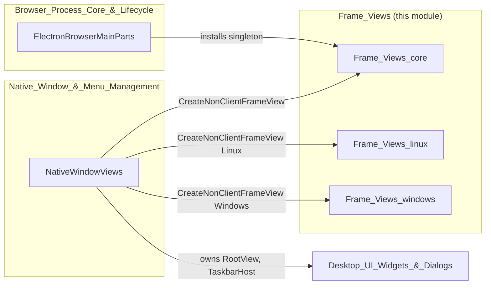

# Frame Views

## Introduction

The **Frame Views** module implements the non-client area ("chrome") of Electron's native windows — the title bar, window caption buttons (minimize/maximize/restore/close), resize borders, and window-controls-overlay (WCO) placeholder regions that Electron draws itself instead of delegating to the OS. It is the visual/layout layer that sits directly beneath [`NativeWindowViews`](Native_Window_%26_Menu_Management.md), the `views::Widget`-based native window implementation used on Windows and Linux.

Whenever an Electron `BrowserWindow` is created with `frame: false`, a custom titlebar, or a Linux client-side-decorated (CSD) window, this module supplies the `views::NonClientFrameView` subclass that is installed onto the underlying `views::Widget`. It also supplies the `views::ViewsDelegate` implementation that customizes global Views-toolkit behavior (window placement persistence, default icons, non-client frame creation) for the whole application.

This module is C++/Views-toolkit only; it has no direct JavaScript-facing API. It is consumed internally by the [Native Window & Menu Management](Native_Window_%26_Menu_Management.md) module (specifically `NativeWindowViews`) and by the [Browser Process Core & Lifecycle](Browser_Process_Core_%26_Lifecycle.md) module (`ElectronBrowserMainParts` installs the `ViewsDelegate` singleton at startup).

## Architecture Overview

Frame Views is organized around the `views::NonClientFrameView` inheritance hierarchy, with platform-specific concrete implementations selected at window-creation time by `NativeWindowViews::CreateNonClientFrameView()`.

*(`NativeWindowViews` and the global `ViewsDelegate` singleton are owned by other modules and shown here only to illustrate integration points.)*

### Class responsibilities at a glance

| Component | Role |
|---|---|
| `FramelessView` | Common base for all custom frame views: resize-border hit testing, client-bounds calculation for frameless/no-decoration windows. |
| `NativeFrameView` | Thin wrapper around the OS-native (non-custom) frame that reports min/max size from `NativeWindow`. |
| `OpaqueFrameView` | Fully custom-painted frame (titlebar + caption buttons drawn by Chromium code, no OS decorations) — the default "opaque" style on Linux. |
| `ClientFrameViewLinux` | CSD (client-side decoration) frame for Linux desktop environments; integrates with `ui::LinuxUi` nav-button providers and window-frame theming (GTK/adwaita-like decorations). |
| `WinFrameView` / `WinCaptionButtonContainer` / `WinCaptionButton` / `WinIconPainter` / `Win11IconPainter` | Windows-specific custom titlebar and caption-button rendering, replicating the Windows 10/11 caption button look when Electron draws its own frame. |
| `CaptionButtonPlaceholderContainer` | Reserves non-client screen space under overlay caption buttons for the Window Controls Overlay API, without drawing anything itself. |
| `ElectronDesktopWindowTreeHostLinux` | Linux `DesktopWindowTreeHost` specialization that bridges platform window-state/tiling/theme events into `ClientFrameViewLinux` and `NativeWindowViews`. |
| `ViewsDelegate` | Application-wide `views::ViewsDelegate` implementation: window-placement persistence, default frame-view creation policy, platform icon lookup. |

## Sub-modules

This module is split into three sub-modules by platform scope:

### [Frame_Views_core](Frame_Views_core.md)
The platform-agnostic foundation: `FramelessView` (the shared `NonClientFrameView` base), `NativeFrameView` (native-OS frame passthrough), `CaptionButtonPlaceholderContainer` (WCO placeholder), and the process-wide `ViewsDelegate`. Every other frame-view class in this module ultimately derives from or is configured by these components.

### [Frame_Views_linux](Frame_Views_linux.md)
Linux-specific frame rendering: `OpaqueFrameView` (self-drawn titlebar/buttons) and `ClientFrameViewLinux` (desktop-environment-themed CSD frame with rounded corners, nav-button providers, and tiling support), plus `ElectronDesktopWindowTreeHostLinux`, which wires platform window state (theme changes, DPI, tiled-edge state) into these views.

### [Frame_Views_windows](Frame_Views_windows.md)
Windows-specific custom titlebar rendering: `WinFrameView`, its `WinCaptionButtonContainer`/`WinCaptionButton` building blocks, and the `WinIconPainter`/`Win11IconPainter` strategy classes used to draw minimize/maximize/restore/close glyphs matching Windows 10 and Windows 11 visual styles.

## How It Fits Into the Overall System

- **[Native_Window_&_Menu_Management](Native_Window_%26_Menu_Management.md)**: `NativeWindowViews` is the direct consumer of this module; it selects and owns a `FramelessView`-derived instance as the widget's non-client frame view and hosts a `RootView`/`MenuBar` inside it.
- **[Browser_Process_Core_&_Lifecycle](Browser_Process_Core_%26_Lifecycle.md)**: `ElectronBrowserMainParts` constructs the process-wide `ViewsDelegate` during startup, before any `NativeWindowViews` instance is created.
- **[Desktop_UI_Widgets_&_Dialogs](Desktop_UI_Widgets_%26_Dialogs.md)**: Related window-chrome concerns—window controls (`TaskbarHost`, `JumpList` on Windows), the menu bar/model, and X11 global menu bar—live in sibling sub-modules of that parent module and cooperate with Frame Views' caption-button and titlebar layout.
